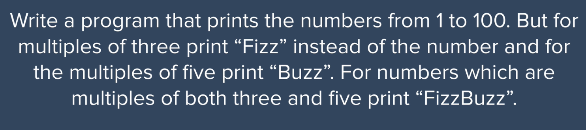
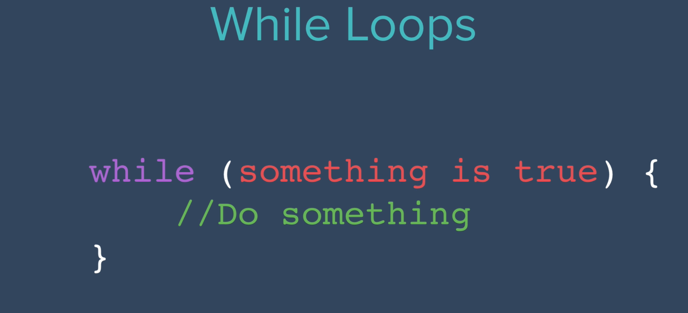
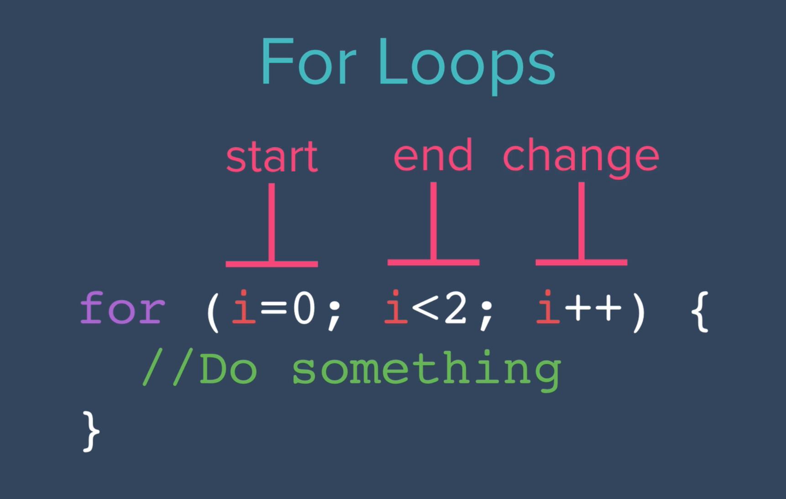

**Random Function in JS**

varn=Math.random(); // Math.random(gives your random number between 0 = 0.999999999999999)

// We would have to convert this number into the numbers that we need.

n=n*6;

//For example: if we need a random dice numbers, we would have to mutiply the number by n

n=Math.floor(n) +1 ;

//Then we conver the number into whole number and add + 1 which will be 1 to 6.

console.log(n);

// -------------------------------------------

varfirstName=prompt("Type your first name");

varsecondName=prompt("Type the name of your crush!");

varloveScore=Math.random(loveScore) *100;

loveScore=Math.floor(loveScore) +1 ;

console.log(loveScore);

---

**Control statements (If / Else)**

var firstName = prompt("Type your first name");
var secondName = prompt("Type the name of your crush!");

var loveScore = Math.random(loveScore) * 100;

loveScore = Math.floor(loveScore) + 1 ;

console.log(loveScore);

if (loveScore > 70){
    console.log("You love each other");
}
else{
    console.log("Your love is " + loveScore + " only");
}

=== -> Equal

!== -> Not Equal

The difference between === and ==

=== checks the datatype

== only checks the value.

For example :

var a = 1;
var b = "1";

typeof(a)
'number'
typeof(b)
'string'
if (a ===b ){}
undefined
if (a ===b ){
    console.log("yes");
}else{
    console.log("No");
}
 No

if (a ==b ){}
undefined
if (a ===b ){
    console.log("yes");
}else{
    console.log("No");
}
yes

---

**Combining Comparators**

&& -> AND

| | -> OR

!  - > Not

<= Less than

---

**Coding Question 1**

BMI Calculator Advanced (IF/ELSE)

Previously, we've created a function that is able to calculate the BMI. But once we get a result, we will want to tell the user what the number means.

Write a function that outputs (returns) a different message depending on the BMI.

BMI  **<18.5** , the output should be: " **Your BMI is `<bmi>`, so you are underweight.** "

BMI  **18.5-24.9** , the output should be " **Your BMI is `<bmi>`, so you have a normal weight.** "

BMI  **>24.9** , the output should be " **Your BMI is `<bmi>`, so you are overweight.** "

The message **MUST** be **returned** as an output from your function. You should **NOT NEED** to use  **alert** , **prompt** or **console.log** in this challenge.

**IMPORTANT** the message wording has to match precisely for the code to pass the validation. Including punctuation and capitalisation.

Solution :

function bmiCalculator(weight, height) {

    calBmi = weight / (Math.pow(height, 2));

    if (calBmi < 18.5) {

    return "Your BMI is " + calBmi + ", so you are underweight.";

    } else if (calBmi >= 18.5 && calBmi <= 24.9) {

    return "Your BMI is " + calBmi + ", so you have a normal weight.";

    } else {

    return "Your BMI is " + calBmi + ", so you are overweight.";
    }
}

---

**Coding Question 2**

Question

Write a program that works out whether if a given year is a leap year. A normal year has 365 days, leap years have 366, with an extra day in February. The reason why we have leap years is really fascinating,[ this video](https://www.youtube.com/watch?v=xX96xng7sAE) goes into more detail.

This is how to work out whether if a particular year is a leap year:

*A year is a leap year if it is evenly divisible by * ***4 *** *;*

***except**** if that year is also evenly divisible by * ***100*** *;*

***unless**** that year is also evenly divisible by * ***400*** *.*

e.g. Is the year 2000 a leap year?:

2000 ÷ 4 = 500 (Leap)

2000 ÷ 100 = 20 (Not Leap)

2000 ÷ 400 = 5 (Leap!)

So the year 2000 is a leap year.

But the year 2100 is not a leap year because:

2100 ÷ 4 = 525 (Leap)

2100 ÷ 100 = 21 (Not Leap)

2100 ÷ 400 = 5.25 (Not Leap)

**Warning** your output should match the Example Output format exactly, even the positions of the commas and full stops.

**Example Input 1**

<pre class="prettyprint linenums prettyprinted" role="presentation"><ol class="linenums"><li class="L0">
2400
</li></ol></pre>

**Example Output 1**

<pre class="prettyprint linenums prettyprinted" role="presentation"><ol class="linenums"><li class="L0">
Leap year.
</li></ol></pre>

**Example Input 2**

<pre class="prettyprint linenums prettyprinted" role="presentation"><ol class="linenums"><li class="L0">
1989
</li></ol></pre>

**Example Output 2**

<pre class="prettyprint linenums prettyprinted" role="presentation"><ol class="linenums"><li class="L0">
Not leap year.
</li></ol></pre>

**Hint**

1. Remember that the modulo (%) operator gives you the remainder of a division. We covered this in [this lesson](https://www.udemy.com/course/the-complete-web-development-bootcamp/learn/lecture/12371848).
2. Try to visualise the rules by creating a flow chart on [www.draw.io](http://www.draw.io/).
3. If you really get stuck, you can see [the flow chart I created](https://bit.ly/36BjS2D).
4. Try to run your code in [this Repl.it playground](https://repl.it/@appbrewery/Leap-year-challenge) and check it against the [known leap years](https://www.mathsisfun.com/leap-years.html).

Answer:

function isLeap(year) {

/**************Don't change the code above****************/

    if(year % 4 != 0 ){
        return "Not leap year.";
    }else{
        if(year % 100 != 0){
            return "Leap year.";
        }
        else{
            if(year % 400 != 0){
                return "Not Leap year.";
            }
            else{
                return "Leap year.";
            }
        }
    }
}

---

**Collections : Working with JS Arrays**

var guestList = ['Sudhanshu', 'Jack', 'Angela', 'Pam', 'Jim'];
console.log(guestList.length);

5

guestList[1] - > 'Jack'

Quick Question: Check if the guest list matches the name of the person. If yes, welcome, if not print sorry next time.

var guestList = ['Sudhanshu', 'Jack', 'Angela', 'Pam', 'Jim'];

var guestName = prompt("What is your name");

if(guestList.includes(guestName)){
    alert("Welcome");
}
else{
    alert("Sorry Next time");
}

---

**Important Question**

// Write a function that ask the user to type a number and add that number into the array.Solution : function fizzBuzz(){

    userInput = prompt("Type a number that you want to add");

    output.push(userInput);

    console.log(output);
}

fizzBuzz();

Solution of Fizz Buzz;

var output = [];
var count = 1;
function fizzBuzz(){

    if( count%3 === 0 && count % 5 === 0){
        output.push("FizzBuzz");
    }
    else if(count%5 === 0){
            output.push("Buzz");
        }
    else if(count %3 === 0 ){
            output.push("Fizz");
        }
    else{
        output.push(count);
    }

    count++;

    console.log(output);
}

output : [1, 2, 'Fizz', 4, 'Buzz', 'Fizz', 7, 8, 'Fizz', 'Buzz', 11, 'Fizz', 13, 14, 'FizzBuzz']

---

**Coding Challenge 3**

Who's Buying Lunch? Code Challenge

You are going to write a function which will select a random name from a list of names. The person selected will have to pay for everybody's food bill.

 **Important** : The output should e returned from the function and you do not need  **alert** , **prompt** or  **console.log** . The output should match the example output exactly, including capitalisation and punctuation.

**Example Input**

<pre class="prettyprint linenums prettyprinted" role="presentation"><ol class="linenums"><li class="L0">
["Angela","Ben","Jenny","Michael","Chloe"]
</li></ol></pre>

**Example Output**

<pre class="prettyprint linenums prettyprinted" role="presentation"><ol class="linenums"><li class="L0">
Michaelis going to buy lunch today!
</li></ol></pre>

**Hint**

1. You might need to think about [Array.length](https://developer.mozilla.org/en-US/docs/Web/JavaScript/Reference/Global_Objects/Array/length).
2. Remember that Arrays start at position  **0** !

Solution :

function whosPaying(names) {

/******Don't change the code above*******/

    //Write your code here.

    names = ["Angela", "Ben", "Jenny", "Michael", "Chloe"];

    const randomIndex = Math.floor(Math.random() * names.length);

    const randomName = names[randomIndex];

    return randomName + ' is going to buy lunch today!';

/******Don't change the code below*******/
}

solution:

function whosPaying(names) {

var numberOfPeople = names.length;
var randomPersonPosition = Math.floor(Math.random() * numberOfPeople)
var randomPerson = names[randomPersonPosition];

return randomPerson + " is going to buy lunch Today!";

}

---

**While Loop**

var i = 1;

while(i < 4){
    console.log(i);
    i++;

}

Solution : 1,2,3,4.

**FIZZBUZZ in WHILE LOOP EXAMPLE**

var output = [];
var count = 1;

function fizzBuzz(){

    while(count <= 100){

    if( count%3 === 0 && count % 5 === 0){
            output.push("FizzBuzz");
        }
        else if(count%5 === 0){
                output.push("Buzz");
            }
        else if(count %3 === 0 ){
                output.push("Fizz");
            }
        else{
            output.push(count);
        }

    count++;

    console.log(output);
    }
}

Practice Question:

99 bottles of beer on the wall, 99 bottles of beer.
Take one down and pass it around, 98 bottles of beer on the wall.

Print this until the bottle is 1

Last print : 

No more bottles of beer on the wall, no more bottles of beer.
Go to the store and buy some more, 99 bottles of beer on the wall.

Ans : 

var count = 99;

function letsHaveAbeer(){
    while(count >= 0){

    if(count < 100 && count > 1){
            console.log(+count+ " bottles of beer on the wall, " +count+" bottles of beer.");
            console.log("Take one down and pass it around, " +(count - 1)+ " bottles of beer on the wall.");
        }
        else if(count === 1){
            console.log(+count+ " bottles of beer on the wall, " +count+" bottles of beer.");
            console.log("Take one down and pass it around, no more bottles of beer on the wall.");
        }
        else{
            console.log("No more bottles of beer on the wall, no more bottles of beer. Go to the store and buy some more, 99 bottles of beer on the wall.");
        }
        count--;
    }
}

// Solution from the course:
var numberOfBottles = 99
while (numberOfBottles >= 0) {
    var bottleWord = "bottle";
    if (numberOfBottles === 1) {
        bottleWord = "bottles";
    }
    console.log(numberOfBottles + " " + bottleWord + " of beer on the wall");
    console.log(numberOfBottles + " " + bottleWord + " of beer,");
    console.log("Take one down, pass it around,");
	numberOfBottles--;
    console.log(numberOfBottles + " " + bottleWord + " of beer on the wall.");
}

---

**For Loop**

FIZZBUZZ example in while loop.

var output = []

function fizzBuzz(){

    for(var count = 1; count <= 100; count++){

    if(count%3 === 0 && count %5 === 0){
            output.push("FizzBuzz");

    }else if(count%3 === 0){
            output.push("Fizz");

    }else if(count%5 === 0){
            output.push("Buzz");
        }
        else{
            output.push(count);
        }

    }
    console.log(output);
}

---

**Coding Challenge : Fibonacci Challenge**

The Fibonacci Exercise

Fibonacci was an Italian mathematician who came up with the [Fibonacci sequence](https://en.wikipedia.org/wiki/Fibonacci_number):

0, 1, 1, 2, 3, 5, 8, 13, 21, 34, 55, 89, 144 ...

Where every number is the sum of the two previous ones.

e.g. 0, 1, 1, 2, 3, 5 comes from

0 + 1 = 1

1 + 1 = 2

1 + 2 = 3

2 + 3 = 5

etc.

Create a function where you can call it by writing the code:

`fibonacciGenerator (n)`

Where **n** is the **number of items **in the sequence.

So I should be able to call:

`fibonacciGenerator(3)` and get

[0,1,1]

as the output.

IMPORTANT: The solution checker is expecting an **array** as the correct output.

Do **NOT** change any of the existing code.

You do **NOT** need any **alerts** or  **prompts** , the result should be **returned** from the function as an  **output** .

The **first two numbers** in the sequence must be **0** and  **1** .

Also, if you decide to create a **for** loop, make sure you explicitly specify `var i = 0` rather than simply writing `i = 0` . This is a quirk of the testing suite.

e.g. `for (var i = 0; i < 10; i ++)`

HINT: Use [this Repl.it Playground](https://repl.it/@appbrewery/Fibonacci-Coding-Exercise) to test out your solution.

HINT: Use [this flow chart](https://drive.google.com/file/d/1g8vVtqhSj44vcElfc-HK0nMbecteW8Yg/view?usp=sharing) to understand the logic if you get stuck.

**Solution:**

function fibonacciGenerator (n) {

    var output = [];

    for(var i = 0; i < n; i ++){

    if(i === 0 ){
            output.push(0);
        }
        else if(i === 1){
            output.push(1);
        }
        else {
            output.push(
                output[output.length - 1] +
                output[output.length - 2]
            );
        }

    }//for loop ends

    return output;
}//function ends
