# Section 18: Advanced JavaScript & DOM Manipulation - Complete Documentation

## Table of Contents

1. [Introduction to Events](#introduction-to-events)
2. [Event Listeners](#event-listeners)
3. [Higher Order Functions](#higher-order-functions)
4. [Debugger in Console](#debugger-in-console)
5. [Playing Sounds on Websites](#playing-sounds-on-websites)
6. [Switch Statements](#switch-statements)
7. [JavaScript Objects Deep Dive](#javascript-objects-deep-dive)
8. [Constructor Functions](#constructor-functions)
9. [Methods in Objects](#methods-in-objects)
10. [Keyboard Event Listeners](#keyboard-event-listeners)
11. [Callbacks and Event Response](#callbacks-and-event-response)
12. [Adding Animations](#adding-animations)

---

## Introduction to Events

Events are actions or occurrences that happen in the browser. Common examples include:
- User clicking a button
- Pressing a keyboard key
- Page finishing to load
- Form being submitted

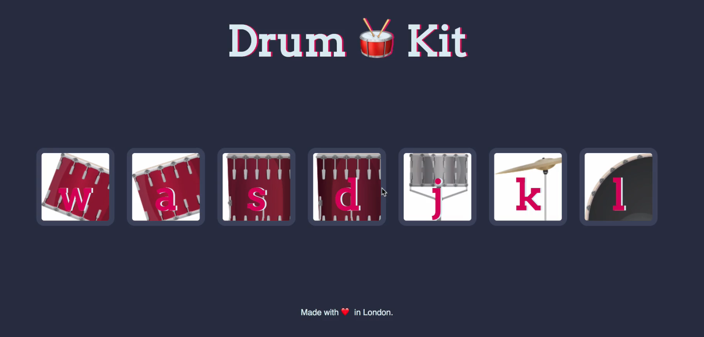

### Useful Resources

- [MDN - Document Object Model Events](https://developer.mozilla.org/en-US/docs/Web/API/Document_Object_Model/Events)
- [MDN - EventTarget addEventListener](https://developer.mozilla.org/en-US/docs/Web/API/EventTarget/addEventListener)

---

## Event Listeners

### What is an Event Listener?

An **event listener** is a JavaScript function that "listens" for a specific event (like a click, hover, or keypress) to occur on a web page element and then executes a piece of code in response.

### Syntax

```javascript
// Select the element and add event listener
document.querySelector("button").addEventListener("click", handleClick);

function handleClick() {
    alert("I got clicked!");
}
```

### Important: Why `handleClick` and not `handleClick()`?

We pass the function **reference** (`handleClick`) without parentheses because:
- `handleClick` = reference to the function (wait for event to call it)
- `handleClick()` = immediately executes the function

We need to **wait** for the click event to happen before the function runs.

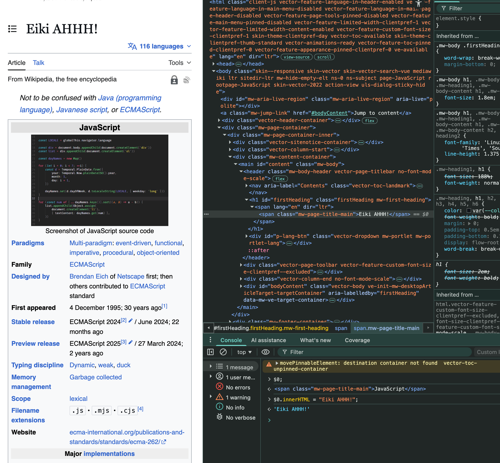

### Accessing Elements via Console

You can also access elements directly in the browser console using `$0`:
- `$0` refers to the currently selected element in DevTools

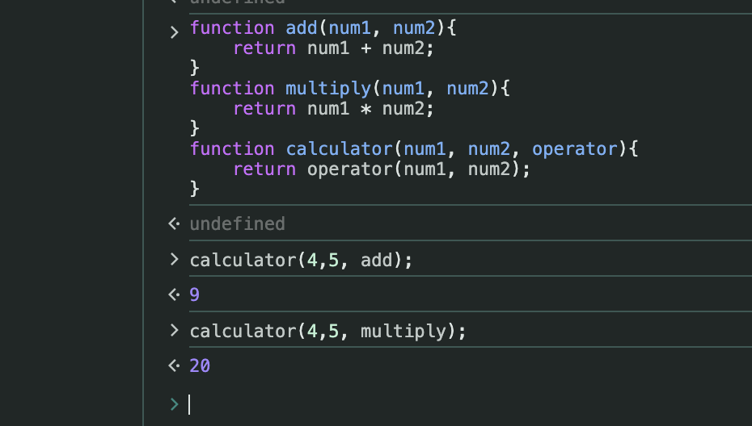

---

## Higher Order Functions

### Definition

**Higher Order Functions** are functions that can take other functions as inputs (arguments) or return functions as outputs.

> "Higher order functions are functions that can take other functions as inputs."

### Example: Calculator Function

```javascript
function add(num1, num2) {
    return num1 + num2;
}

function calculator(num1, num2, operator) {
    return operator(num1, num2);
}

// Usage
calculator(2, 3, add); // Returns 5
```

In this example:
- `add` is a function passed as an argument to `calculator`
- `calculator` is a higher order function because it accepts a function as a parameter

---

## Debugger in Console

### Using the Debugger

The `debugger` statement allows you to pause code execution and step through it line by line.

```javascript
debugger; // Press Shift + Enter, then type the function to debug

calculator(2, 3, add);
```

### Debugger Controls

1. **Step Into** - Enters into the function call to see internal execution

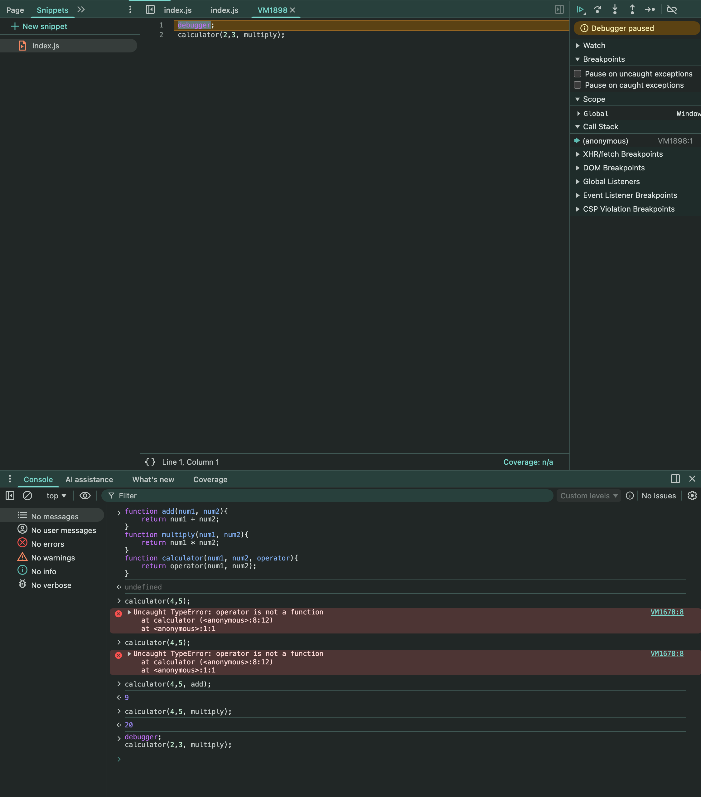

2. **Continue Stepping** - Move through each line of code

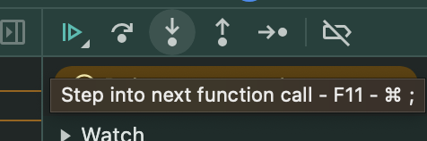

3. **View Execution** - See variables and their values at each step

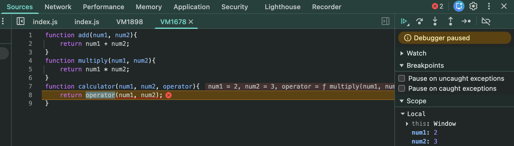

### Challenge: Add a Subtract Function

```javascript
function add(num1, num2) {
    return num1 + num2;
}

function subtract(num1, num2) {
    return num1 - num2;
}

function multiply(num1, num2) {
    return num1 * num2;
}

function divide(num1, num2) {
    return num1 / num2;
}

function calculator(num1, num2, operator) {
    return operator(num1, num2);
}
```

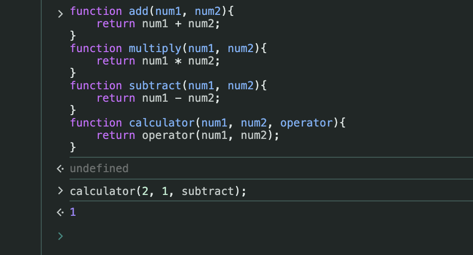

---

## Playing Sounds on Websites

### Creating Audio Objects

To play sounds in JavaScript, use the `Audio` constructor:

```javascript
var audio = new Audio('path/to/sound.mp3');
audio.play();
```

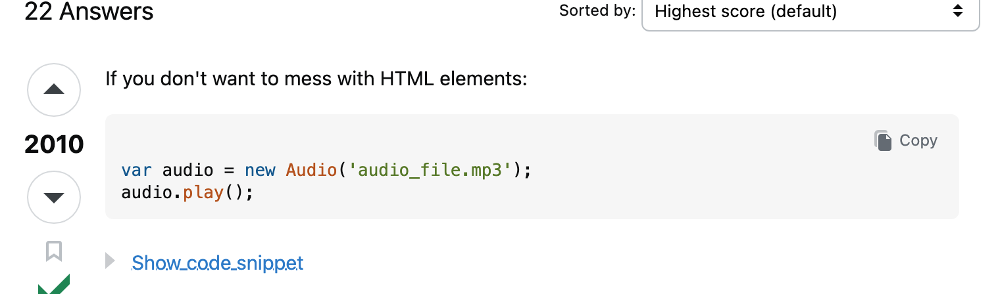

### Implementation: Drum Kit Sound on Click

```javascript
var numberOfDrumButtons = document.querySelectorAll(".drum").length;

for (var i = 0; i < numberOfDrumButtons; i++) {
    document.querySelectorAll(".drum")[i].addEventListener("click", handleClick);

    function handleClick() {
        var audio = new Audio('./sounds/tom-1.mp3');
        audio.play();
    }
}
```

---

## Switch Statements

### Syntax

```javascript
switch (expression) {
  case value1:
    // Code to execute if expression === value1
    break;
  case value2:
    // Code to execute if expression === value2
    break;
  default:
    // Code to execute if no cases match
}
```

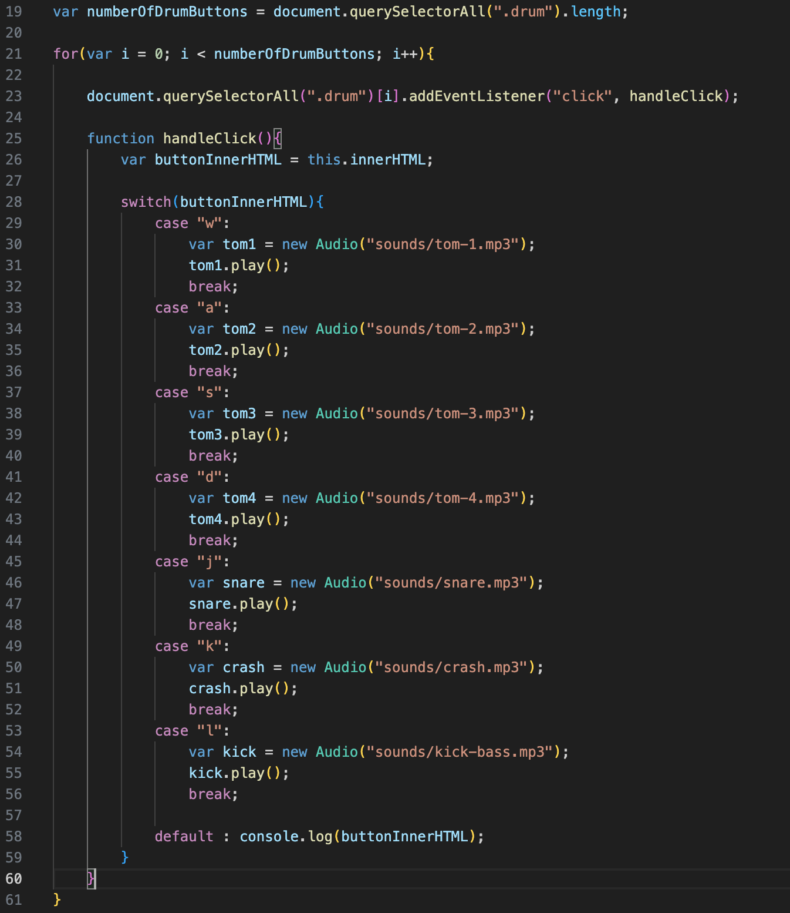

### Key Concepts

- `numberOfDrumButtons` - Counts total buttons with class `.drum`
- `buttonInnerHTML` - Uses `this.innerHTML` to get the clicked button's content
- **`this` keyword** - In JavaScript, `this` refers to the **object** that is currently executing the code

### Full Implementation with Switch

```javascript
for (var i = 0; i < numberOfDrumButtons; i++) {
    document.querySelectorAll(".drum")[i].addEventListener("click", function() {
        var buttonInnerHTML = this.innerHTML;
        
        switch(buttonInnerHTML) {
            case "w":
                var tom1 = new Audio("sounds/tom-1.mp3");
                tom1.play();
                break;
            case "a":
                var tom2 = new Audio("sounds/tom-2.mp3");
                tom2.play();
                break;
            case "s":
                var tom3 = new Audio("sounds/tom-3.mp3");
                tom3.play();
                break;
            case "d":
                var tom4 = new Audio("sounds/tom-4.mp3");
                tom4.play();
                break;
            case "j":
                var snare = new Audio("sounds/snare.mp3");
                snare.play();
                break;
            case "k":
                var crash = new Audio("sounds/crash.mp3");
                crash.play();
                break;
            case "l":
                var kick = new Audio("sounds/kick-bass.mp3");
                kick.play();
                break;
            default:
                console.log(buttonInnerHTML);
        }
    });
}
```

---

## JavaScript Objects Deep Dive

### What is an Object?

An object is a collection of related data and/or functionality.

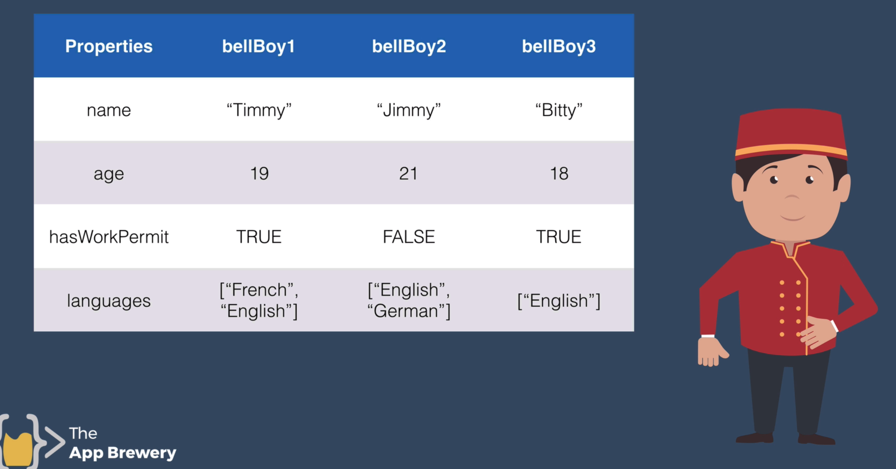

### Creating an Object

```javascript
var housekeeper = {
    name: "John",
    age: 30,
    isCertified: true,
    languages: ["English", "Spanish"]
};
```

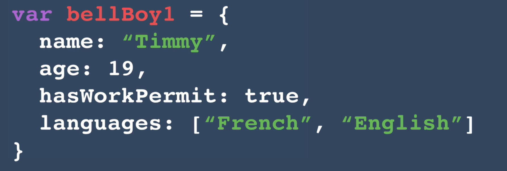

### Task: Create a Housekeeper Object

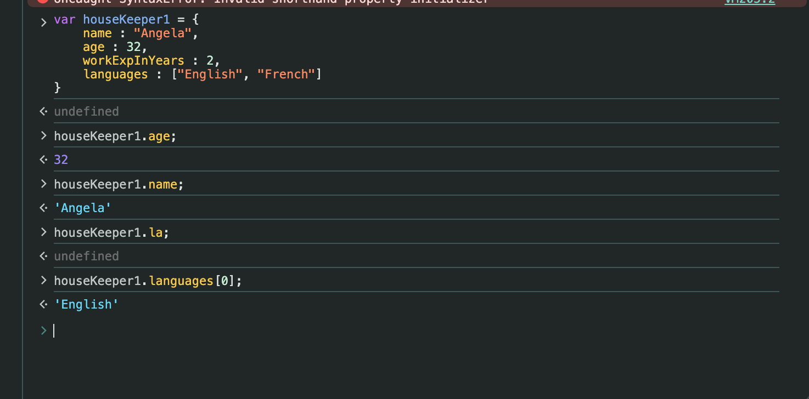

### Problem: Multiple Similar Objects

If you need to create multiple objects with the same properties (e.g., multiple housekeepers), writing each one manually is repetitive.

### Solution: Constructor Functions

A **constructor function** is a factory that creates objects with predefined properties.

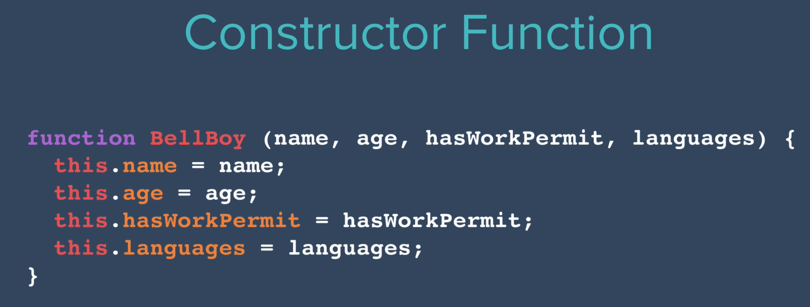

---

## Constructor Functions

### What is a Constructor?

In JavaScript, a **constructor** is a special function used to create and initialize object instances. It defines the initial state (properties and methods) that every object of that type will have.

### Naming Convention

> **Important:** The first character of a constructor function name must be **uppercase**.

```javascript
function BellBoy(name, age, hasWorkPermit, languages) {
    this.name = name;
    this.age = age;
    this.hasWorkPermit = hasWorkPermit;
    this.languages = languages;
}
```

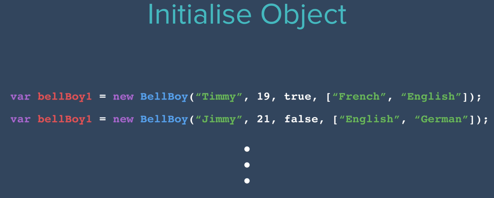

### Creating Object Instances

```javascript
var bellBoy1 = new BellBoy("Timmy", 19, true, ["french", "english", "Hindi"]);
var bellBoy2 = new BellBoy("Sarah", 21, false, ["german", "english"]);
```

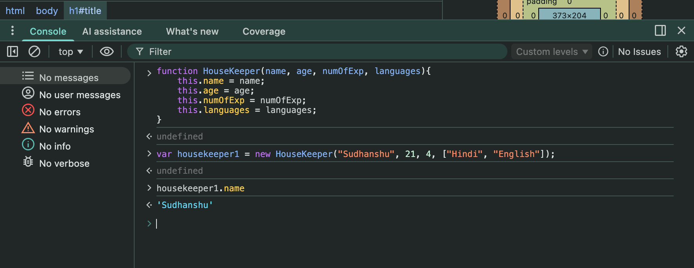

### Task: Create a Constructor

Solution for creating a `HouseKeeper` constructor:

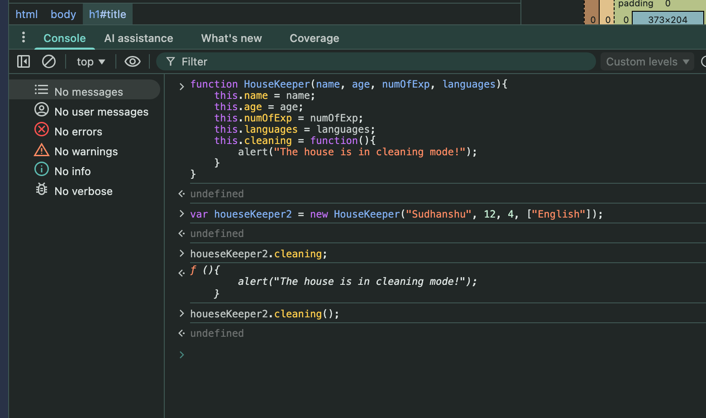

---

## Methods in Objects

### What are Methods?

**Methods** are **actions** that can be performed on objects. They are **functions stored as property values**.

> In JavaScript, a **method** is a function that is stored as a property of an object. While a standard function is standalone, a method is associated with an object and often operates on the data contained within that object.

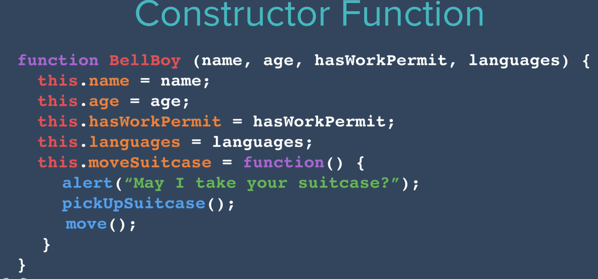

### Adding Methods to Constructor

```javascript
function BellBoy(name, age, hasWorkPermit, languages) {
    this.name = name;
    this.age = age;
    this.hasWorkPermit = hasWorkPermit;
    this.languages = languages;
    
    // Method
    this.greet = function() {
        console.log("Hello, my name is " + this.name);
    };
}

// Usage
var bellBoy = new BellBoy("Timmy", 19, true, ["English"]);
bellBoy.greet(); // "Hello, my name is Timmy"
```

### Audio Object Example

We've already been using objects with methods:

```javascript
var audio = new Audio('sounds/tom-1.mp3');
audio.play(); // play() is a method of the audio object
```

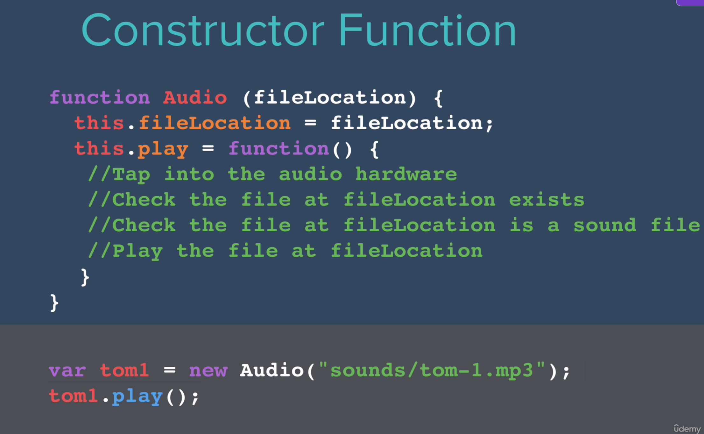

---

## Keyboard Event Listeners

### Listening for Keyboard Events

Instead of listening for clicks, we can listen for keyboard presses:

```javascript
document.addEventListener("keypress", function(event) {
    console.log(event);
});
```

- `"keypress"` - The event type to listen for
- `event` - Contains information about the pressed key

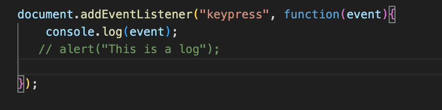

### Accessing the Pressed Key

```javascript
document.addEventListener("keypress", function(event) {
    console.log(event.key); // Logs the actual key pressed (e.g., "a", "w", "Enter")
});
```

### Resources

- [MDN - Element keypress_event](https://developer.mozilla.org/en-US/docs/Web/API/Element/keypress_event)
- [MDN - Document Object Model Events](https://developer.mozilla.org/en-US/docs/Web/API/Document_Object_Model/Events)

---

## Callbacks and Event Response

### What is a Callback Function?

A **callback function** is a function passed as an argument into another function. The "outer" function then executes the callback at a specific time—either immediately or after some task is completed.

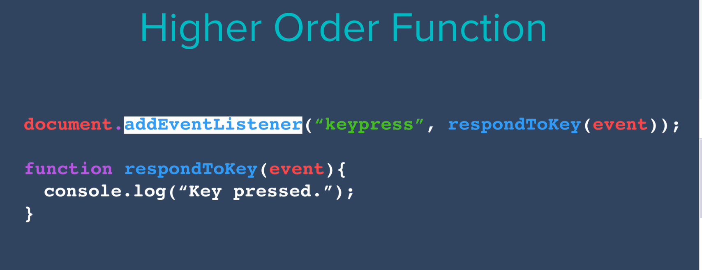

### Example

```javascript
// Callback function
function sayHello() {
    console.log("Hello!");
}

// Function that takes a callback
function executeCallback(callback) {
    callback(); // Executes the callback
}

executeCallback(sayHello); // "Hello!"
```

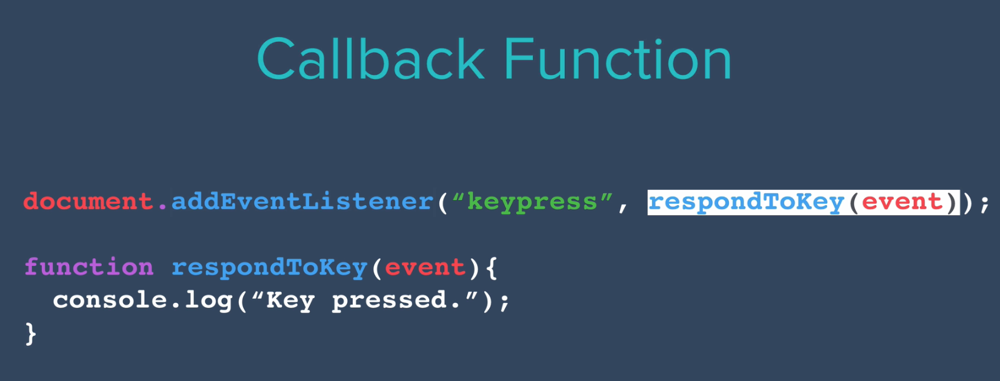

### Callbacks in Event Listeners

Event listeners use callbacks extensively:

```javascript
// Anonymous callback
document.addEventListener("click", function() {
    console.log("Clicked!");
});

// Named callback
function handleClick() {
    console.log("Clicked!");
}
document.addEventListener("click", handleClick);
```

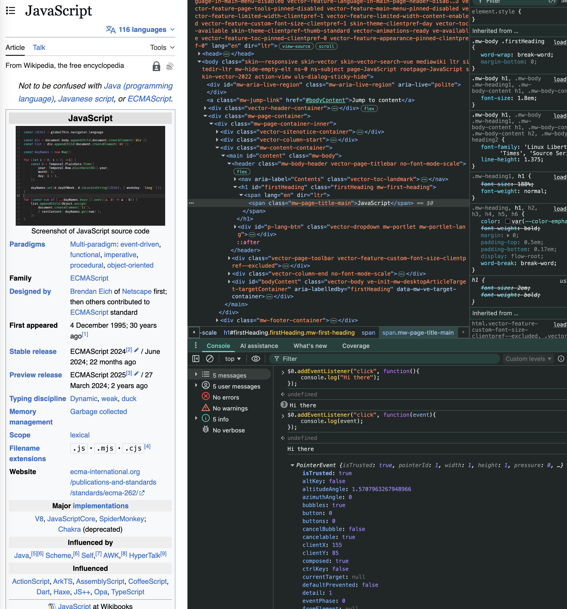

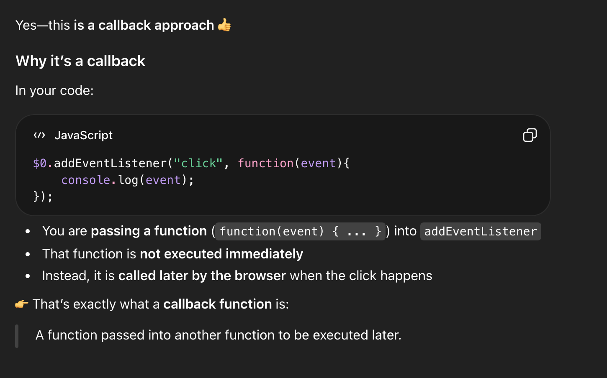

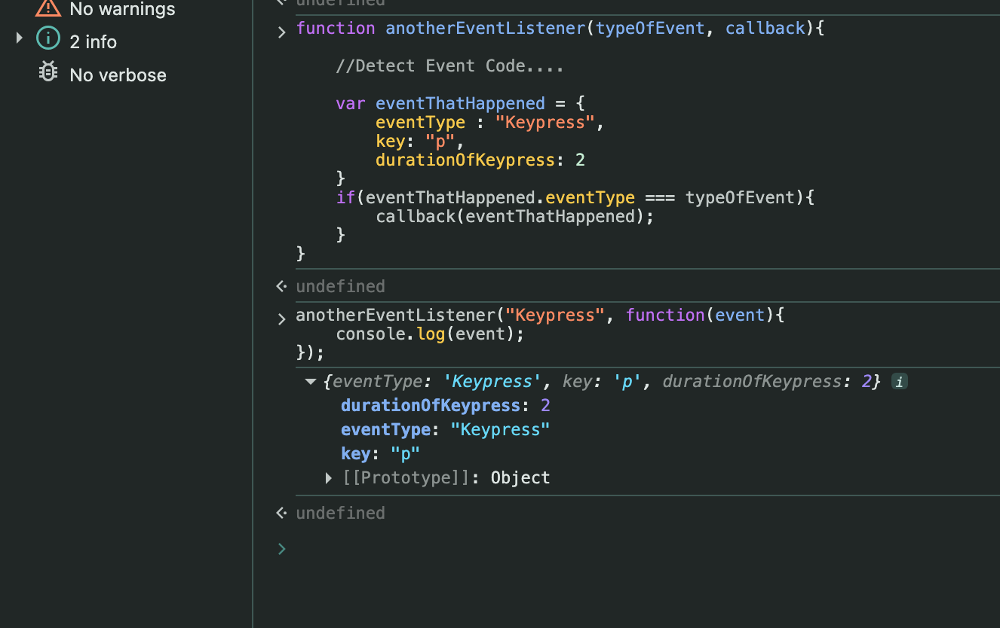

---

## Adding Animations

### CSS Transitions with JavaScript

You can add animations by manipulating CSS classes with JavaScript:

```javascript
function buttonAnimation(currentKey) {
    var activeButton = document.querySelector("." + currentKey);
    activeButton.classList.add("pressed");
    
    setTimeout(function() {
        activeButton.classList.remove("pressed");
    }, 100);
}
```

### CSS Class for Animation

```css
.pressed {
    box-shadow: 0 3px 4px 0 #DBEDF3;
    opacity: 0.5;
}
```

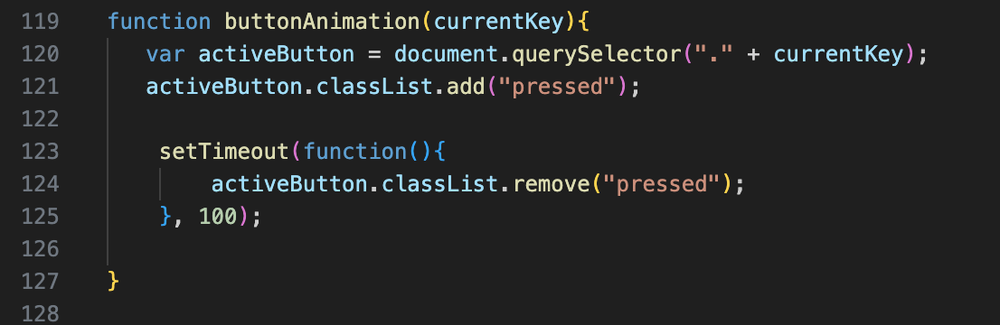

### How It Works

1. Add the `.pressed` class when key/button is activated
2. Use `setTimeout()` to remove the class after 100ms
3. CSS handles the visual transition

---

## Complete Drum Kit Implementation

### Final Code Structure

```javascript
// Detecting Button Click
var numberOfDrumButtons = document.querySelectorAll(".drum").length;

for (var i = 0; i < numberOfDrumButtons; i++) {
    document.querySelectorAll(".drum")[i].addEventListener("click", handleClick);

    function handleClick() {
        var buttonInnerHTML = this.innerHTML;
        makeSound(buttonInnerHTML);
        buttonAnimation(buttonInnerHTML);
    }
}

// Detecting Keyboard Press
document.addEventListener("keypress", function(event) {
    makeSound(event.key);
    buttonAnimation(event.key);
});

// Play Sound Function
function makeSound(key) {
    switch(key) {
        case "w":
            var tom1 = new Audio("sounds/tom-1.mp3");
            tom1.play();
            break;
        case "a":
            var tom2 = new Audio("sounds/tom-2.mp3");
            tom2.play();
            break;
        case "s":
            var tom3 = new Audio("sounds/tom-3.mp3");
            tom3.play();
            break;
        case "d":
            var tom4 = new Audio("sounds/tom-4.mp3");
            tom4.play();
            break;
        case "j":
            var snare = new Audio("sounds/snare.mp3");
            snare.play();
            break;
        case "k":
            var crash = new Audio("sounds/crash.mp3");
            crash.play();
            break;
        case "l":
            var kick = new Audio("sounds/kick-bass.mp3");
            kick.play();
            break;
        default:
            console.log(key);
    }
}

// Button Animation Function
function buttonAnimation(currentKey) {
    var activeButton = document.querySelector("." + currentKey);
    activeButton.classList.add("pressed");
    
    setTimeout(function() {
        activeButton.classList.remove("pressed");
    }, 100);
}
```

---

## Summary

### Key Concepts Covered

| Concept | Description |
|---------|-------------|
| **Event Listeners** | Functions that wait for specific events (click, keypress) |
| **Higher Order Functions** | Functions that accept other functions as arguments |
| **Debugger** | Tool to step through code execution |
| **Audio API** | Play sounds using `new Audio()` and `.play()` |
| **Switch Statements** | Cleaner alternative to multiple if/else statements |
| **Objects** | Collections of related properties and methods |
| **Constructor Functions** | Factories for creating similar objects |
| **Methods** | Functions stored as object properties |
| **Callbacks** | Functions passed to other functions for later execution |
| **Animations** | CSS class manipulation with `setTimeout()` |

### Best Practices

1. Always use **uppercase first letter** for constructor functions
2. Pass function **references** (not calls) to event listeners
3. Use **`this`** to refer to the calling element inside event handlers
4. Separate concerns: keep HTML, CSS, and JavaScript in separate files
5. Use **switch statements** for multiple condition checks on the same variable
