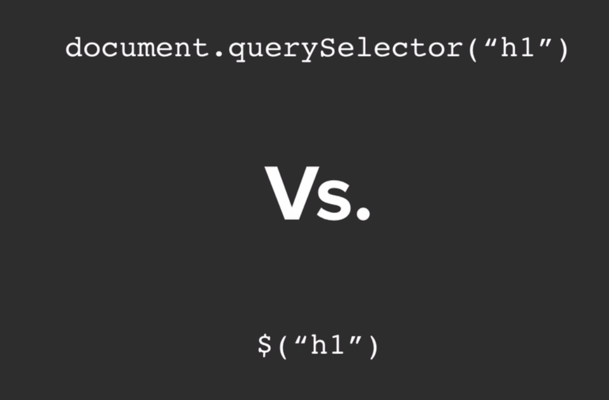
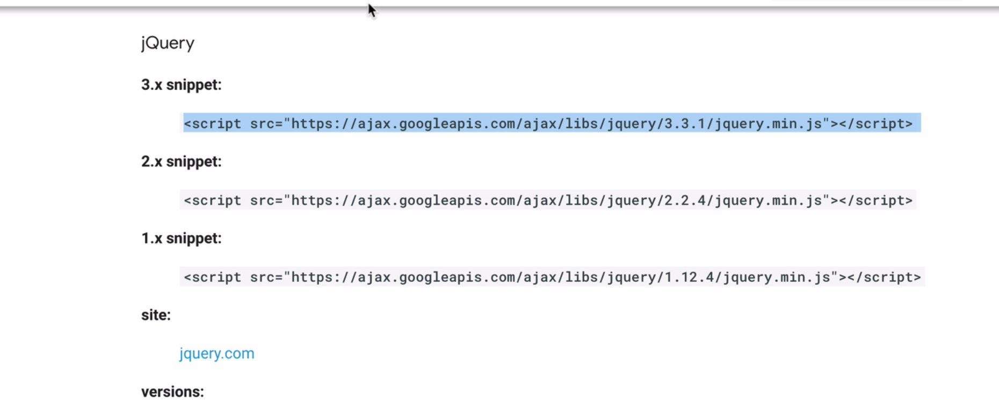
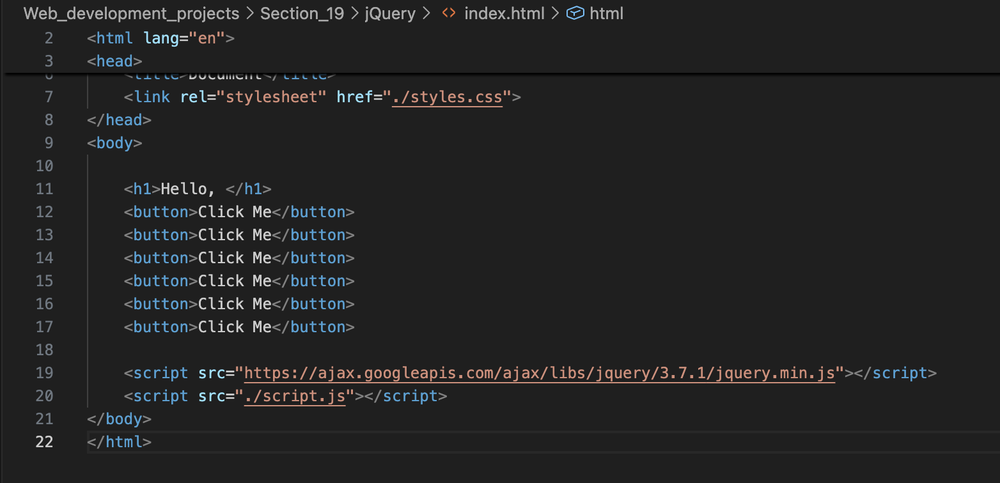
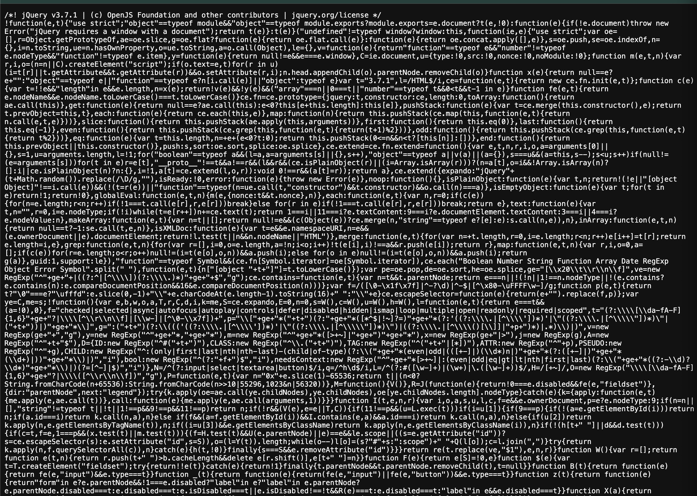
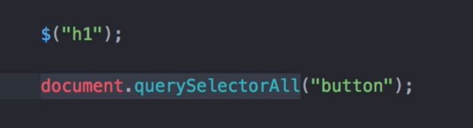

**What is JQuery?**

jQuery is  a fast, small, and feature-rich JavaScript library designed to simplify HTML DOM traversal, event handling, CSS manipulation, and Ajax for web development.

---

How to download Jquery?

[https://jquery.com/]()

You can either download it or use CDN as we used in the bootstrap module.

[https://developers.google.com/speed/libraries#jquery]()

We can add jQuery using this snippet that can be found from [https://developers.google.com/speed/libraries#jquery]()

``

Do not add the Jquery script snipper below the JS script as it will not work because if we try to place the script.js first, it wont read the file and wont understand what the short code is all about without having a reference from Jquery library.

How to check if Jquery is setup properly?

$(document).ready(function(){

$("h1").css("color", "red");

});

You can type this to check if Jquery is working.

---

How to Minifiction Works to Reduce FIle Size

This is nothing but a minimized Javscript code.

You can use this website to minify your code.
Now, if we would like to minify this code, we can copy out JS code and paste it on this website [https://www.minifier.org/]()

to generate a minified version.

---

**Selecting Elements with JQuery**

