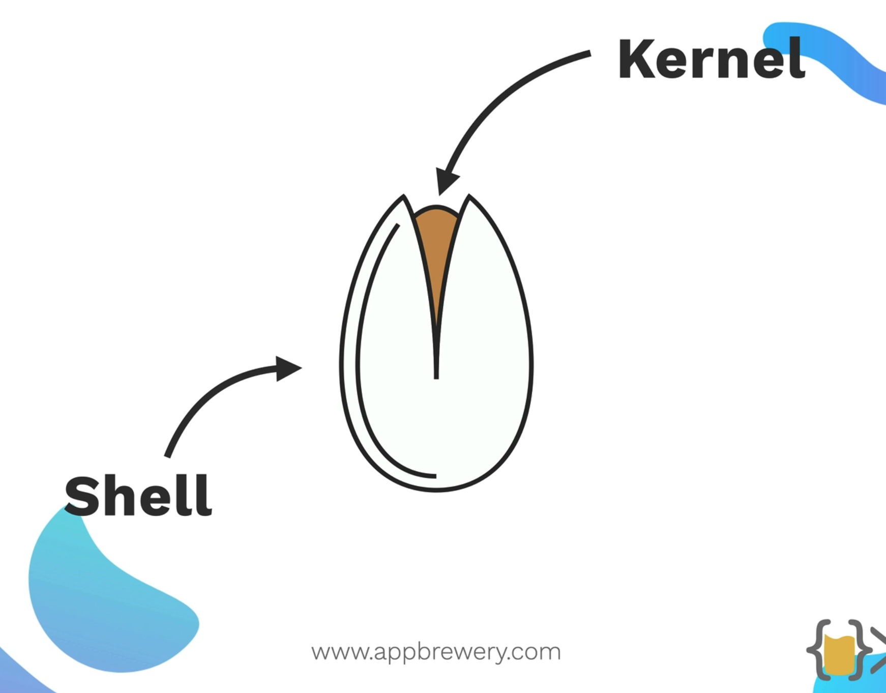

The **kernel** is the core, privileged heart of an operating system that directly manages hardware and system resources. The **shell** is a user-level interface (like a command-line) that interprets user commands and translates them into instructions the kernel can execute.

BASH = Bourne Again SHell - It is cmd line interpretor for unix system like linux.

It provided greater control than the GUI's and also speed.

[www.geeksforgeeks.org/linux-unix/complete-mac-terminal-commands-cheat-sheet](https://www.geeksforgeeks.org/linux-unix/complete-mac-terminal-commands-cheat-sheet/)

### Mac Terminal Keyboard Shortcuts

| ****Shortcut****          | ****Description****                                               |
| ------------------------------------- | ----------------------------------------------------------------------------- |
| `Command + T`          | Open a new Terminal tab.                                                      |
| `Command + N`          | Open a new Terminal window.                                                   |
| `Command + W`          | Close the current Terminal tab or window.                                     |
| `Control + C`          | Cancel the current command or process.                                        |
| `Control + D`          | Exit the current session or close the Terminal window.                        |
| `Control + Z`          | Pause the current process and send it to the background.                      |
| `Command + K`          | Clear the Terminal screen.                                                    |
| `Control + L`          | Clear the screen (similar to`Command + K`).                    |
| `Command + Arrow Up`   | Scroll up through previous commands in the history.                           |
| `Command + Arrow Down` | Scroll down through the command history.                                      |
| `Control + A`          | Move the cursor to the beginning of the line.                                 |
| `Control + E`          | Move the cursor to the end of the line.                                       |
| `Control + U`          | Delete everything from the cursor to the beginning of the line.               |
| `Control + K`          | Delete everything from the cursor to the end of the line.                     |
| `Control + W`          | Delete the word before the cursor.                                            |
| `Control + Y`          | Paste the last deleted text.                                                  |
| `Control + R`          | Search the command history.                                                   |
| `Control + S`          | Resume a paused process (if it was paused using`Control + Z`). |
| `Control + C`          | Interrupt a running process.                                                  |
| `Option + Left Arrow`  | Move the cursor one word left.                                                |
| `Option + Right Arrow` | Move the cursor one word right.                                               |
| `Command + Shift + G`  | Go to a specific directory by entering its path.                              |
| `Tab`                  | Auto-complete file or directory name.                                         |

## Complete Mac Terminal Commands

In this section, you will get a complete table for Mac Terminal commands, we will start with the basics Mac terminal commands to advance Mac terminal commands like "****Network, ****[****Homebrew****](https://www.geeksforgeeks.org/installation-guide/homebrew-installation-on-macos/)****, Environment Variable or Path,**** and more."

### Basics Mac Terminal Commands

| ****Command****                               | ****Description****                                                                  | ****Example****                  |
| --------------------------------------------------------- | ------------------------------------------------------------------------------------------------ | -------------------------------------------- |
| **`<strong>/</strong>`****** (Forward Slash)****  | Represents the root directory in the file system.                                                | `/`                           |
| **`<strong>.</strong>`****** (Single Period)****  | Refers to the current directory in which you're working.                                         | `.`                           |
| **`<strong>..</strong>`****** (Double Period)**** | Refers to the parent directory (one level up from the current directory).                        | `..`                          |
| **`<strong>~</strong>`****** (Tilde)****          | Represents the home directory of the current user.                                               | `~`                           |
| **`<strong>sudo [command]</strong>`**             | Executes a command with elevated (super user) privileges.                                        | `sudo rm -rf /path/to/folder` |
| **`<strong>nano [file]</strong>`**                | Opens the****Nano**** text editor to create or edit a file directly in the terminal. | `nano myfile.txt`             |
| **`<strong>open [file]</strong>`**                | Opens a specified file with the default application associated with its type.                    | `open myfile.txt`             |

### ****Mac Terminal Command for Change Directory****

| ****Command****                | ****Description****                                                              | ****Example****   |
| ------------------------------------------ | -------------------------------------------------------------------------------------------- | ----------------------------- |
| **`<strong>cd</strong>`**          | Navigate to the home directory                                                               | `cd`           |
| **`<strong>cd [folder]</strong>`** | Change to a specific directory (e.g.,`Documents`, `Downloads`) | `cd Documents` |
| **`<strong>cd ~</strong>`**        | Go to the home directory (shortcut for the user's home directory)                            | `cd ~`         |
| **`<strong>cd /</strong>`**        | Navigate to the root directory of the file system                                            | `cd /`         |
| **`<strong>cd -</strong>`**        | Go back to the previous directory you were last working in                                   | `cd -`         |
| **`<strong>pwd</strong>`**         | Print the current working directory                                                          | `pwd`          |
| **`<strong>cd..</strong>`**        | Move up one level to the parent directory                                                    | `cd..`         |
| **`<strong>cd../..</strong>`**     | Move up two levels in the directory structure                                                | `cd../..`      |

### ****List Directory Contents Commands****

| ****Command****       | ****Description****                                                                                                                     | ****Example**** |
| --------------------------------- | --------------------------------------------------------------------------------------------------------------------------------------------------- | --------------------------- |
| **`<strong>ls</strong>`** | Lists all files and subdirectories in the current directory.                                                                                        | `ls`         |
| `ls -C`            | Displays the contents of the directory in a multi-column format.                                                                                    | `ls -C`      |
| `ls -a`            | Shows all entries in the directory, including hidden files (those starting with a period).                                                          | `ls -a`      |
| `ls -1`            | Lists files and directories, one entry per line.                                                                                                    | `ls -1`      |
| `ls -F`            | Adds special symbols: a`/` after directories, a `*` after executable files, and an `@` after symlinks. | `ls -F`      |
| `ls -S`            | Sorts files and directories by size, with the largest listed first.                                                                                 | `ls -S`      |
| `ls -l`            | Lists files in long format, including file permissions, owner, group, size, and modification date.                                                  | `ls -l`      |
| `ls -l /`          | Displays a detailed list of files starting from the root directory, including symbolic links.                                                       | `ls -l /`    |
| `ls -lt`           | Lists files in long format, sorted by modification time (newest first).                                                                             | `ls -lt`     |
| `ls -lh`           | Displays file sizes in human-readable format (KB, MB, GB, etc.) along with other detailed information.                                              | `ls -lh`     |
| `ls -lo`           | Lists files with detailed information, including file size, owner, and flags.                                                                       | `ls -lo`     |
| `ls -la`           | Shows a detailed list of all files, including hidden files (those starting with a period).                                                          | `ls -la`     |
