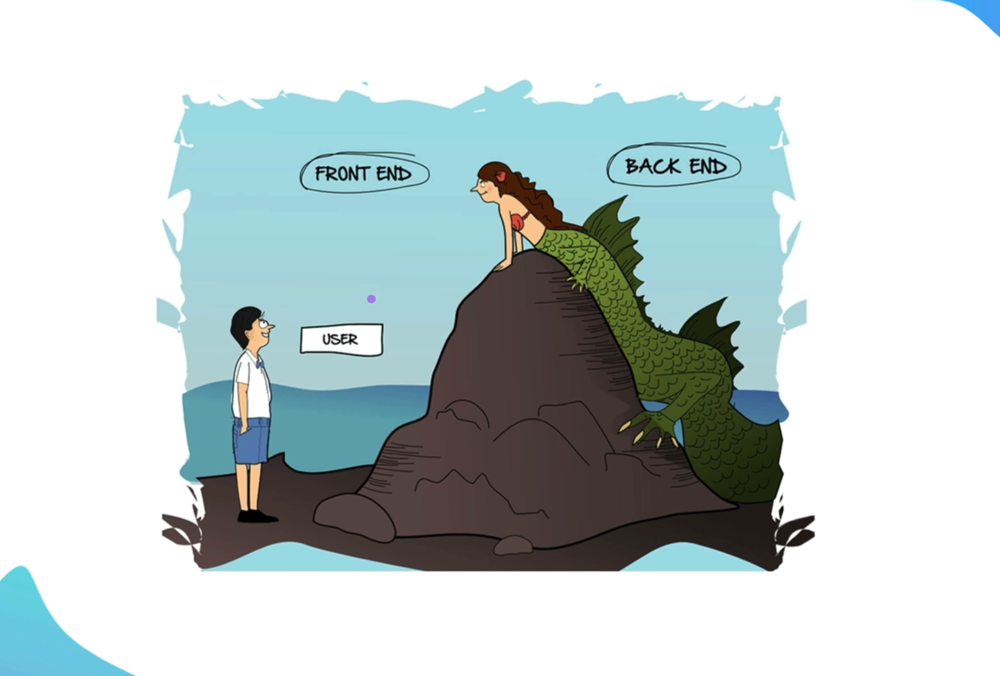
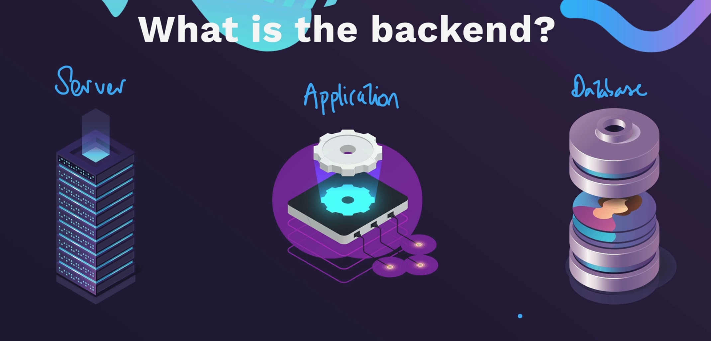
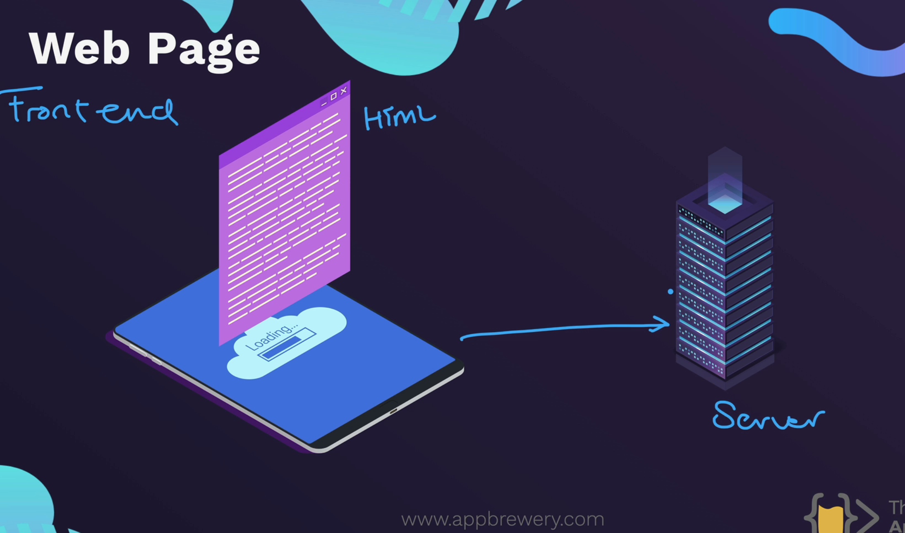
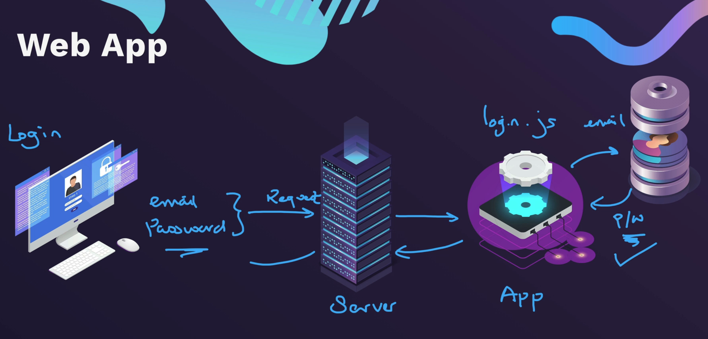
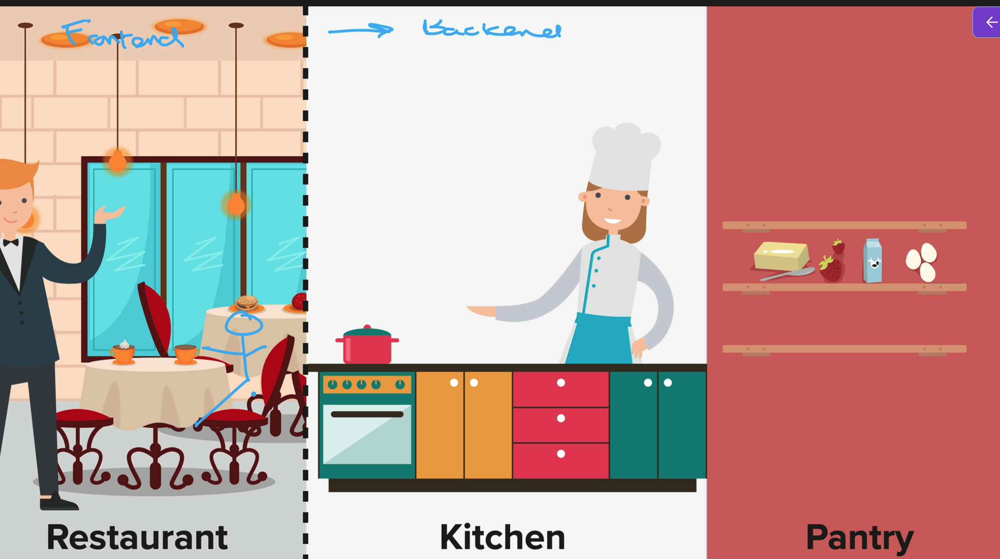

a 

What is Backend?

Server: It is just a computer that runs your website 24/7.

When we build anything, we make a local server.

Application : It is a logic that runs on the backend.  Also how you would like to Respond to the Request from the browser. 

What is 404 Error Page: It is telling the Browser that the request in invalid. 

Database : How to store Data, we have to use database. 

The Front-end talks to the Server to serve any data requestes or any information to be displayed. 

This is a Web app flow. 

Now, this is just an illustration on how the flow works on any web application.

Firstly, lets say we have created a login page on the fron-end. The browser will take that request and send it to the server.
Server will communicate with the application layer to see how to check if the user login. It usually have a logic.
Then, if we have created a database to store user infomration, then the application will match the records from the database to authenticate the user's credentials.
Then, the application responds to the server and server get back to the front-end to display the information.

