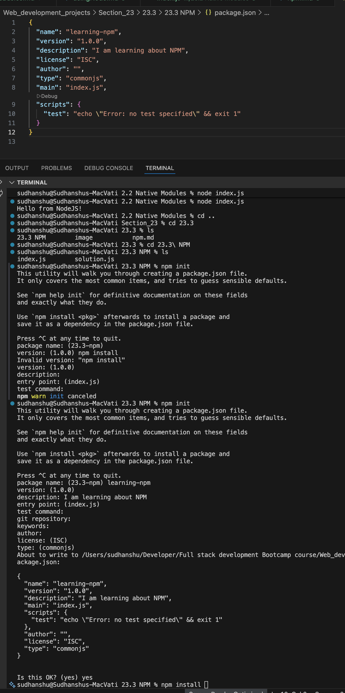
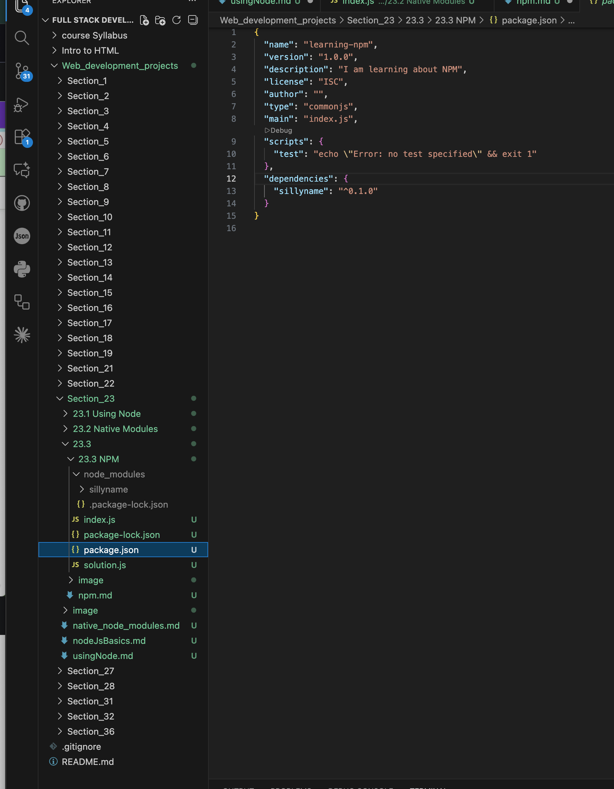
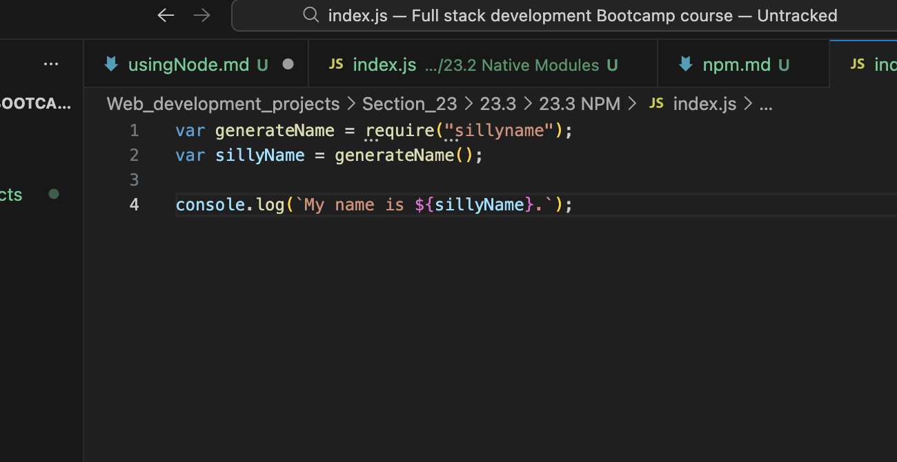
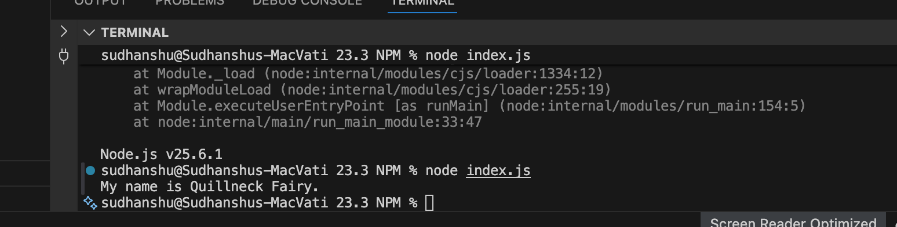

se

---

In order to inilitize NPM?

-> npm init

---

In order to install any package, you can use npm -i sillyname

-i stands for install.

When we install any external package:

These folders get created by defualt :

You can install many packages in one go by leaving spaces.

---

As you can see that you have used someone's else library to import the functionality and use on your application.
