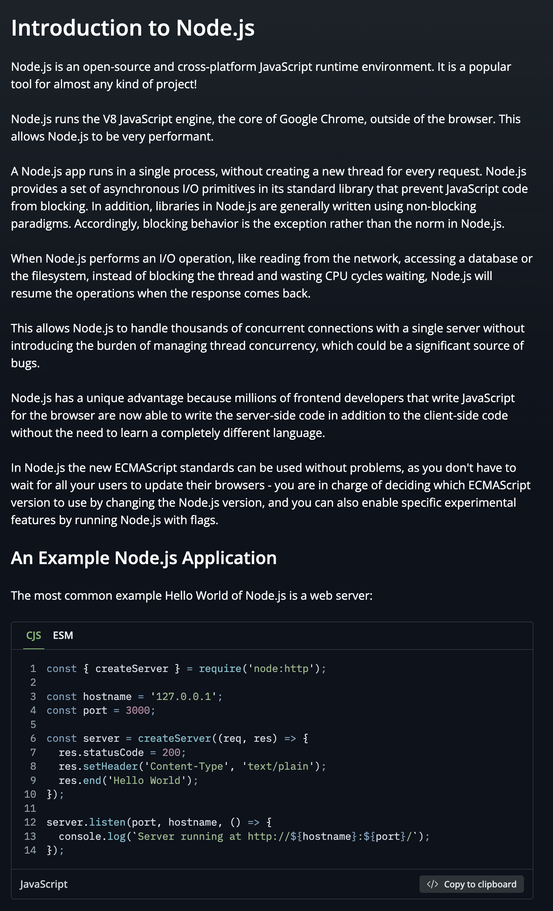
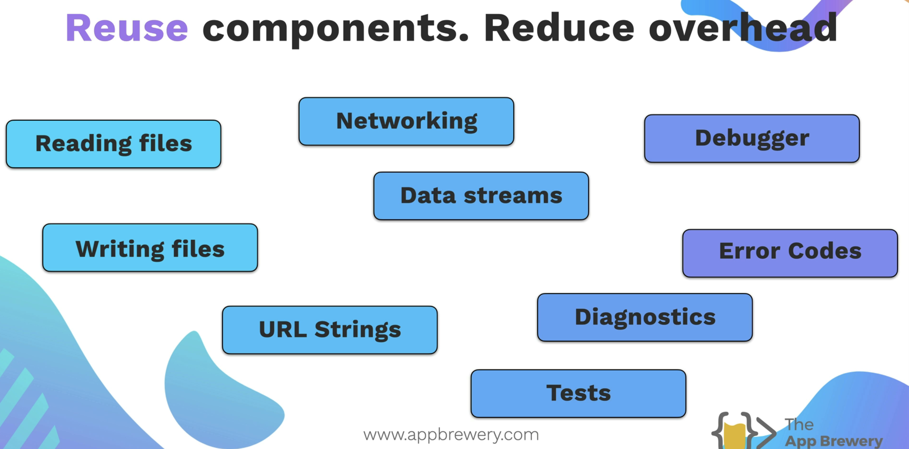
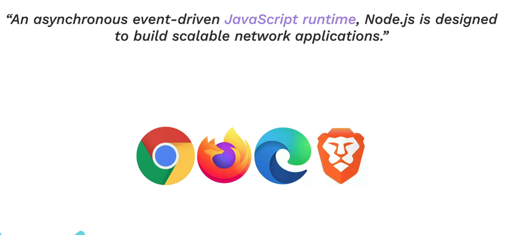
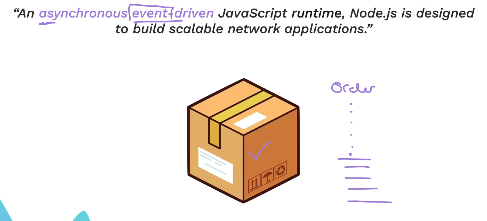
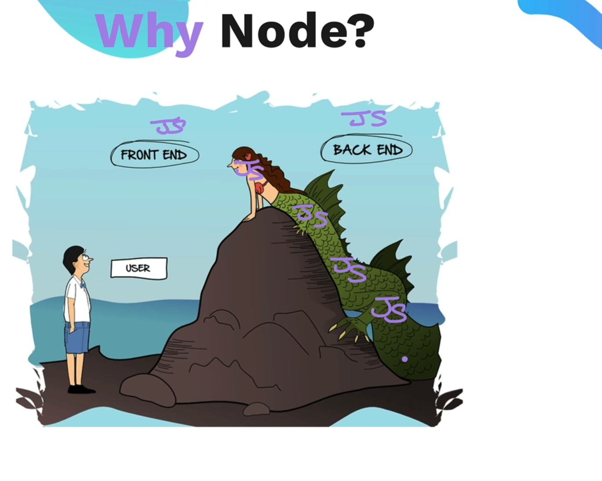
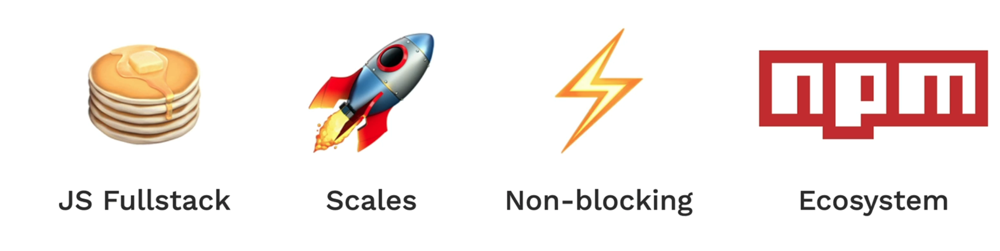

Node JS

What is Node JS?A

We know that we need Backend to build lodics for our application and we need a platform. Node JS framework provided

Shown in this example: Framework acts like a Mayonnaise. We can use market sauce in the sandwhich or create everything from scratch.

Framework provides these functionalities without use writing code from scratch.

Node : 

Earlier, JavaScript code was locked inside the browser, but when Node.js came in, we were able to unlock JS out and use it for different purposes, like server rendering, client-side rendering, and so on.

What does asynchronous mean? For example, if you go on an Amazon website and you order something and you successfully place an order, you would have to wait until the order arrives if you don't use an asynchronous function on the website.

Asynchronous functions used on the Amazon website are event-driven. That means if you place an order, you can do any other things on the website. In the meantime, when the order is placed and delivered, it will run that piece of code.

Why Node?

One of the main features of why we use Node as a framework is that, for the frontend, we can use JavaScript. As well, for writing any backend logic, we can stay on a single language to make our web application work. We do not have to switch any languages.

 It makes it easy for the developers to transition from front end to backend as they are using only one language, JavaScript in this case.

NPM: Node Package manager

 
