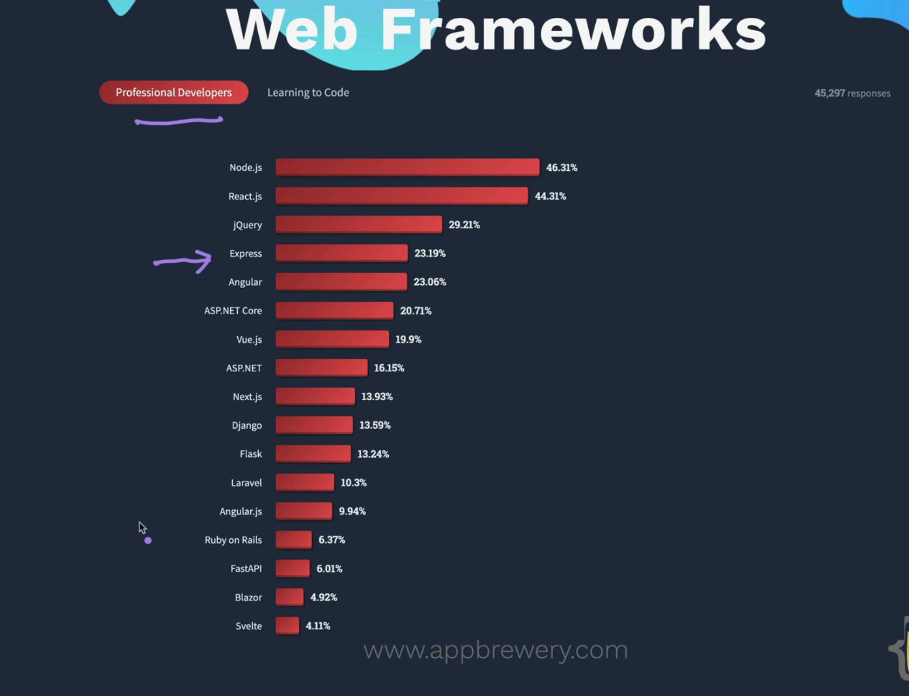
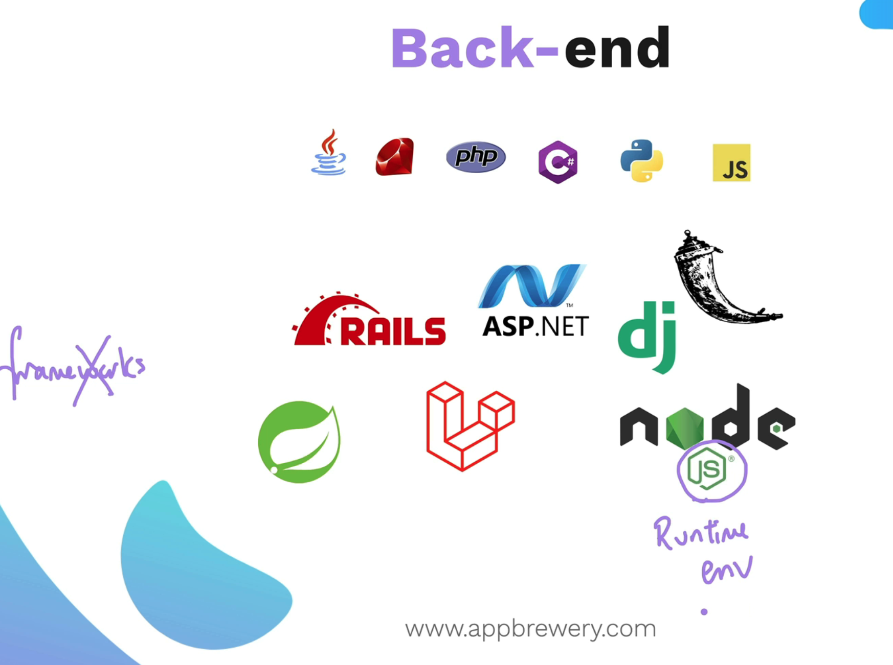
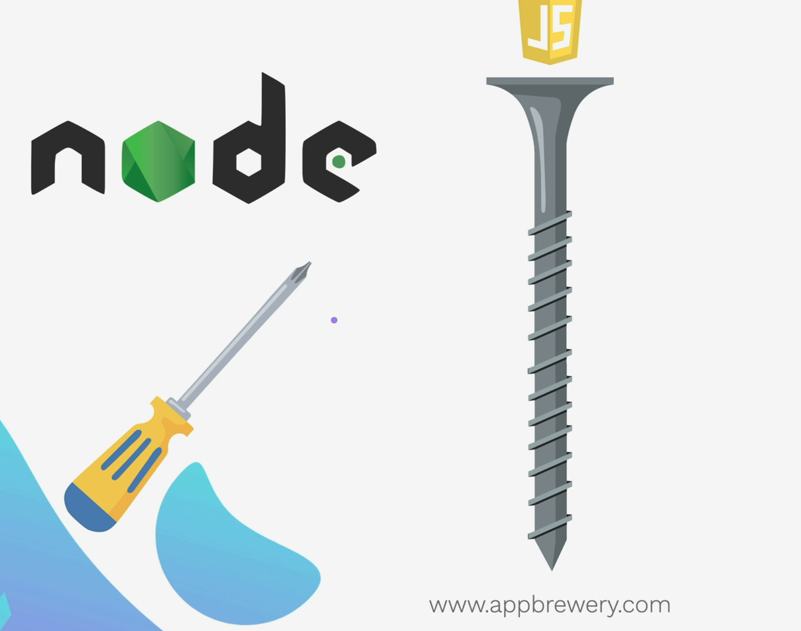
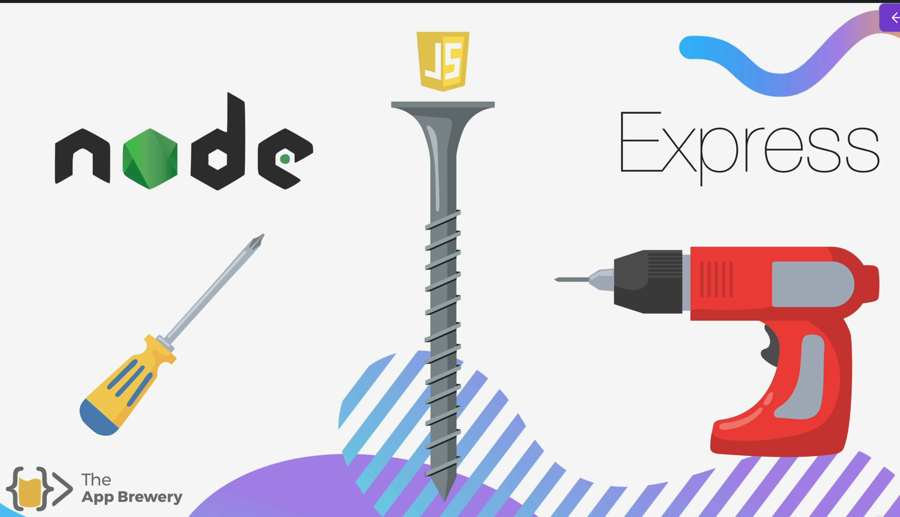
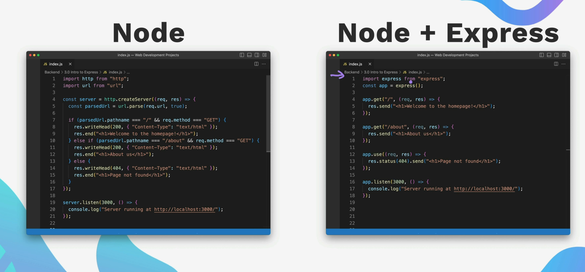
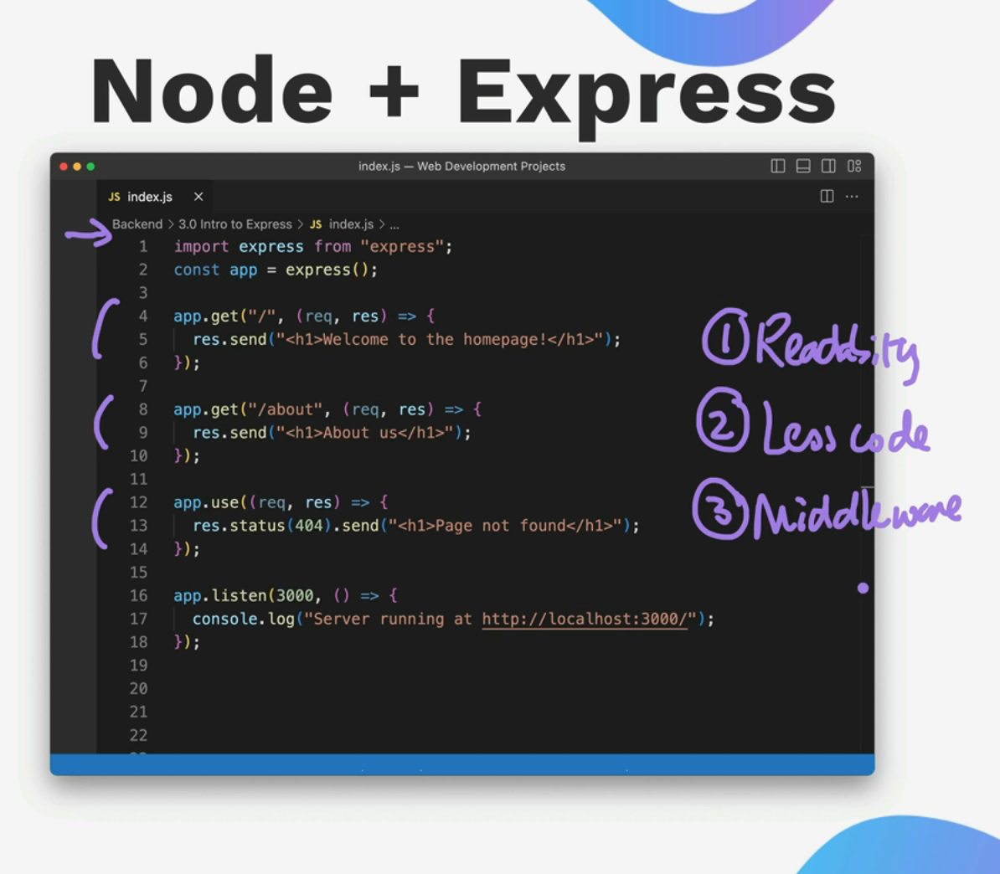
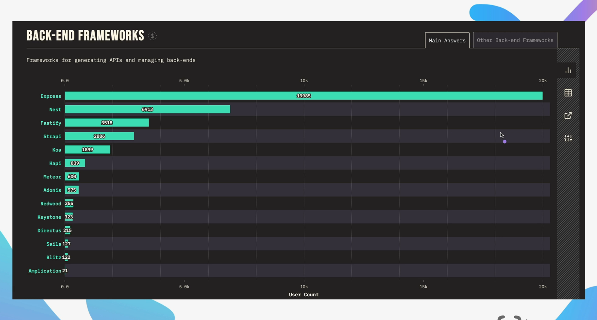

 What is Express Framework? 

The Express Framework has been created on top of Node.

If you go into the details of Node.js, Node.js is not a framework. It is more of a runtime environment.

The runtime environment provides us the environment to run the JavaScript on our computer.

On the other hand, ExpressJS is a framework that allows us to write backend code for any web applications.

---

What is the need of ExpressJS now?

We can use Node in order to build web applications; however, you can also use Node to build IoT products.

You can also make products out of Node. One of the products that we use daily, VS Code, is built on Node.

It is the node that allows us to run the application VS Code.

ExpressLabs acts like an electric screwdriver, which can be helpful to build any application quicker than using node.js.

For any web developer (let's say a full stack developer), they prefer to choose Express as the backend, as it goes well with JavaScript and helps us to write readable code, less code, and also add middleware.

