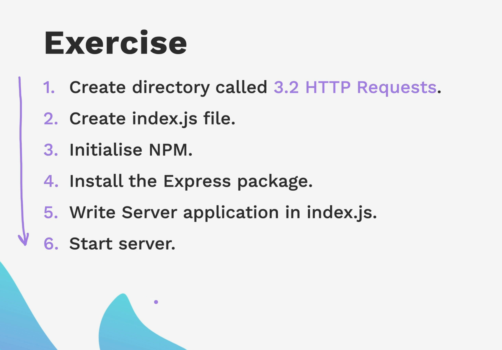
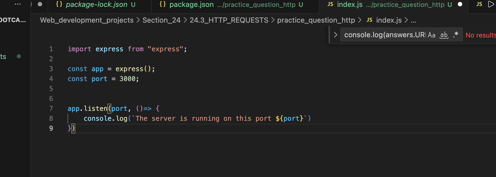

It is basically a language that allows computers to talk to each other.

For any computer to talk to each other, they need the hypertext transfer protocol.

We make a request, and on the basis of the request, the server replies to us. It can reply to us or not. 200 means success. 404 is usually the not found error code. There are many more error codes, and this is how we can know what the exact error code is in order to troubleshoot better.

The HTTP request usually consists of these methods:

GET is the method that is used when you want to request any resource from the server. This could be a.html file or the data on the server.

Post is used to send any resource to the server. This could be a piece of information, or you want to send any email or the password to the server.

Put and Patch are similar. They are both used to update anything. They are usually used to replace any resource on the server.

Patch is something that when you want to patch up any resource.

Let's say you want to get a bicycle from Amazon, and one of those tires is broken. When you want to tell Amazon that the tire has been broken, they have two options:

1. Just replace the whole bike.
2. This path option, where they can just replace the tire which is broken.

Delete is just a resource that is being used to delete any data from the server. If it is saved on the database, then it will be deleted on the database.

When we run this index.js file on the local server, you will get this "Cannot get /" error, as we have not mentioned in the index.js what it needs to get. In this case, for the home page, we need to mention the path of it.

In this case, when the app requests any GET request, it goes to the path that we have mentioned and then opens the information that we need to display on the home page.

---

Now we are going to do an exercise. Below are the steps that we need to do.

We are done up till this point, but we will still get an error when we open the URL of the server as we need to map the direction in which we have to guide the application to open the page when the user is on the home page.

We are going to use app.get method in order to do that.

We have to make sure that we stop the server and re-run in order to see the page loading up.

How to close the port.

When we request our application to go to that page when we open the server, in this case it is the Home Page. the browser sends the request to the server, and since the server is already running and listening and it knows how to handle that GET request. It prints "hello world" on the browser

---

you have noticed that whenever we make any changes to our code, we have to stop the server and re-run it in order to see the changes. NodeBan helps us to make the changes in the code and show and reflect the changes on that local server right at that very moment. It is basically a live server.

You can use nodemon "index.js"

if you like to create more pages like /about, then we have to create a new method app.get and display that information when the user goes to that particular page.

Now we are going to create more pages. /about and /contact pages on our index.js page.

---
