Postman Basics:

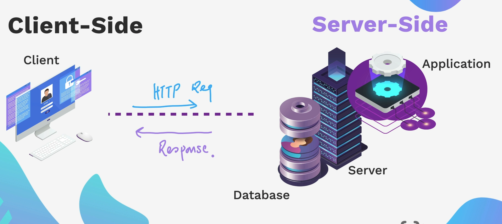

---

What is 404? It is basically a client side error code.

HTTP status codes:

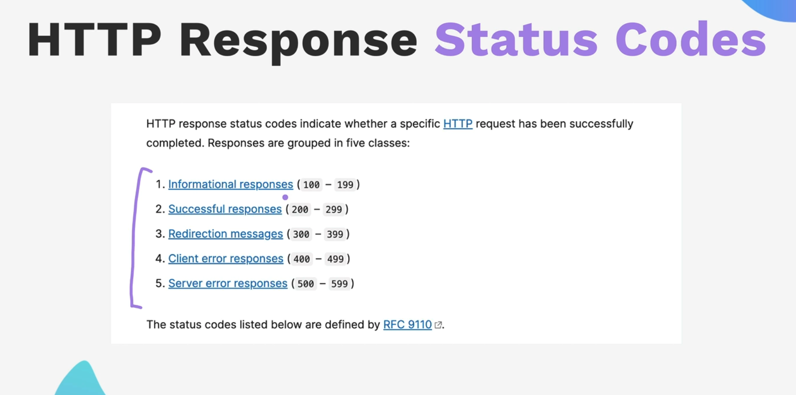

[developer.mozilla.org/en-US/docs/Web/HTTP/Reference/Status](https://developer.mozilla.org/en-US/docs/Web/HTTP/Reference/Status)

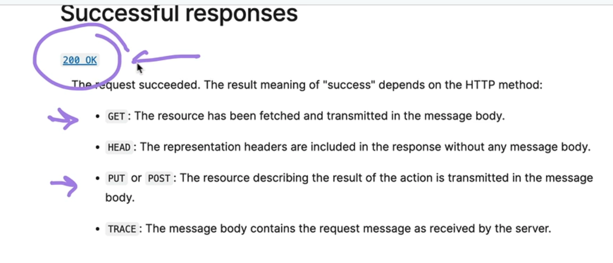

---

Error Code : 301

The redirection code is usually 301 when the original domain has been used and it is redirecting the user to the new URL. You can try this by typing Google without an e (e.g., godol.com). When you go into Inspect and check the Network tab and preserve the logs and try this again, you will see that there is an error code 301. This means that it is directing to godol.com, which is the original link. In this case, Google has already bought the domain to godol.com. That's why it is able to redirect it to the right, correct URL.

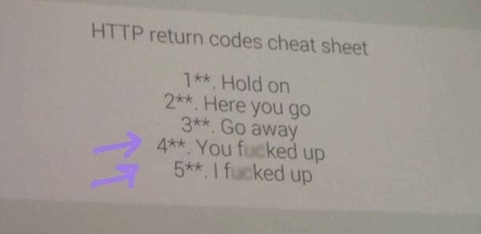

This cheat sheet tells you how to remember the HTTP return.

- If there is any error code from 1 to 199, it says, "Hold on," which means it is just giving some information.
- When you see 200, it is basically success.
- 300 is basically "go away," like redirecting the user.
- 400 would be that the client might have screwed up somewhere.
- 500 is the internal server error, where the application might not be working, or there could be anything wrong with the server which is causing this error.

---

FORM request

You would like to create just the backend, not the frontend, like the UI. You test it on Postman in order to check if everything is working properly.

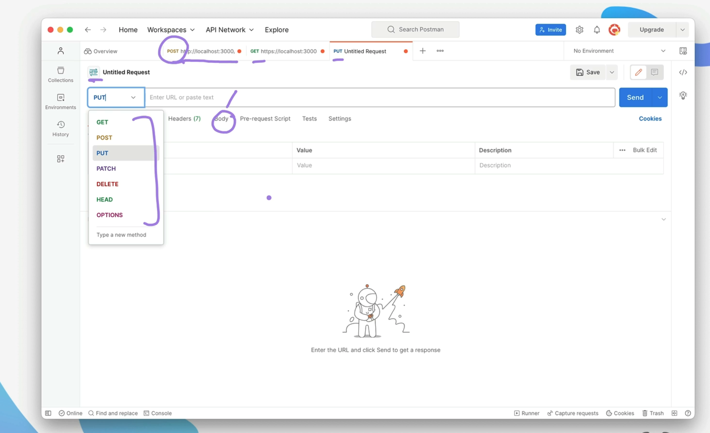

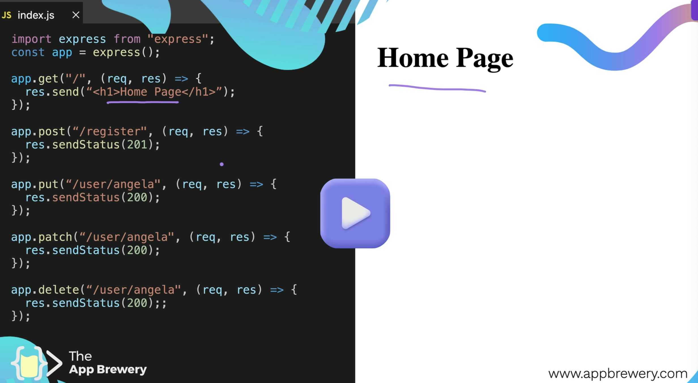

---

Postman: 

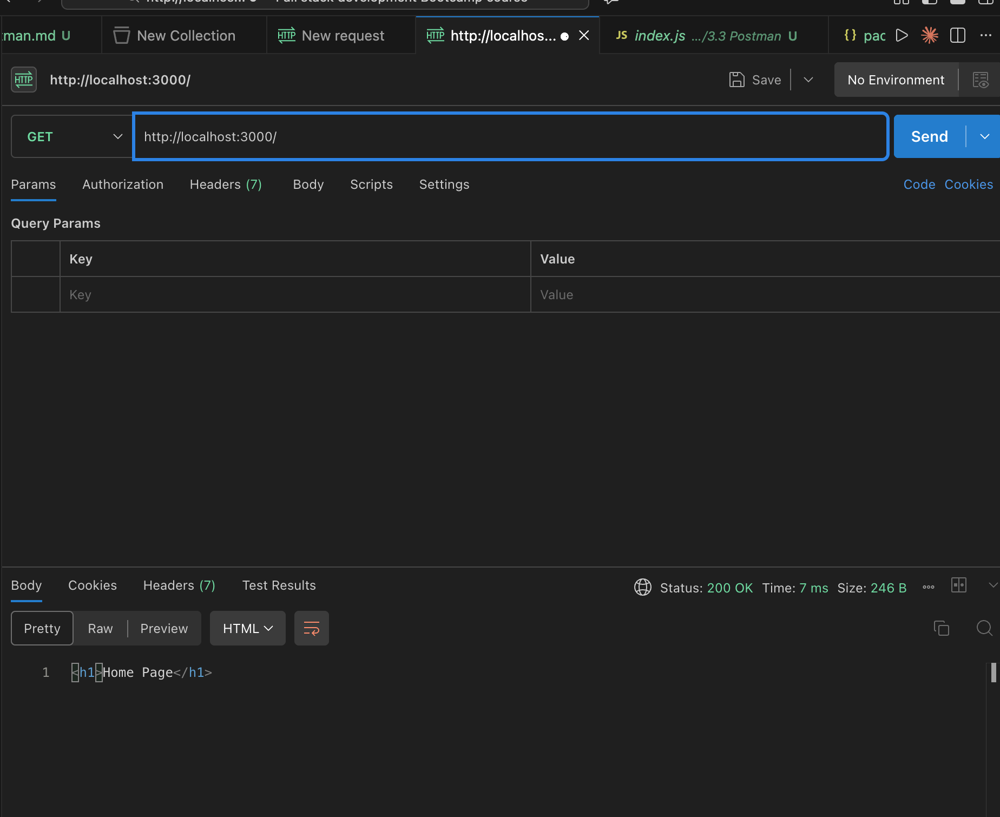

here, filling any form, you need to make sure that you select the POST method and type the URL in this case: localhost:3000/register, and then try to send any value. As you can see, the error code, the successful status, is 200, and we are able to post it successfully. That means this is working completely fine

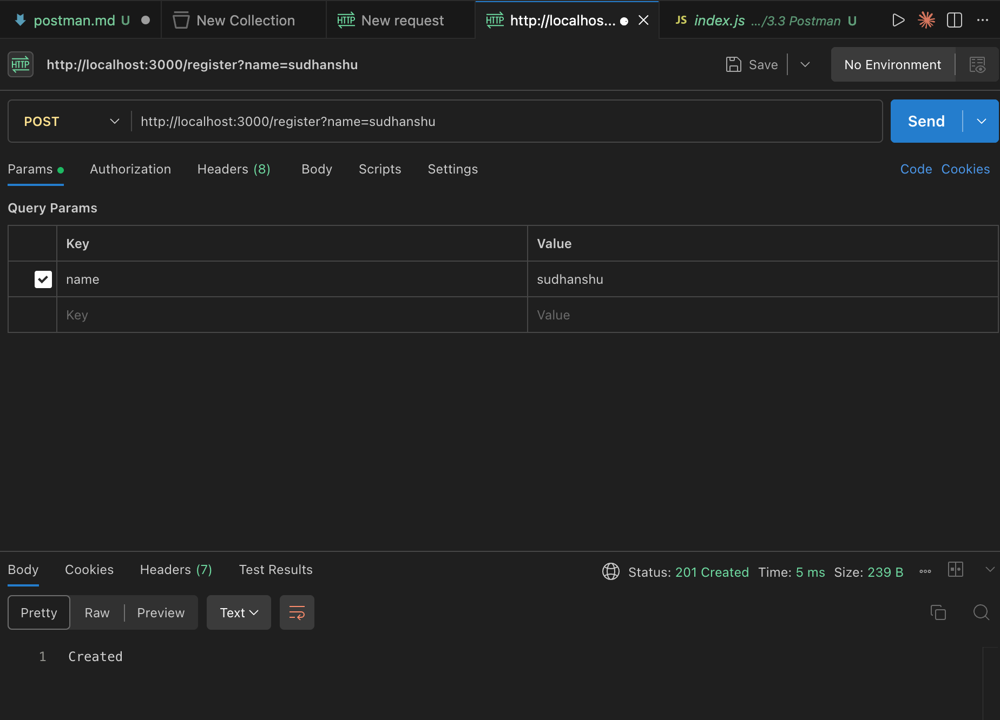

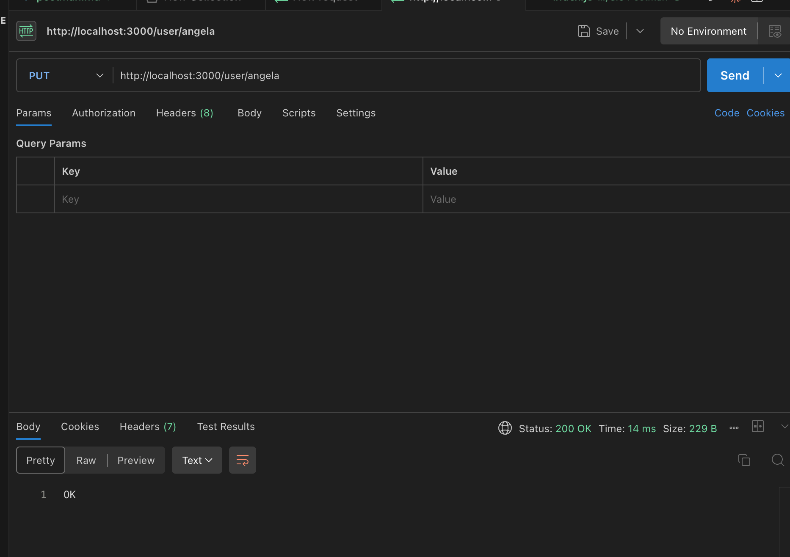

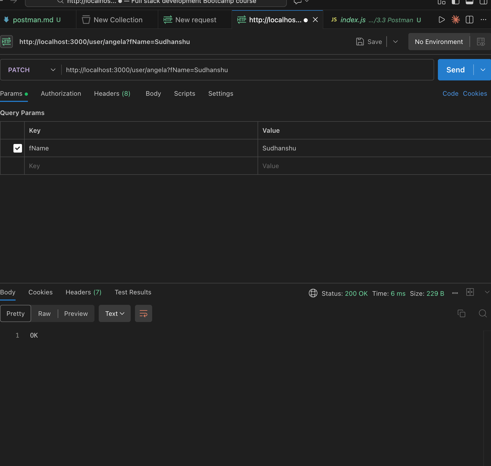

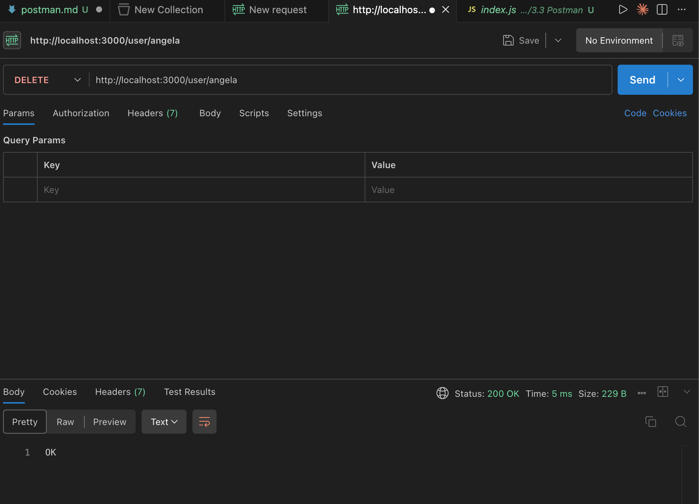

Postman helps us to make sure that we are able to test our APIs. In this case, we tested all the HTTP methods and made sure that every method is working and we are able to perform every operation on the backend. This helps us to successfully test every backend logic.
