---

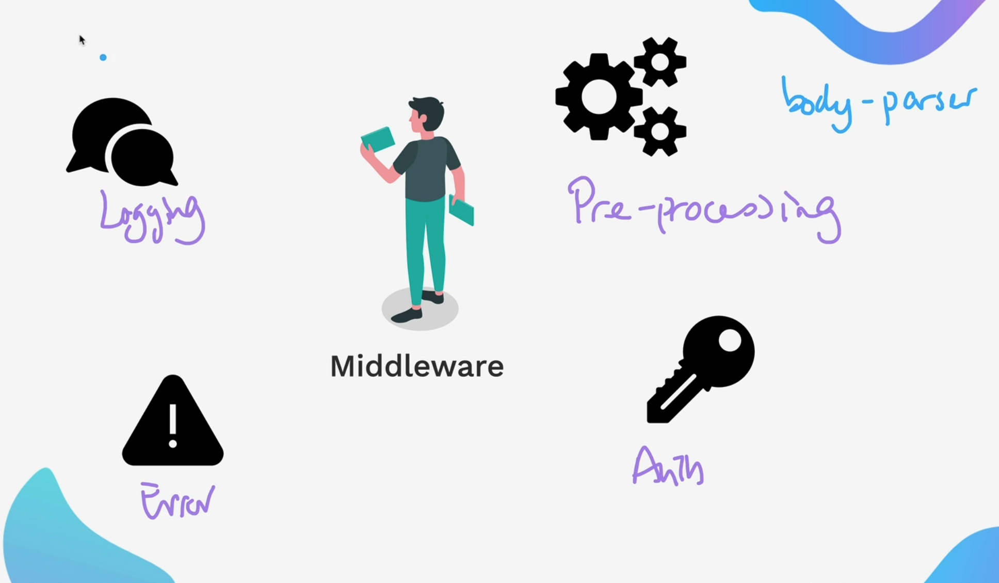

We have seen Body parser in the pre-processing.

Now, we are going to see logging type middleware.

One of the famous package used inside 

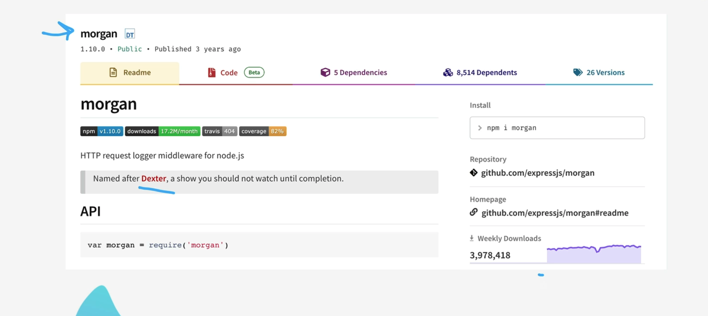

This library is used to just log the logging information that is being made on the server. It records everything.

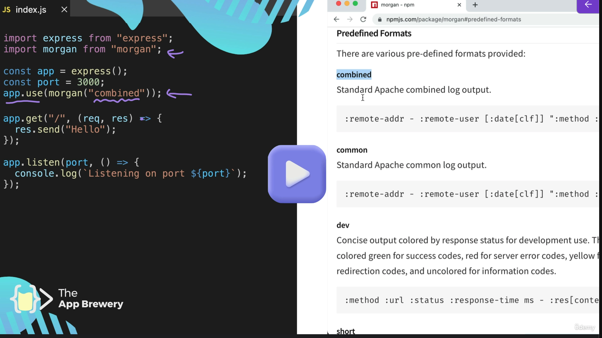

You can use this library Morgan using `app.use` by creating that middleware. You can also go further and read the documentation through this link mentioned below, and you can go as much into detail as you want.

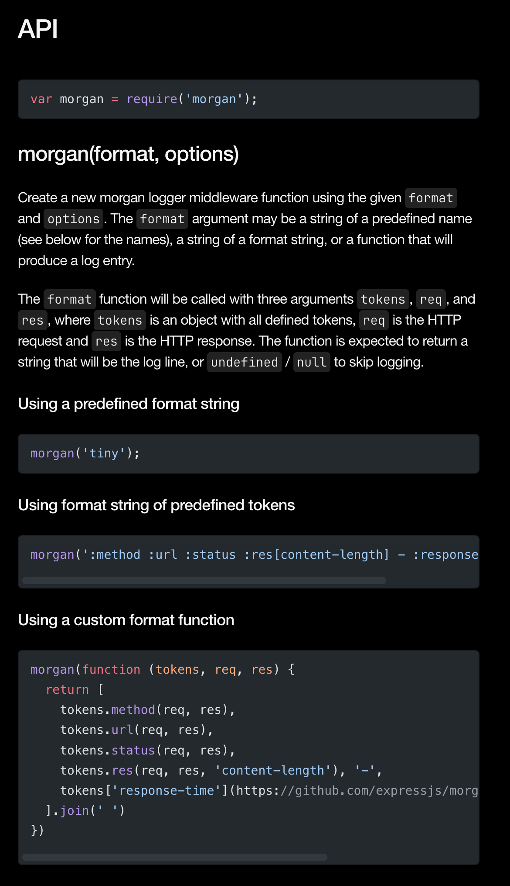

[expressjs.com/en/resources/middleware/morgan](https://expressjs.com/en/resources/middleware/morgan/)

Also, the middleware will always get triggered before any request is sent to the server. In this case, when someone tries to print hello on the homepage, it calls that function `app.get`, and before that, the `app.use(morgan)` middleware has been triggered already.

---

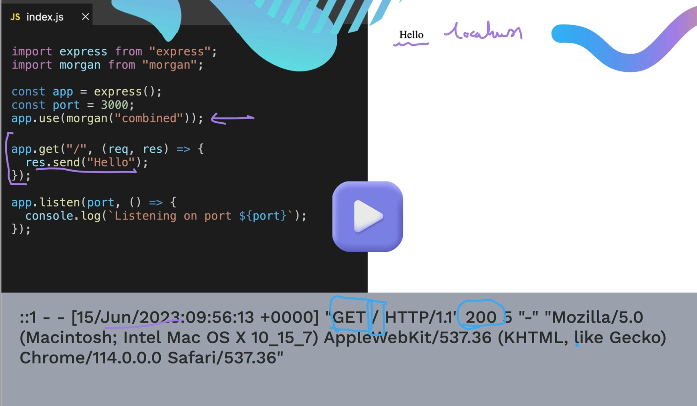

---

Exercise : SOl

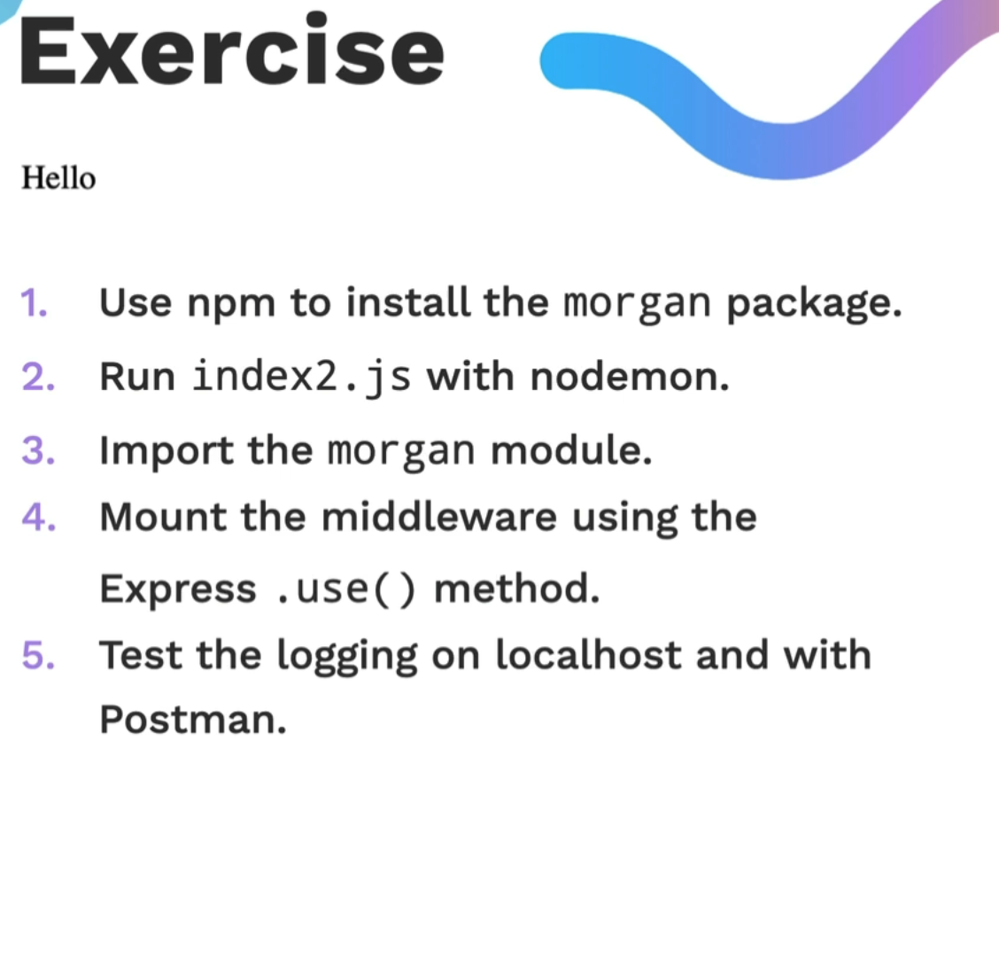

Solution : 

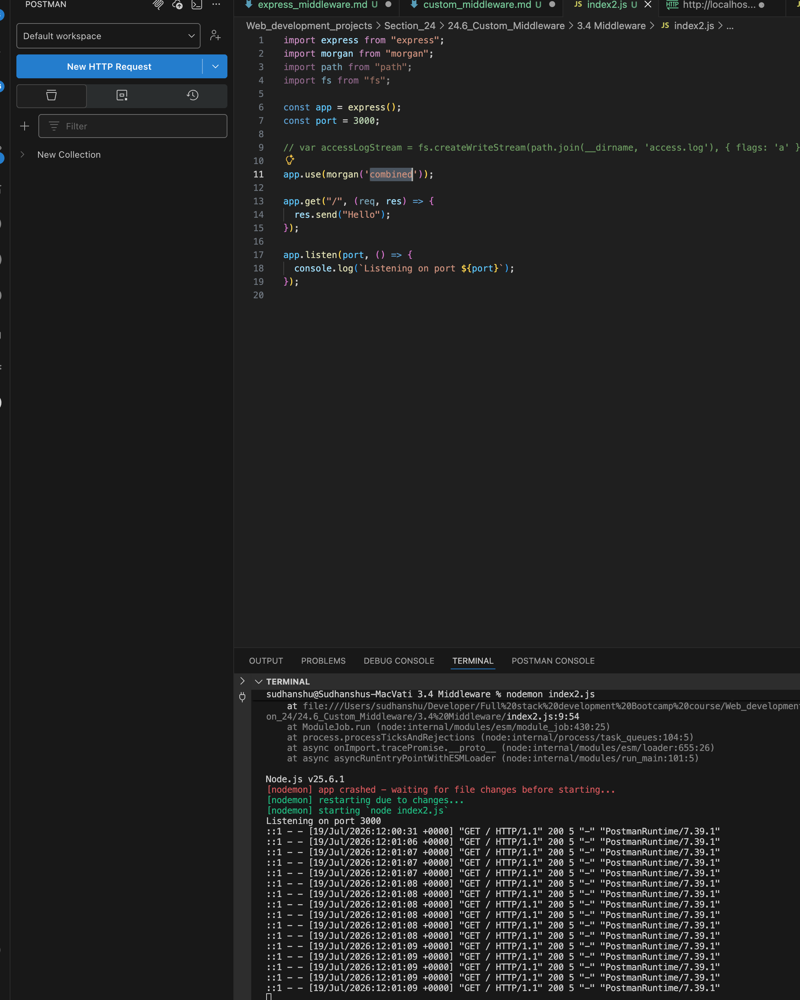

Postman logs: 

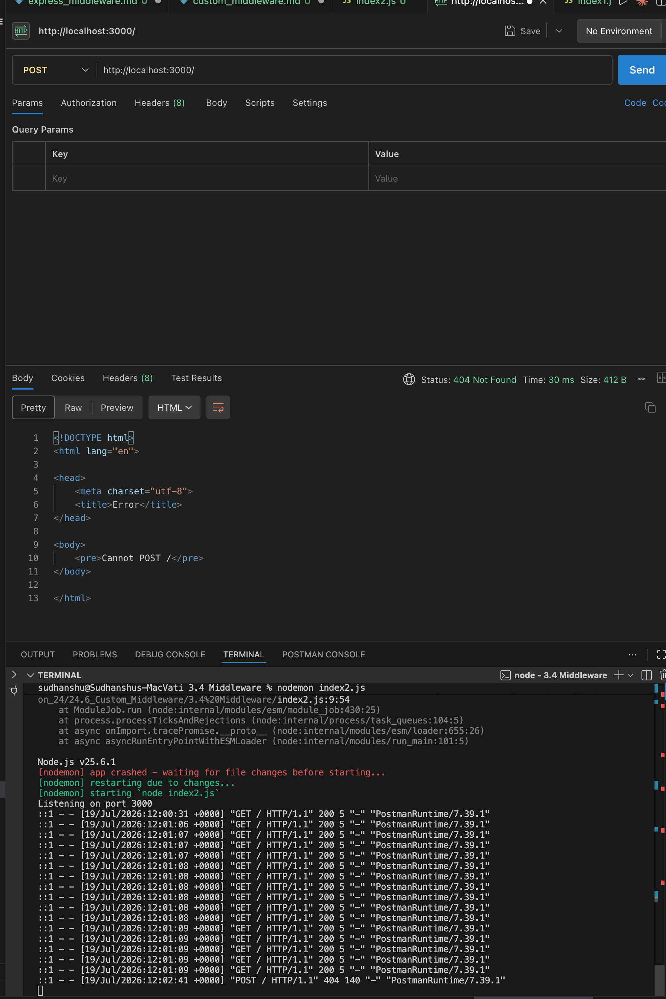

---

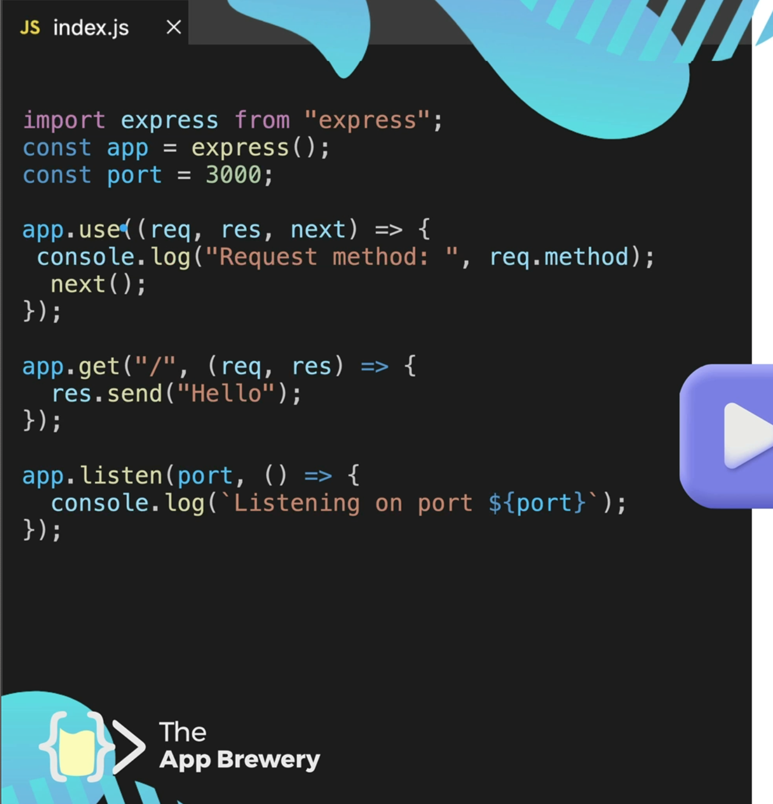

This middleware has req,res anmd next functions.

The next function is used when we want to add more middleware. It basically tells that particular middleware to hop on to the next middleware before going to the server and making any request

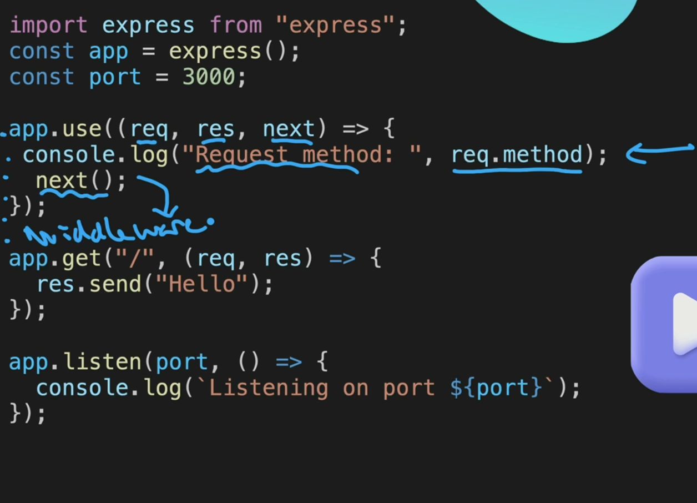

the next function is also important. Just in case, if you have a second middleware, you need to mention the next. If you don't, then it will never reach the next middleware, and your application can crash since it won't. It will just hold the information that it has, and it will never pass it to the server from the client.

---

Exercise: 

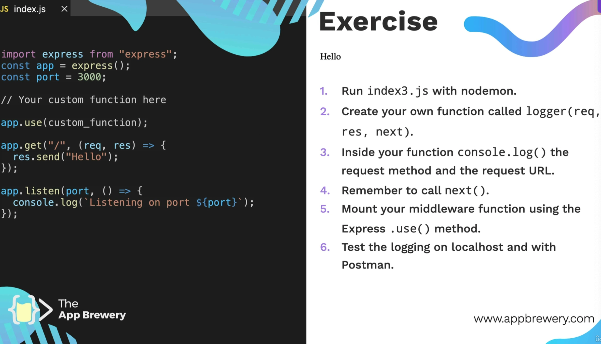
