**Introduction to Version Control and Git**

What is Version control?

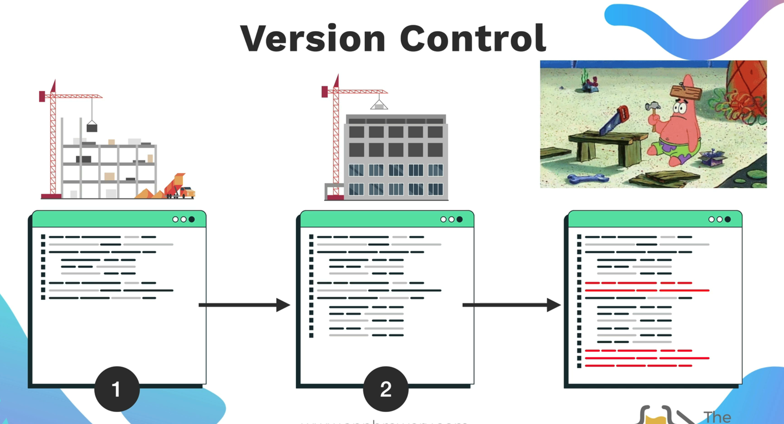

**[Git](https://www.geeksforgeeks.org/git/what-is-git/)** is a free, open-source **distributed version control system (DVCS)**= It tracks every change made to a project's files over time, allowing you to record, compare, and revert to specific versions at any point.

---

**How to create Git Repo**

1. How to initilize the GIT :
   git init

   This will created .git folder.
   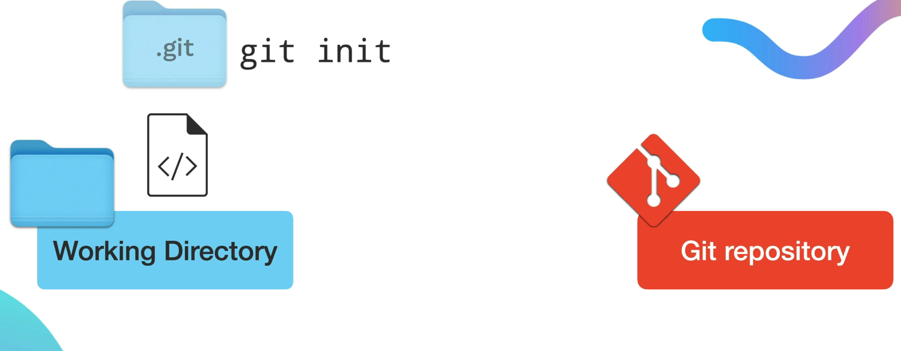
2. Then we are going to put the files into the staging area
   In order to see the files, we can use the cmd -> git status

   For example: If would like to add a particular file, I would use
   git add test.txt

   Example:
   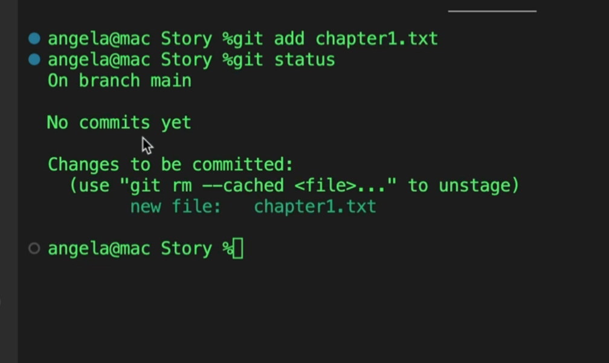
3. Then we commit the file :

   Commit helps us to track the changes we have made in the files.

   CMD :  git commit -m "Complete Chapter 1"

    In order to view the commits that you have made
	You can use the cmd. : git log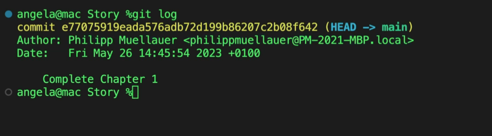

4. You can use git add . to add all the files that needs to be staged.

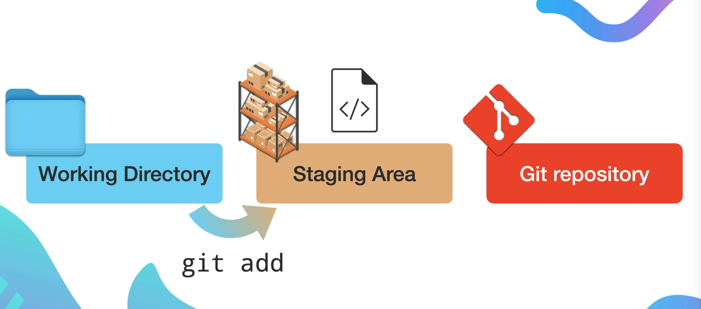
Staging area helps us to see what files we would like to commit or not commit. 

In Git, the **staging area** (also known as the  **index** ) is  =an intermediate space where you prepare and organize changes before permanently recording them in a commit= .

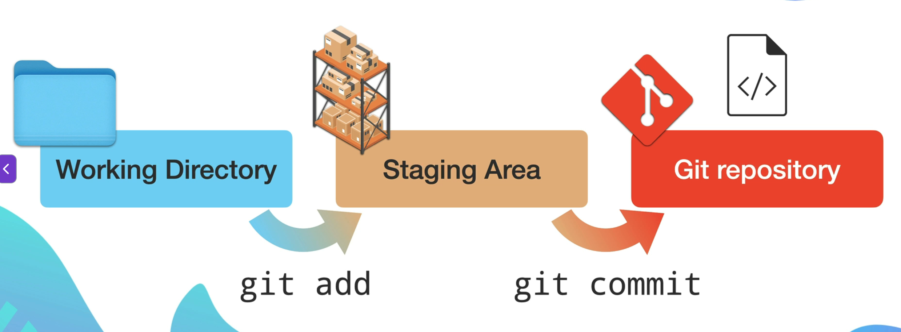

git checkout : The `git checkout` command is  a versatile tool used to navigate between different versions of a project.

git diff filename : To view the changes of the files from the previous version to the current version.
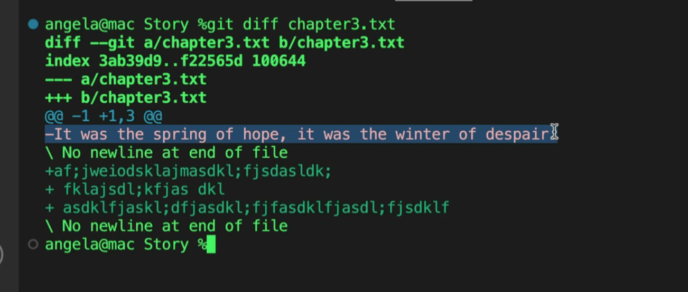

Now, in order to get back to previous committed file on git.
We can use the git checkout filename and it will revert back to the previous committed file. 

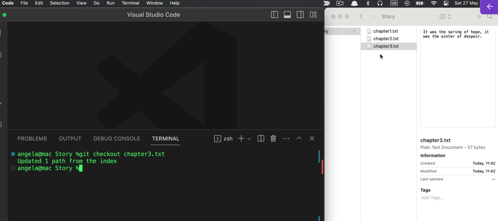

---

What is Github? 

GitHub is a cloud-based platform that acts as a hosting service for Git repositories, enabling developers to store, manage, share, and collaborate on code projects.

How to push the code to Github?
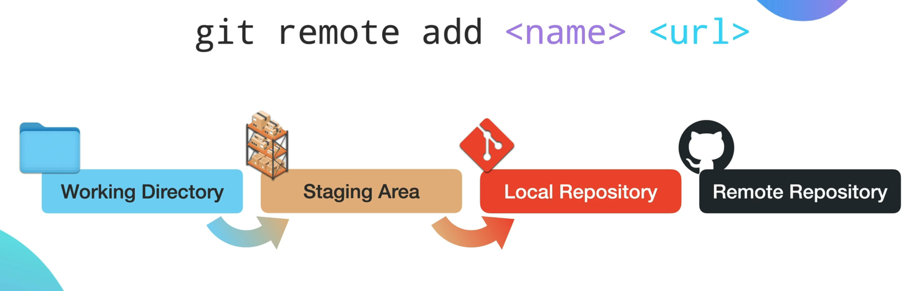

CMD : git remote add origin `<URL>`

origin : convectional naming

git push -u origin main

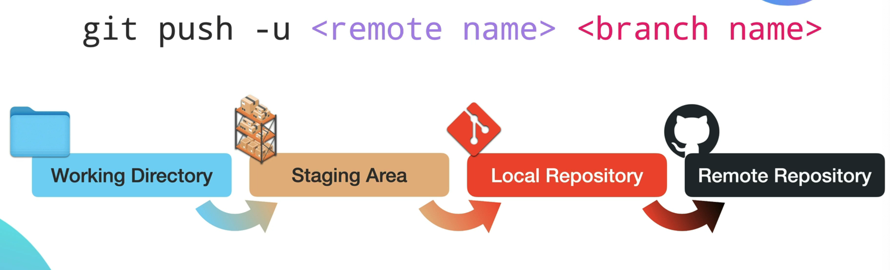

Now, we are going to push this into main branch. 

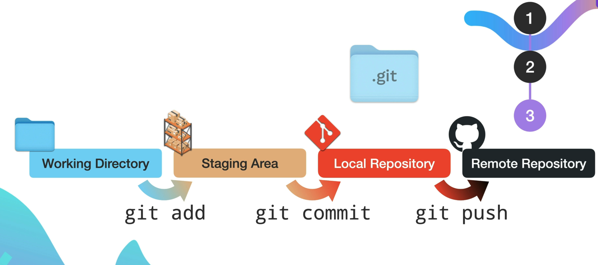

---

**What is gitignore?** 

A `.gitignore` file is a plain text file placed in your [Git repository](https://git-scm.com/) that tells Git which files or folders to ignore and not track.

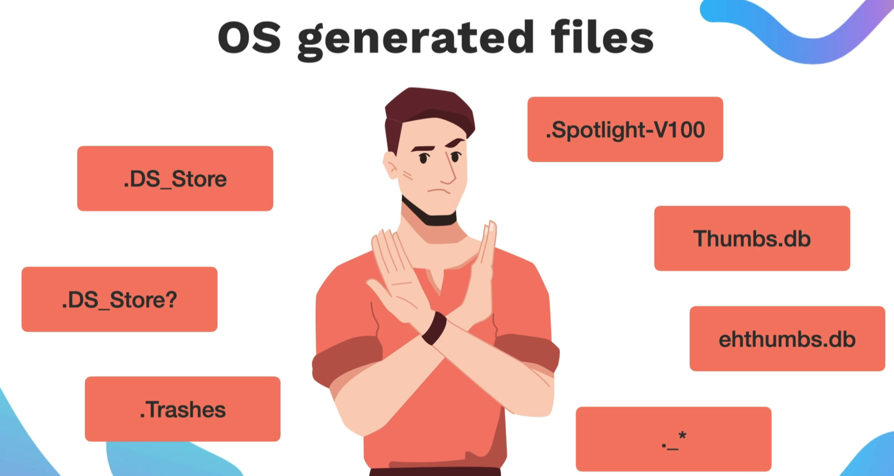

`.DS_Store` (Desktop Services Store) files are  hidden metadata files automatically created by Apple macOS in folders to store custom view settings, such as icon positions, folder background images, and icon sizes.

Premade gitignore files : [https://github.com/github/gitignore]()

---

**What is git cloning?**

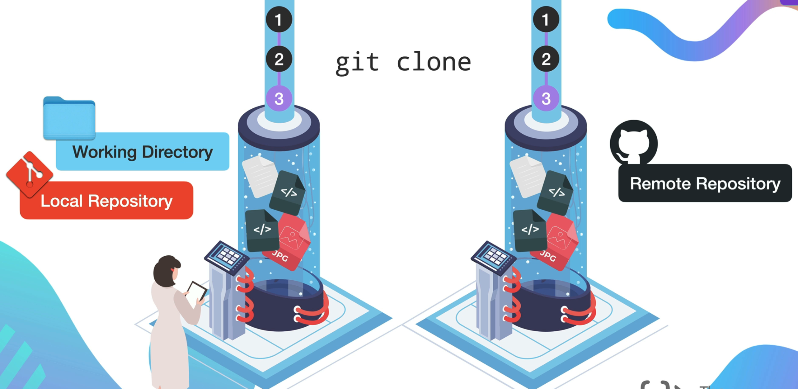

git clone `<url>
`

You can clone these famous repo to playaround.

[https://github.com/MunGell/awesome-for-beginners]()

[https://github.com/clupasq/word-mastermind]()

---

What is Branching and Merging?

Branching and merging are the core features of Git that allow you to work on different parts of a project simultaneously without interfering with the main code.

CMD : git branch `<branch_name>  `
You can view the branches by typing git branch. 

In order to switch to the desired branch, you can use git branch checkout `<branchname>`

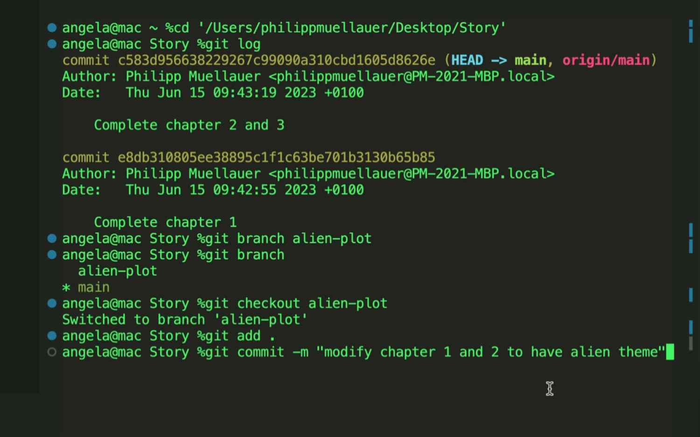

The asterik * sign tells you which branch you are on.

How to merge the branch to the main branch?

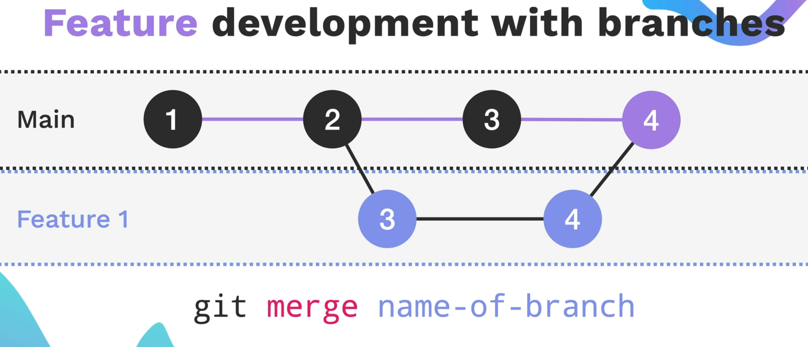

git merge `<branch name>
`

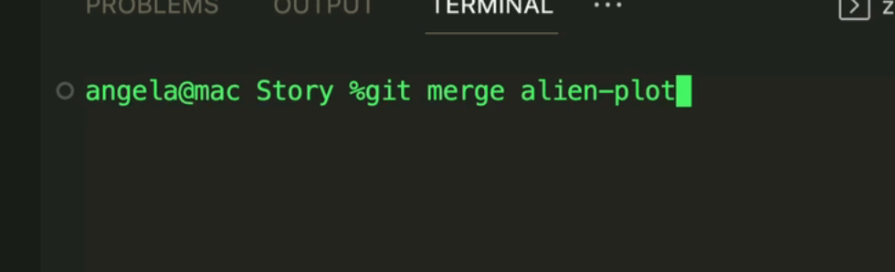

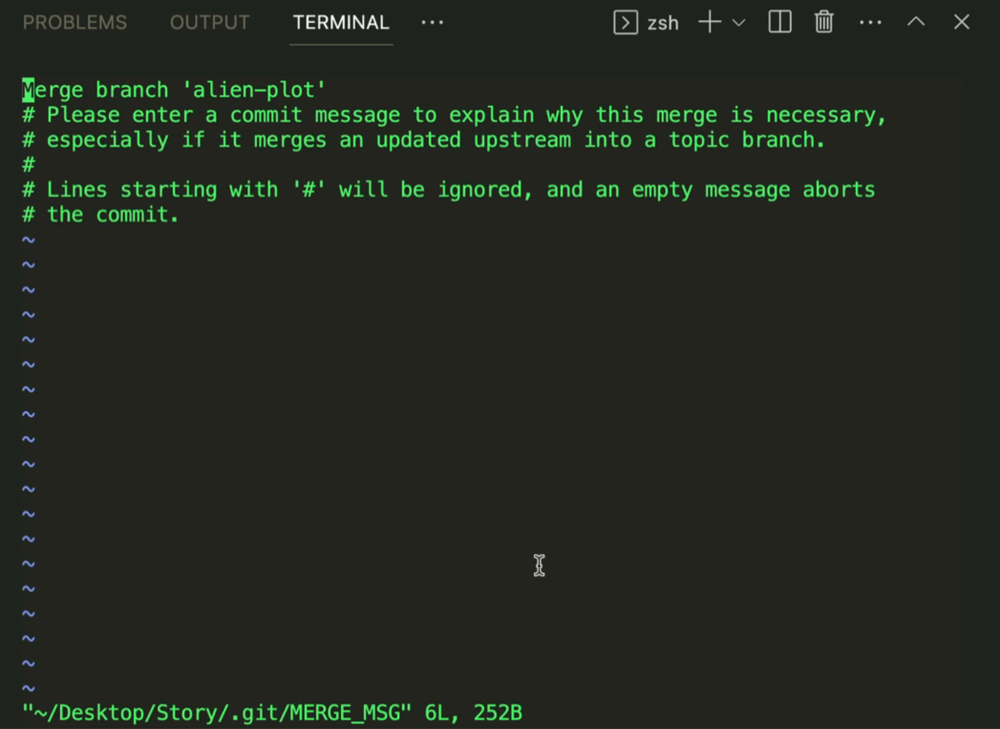

This is a VM text editor and you can use this to save any commit for merging the branch.

You can learn more about git branching from this game :

[https://learngitbranching.js.org/]()

---

What is Forking and Pull Requests? 

In Git and platforms like [GitHub](https://github.com/), forking and pull requests are the  =primary mechanisms for collaborating on projects where you don't have direct write access .

Forking

A **fork** is a personal copy of another user's repository that lives on your account. It allows you to experiment with changes, fix bugs, or add features without affecting the original (upstream) project.

Pull Requests (PRs)

A **pull request** is a proposal to merge changes from your fork (or a branch) into another repository. It serves as a discussion platform where maintainers can review your code, suggest edits, and eventually "pull" your work into the main codebase. 

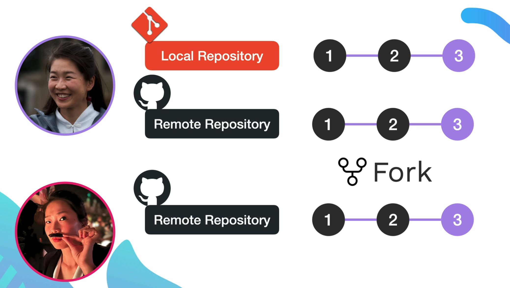

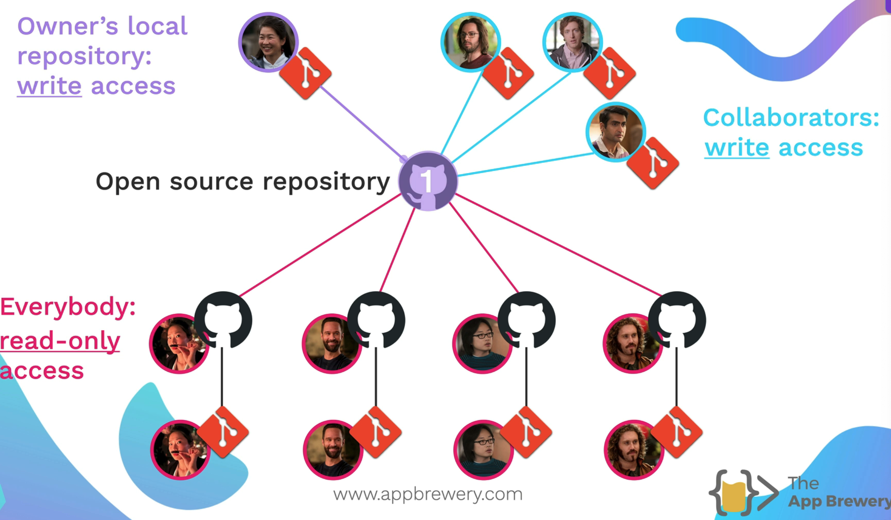

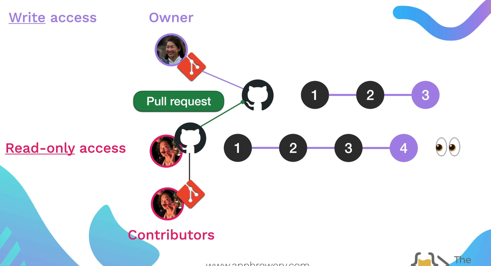

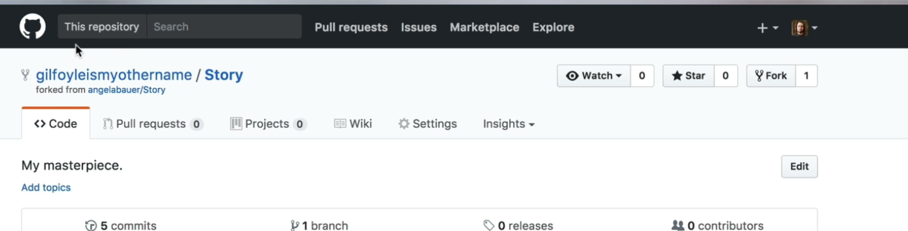

How to approve PR changes?

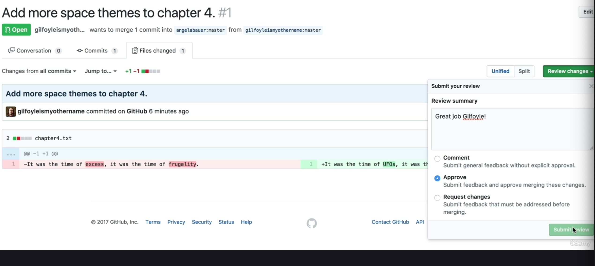
