**API**

What is an API?

It is Application Programming Interface. It is a set of rules on how different software interact with each other. 

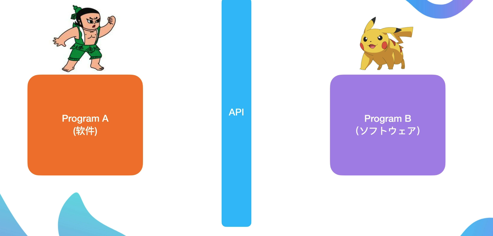

It is a bridge with different softwares. 

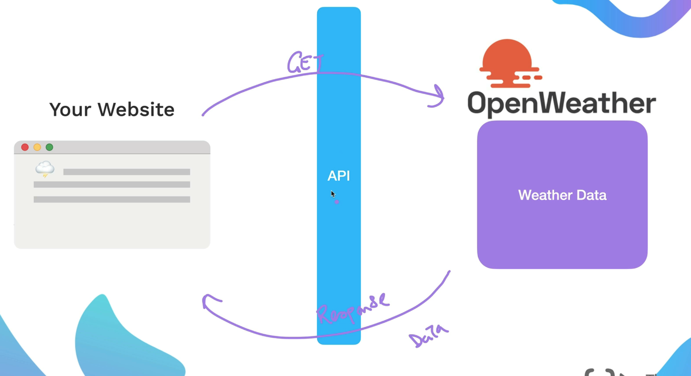

Few examples of an API's

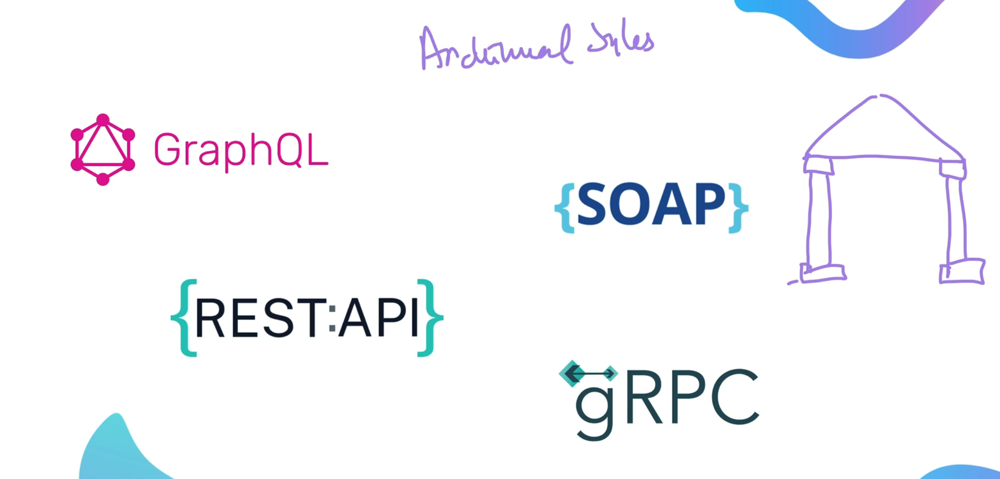

 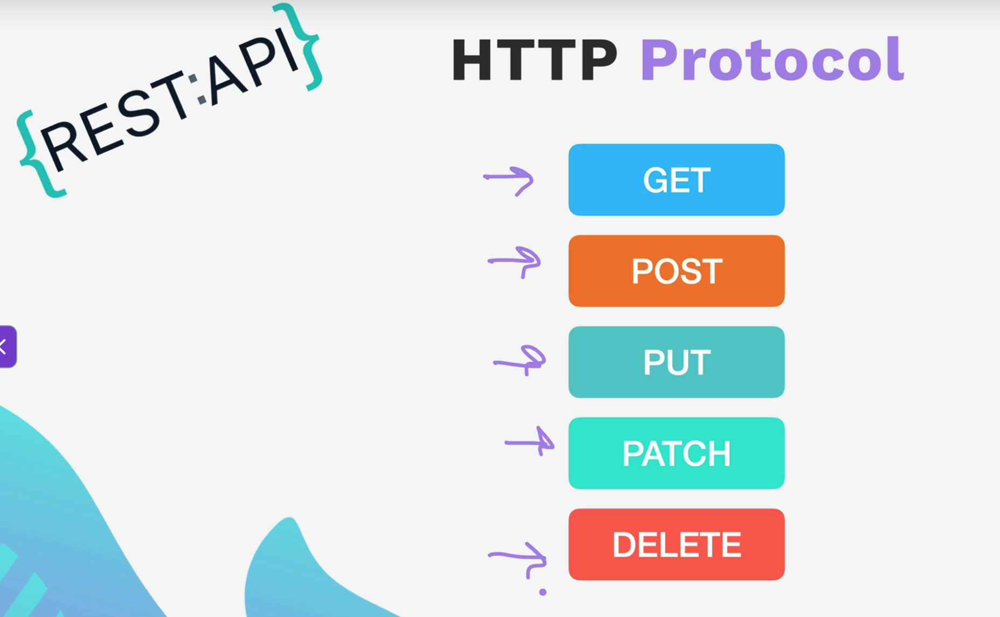

Exercise : Find out the location of International Space Station using the API on Postman?

*[https://wheretheiss.at/w/developer]()*

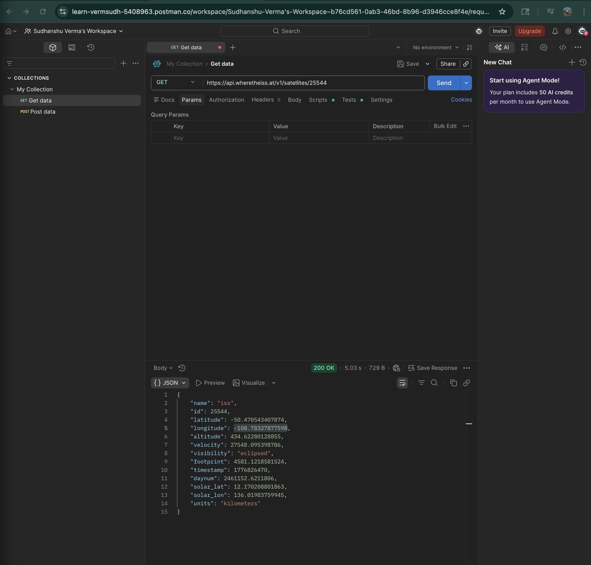

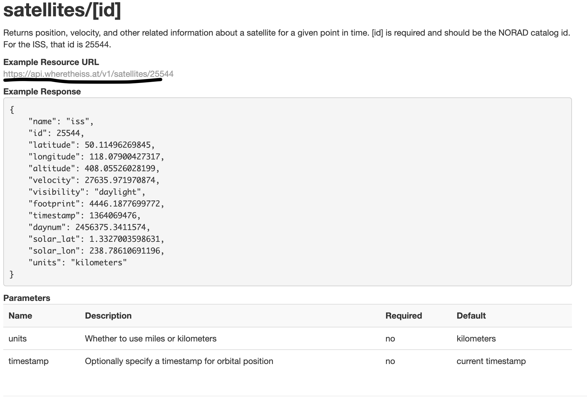

---

**Structuring API Requests**

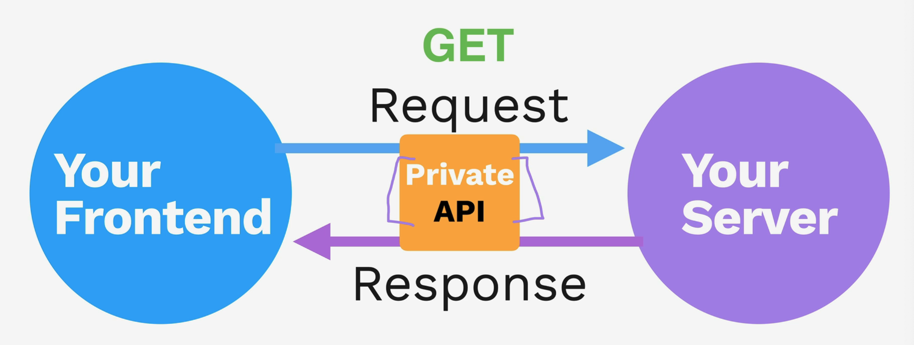

API endpoints

BaseURL/Endpoint

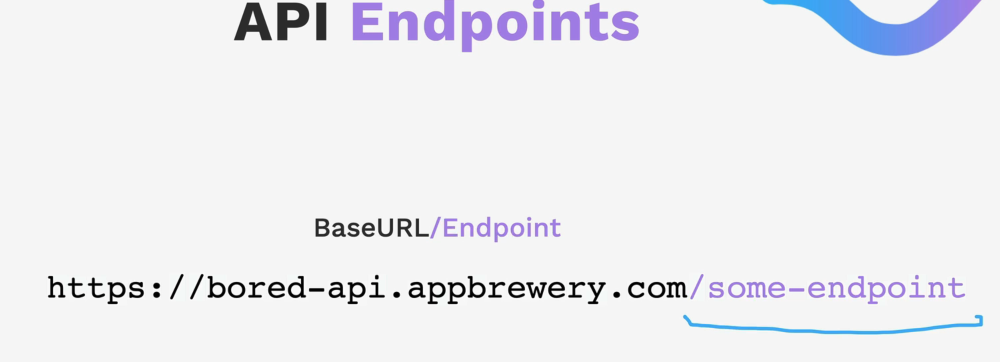

Exercise: [https://bored-api.appbrewery.com/]()

Visit this API documentation, and go to Postman to access the API's.

**Query Parameters**

Query parameters are  a defined set of key-value pairs appended to the end of a URL to provide additional information to a web server.

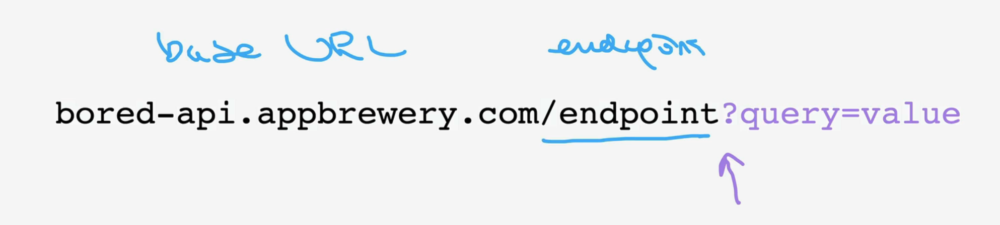

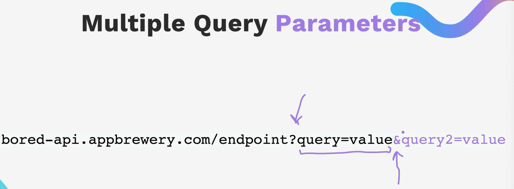

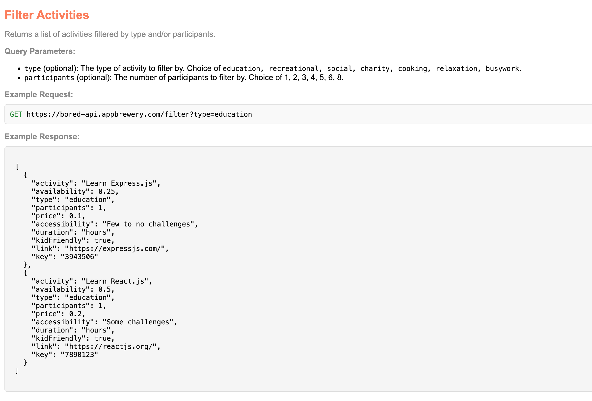

Question : Make an API request through Postman that queries all the "social" activities for 2 people?

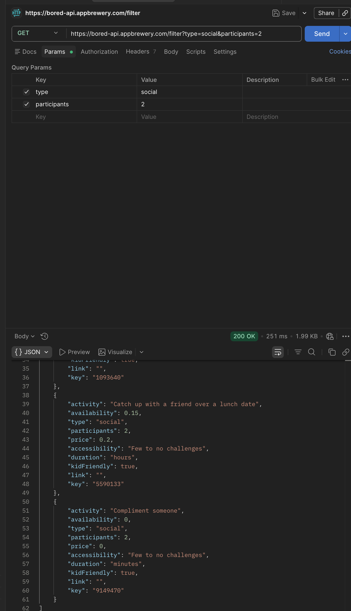

**Path Parameters**

Path parameters are =dynamic segments of a URL path used to identify specific resources in RESTful APIs= (e.g., `/users/{id}`), where `{id}` is replaced by a concrete value like `/users/123`. They are essential for locating particular items, are typically required, and are often used in GET, PUT, or DELETE requests.

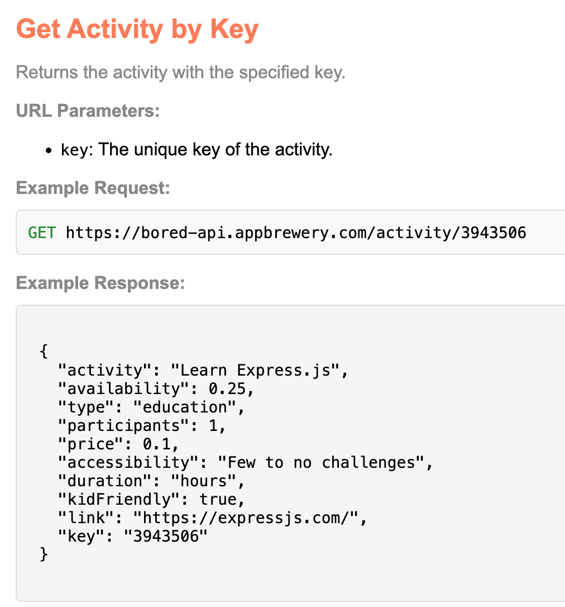

---

**JSON**

JSON (JavaScript Object Notation) is  a lightweight, text-based, and language-independent data-interchange format used for storing and transporting data, primarily between a server and a web application.

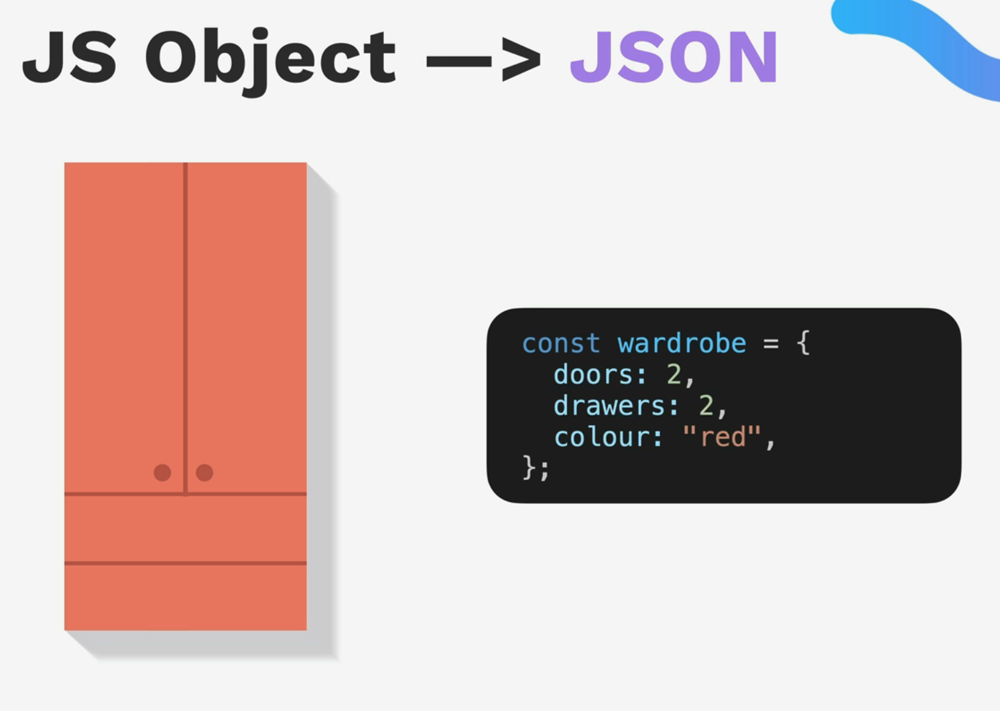

In order to convert the JSON object into JSON, we will have to use stringyfy.

const jsonData = JSON.**stringyfy**(data);

const data = JSON.**parse**(jsonData);
