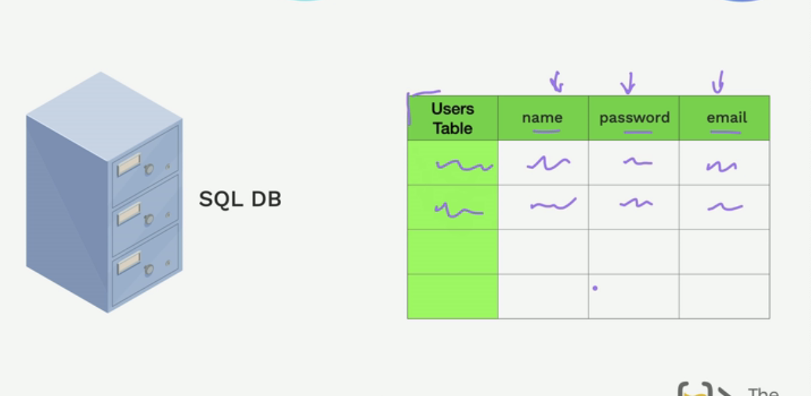
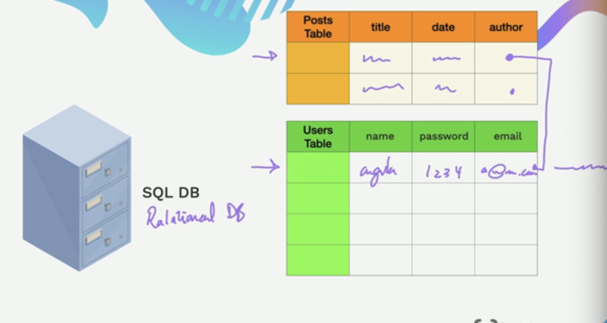
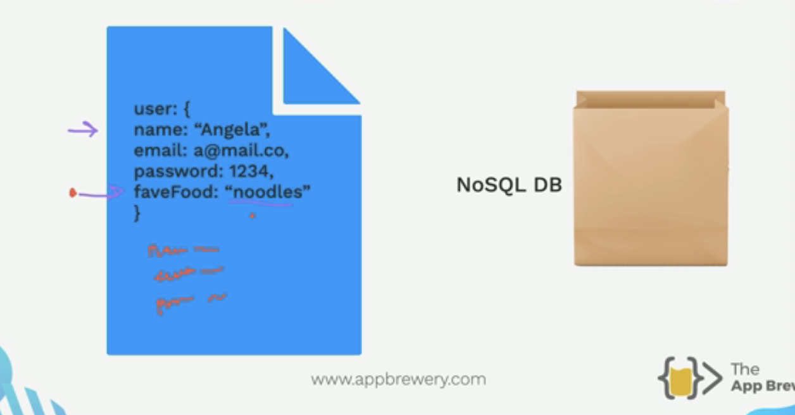

 ver

Data Storage : We need to store our data.

Types of Databases

SQL DB : Structural Datbase. For example: you would like to stoe user data.

Relational Database: We can create link between any tables.

Type of Famous SQL : Oracle Database (quiete expernsive), PostGres, MySQL, Microdoft SQL

---

NoSQL Database : They are quite flexible.
For example: same way you create json, you can change the structure of the database in NoSQL.

It is easy to store and have more flexibilty.
In order to scale the data : horizontally and Vertically.

Horiztal means having more data and Vertically means more fields.

It is easy to add any fields later in NoSQL without changing the Schema.

Whereas you dont have this option in SQL

Example: MongoDB, Reddis, DynamoDB.

NoSQL is better as it is not as traditional and rules like SQL.

---
