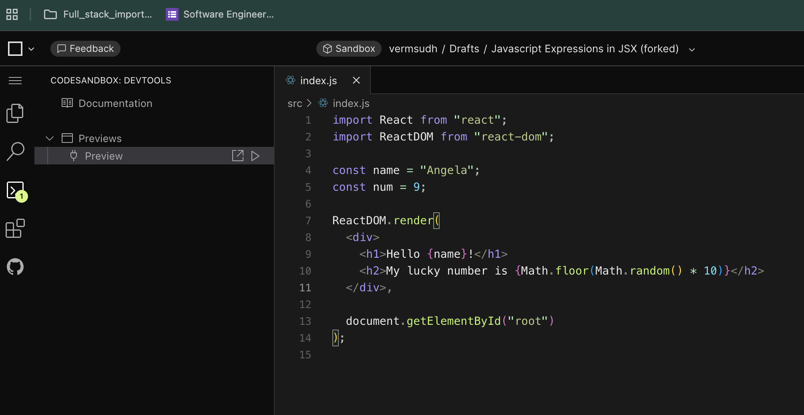

importReactfrom"react";

importReactDOMfrom"react-dom";

constname="Angela";

ReactDOM.render(`<h1>`Hello {name}!`</h1>`,document.getElementById("root"));

This is how you use constant in your code of JS

