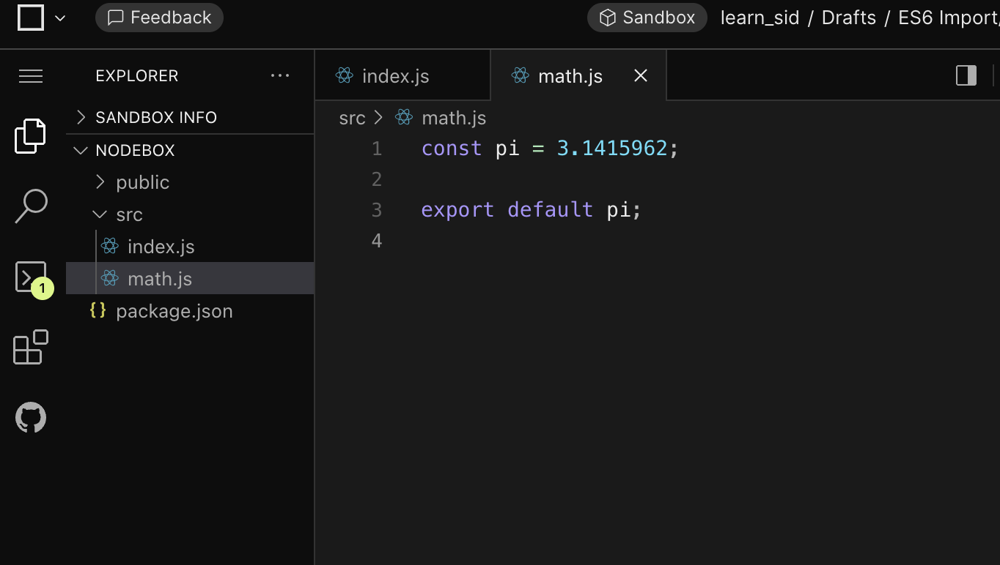
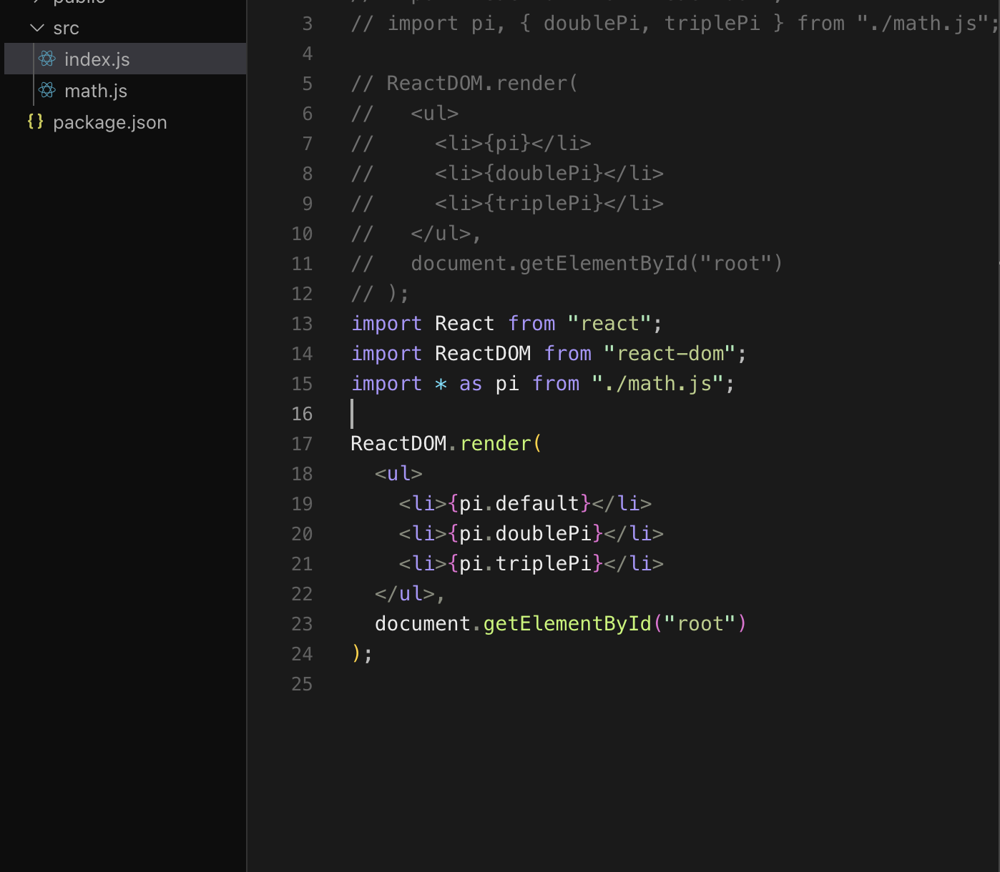
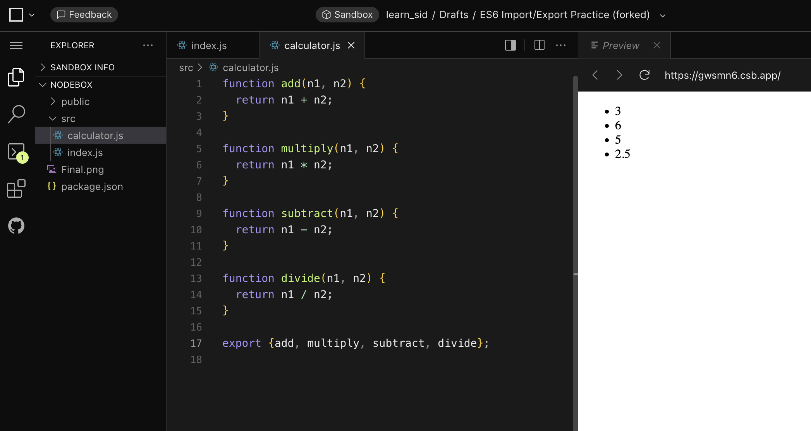
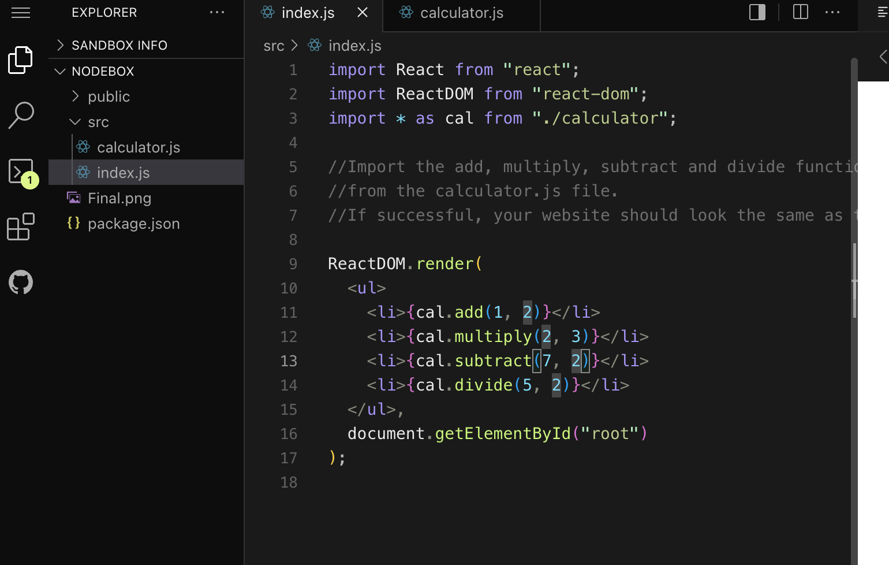

When you make a module of a file like Math.js in this example :

You can use this in any file by importing it.

[stackoverflow.com/questions/31354559/using-node-js-require-vs-es6-import-export](https://stackoverflow.com/questions/31354559/using-node-js-require-vs-es6-import-export)

---

You can also import everything in the Math.js file but we would have to use *.

Example : 

But it is discouraged as for big file, we do not want to import everything from that file. We just import the function that we would like to use it from a different file. 

Next section is the Challange :

---

Challenge for importing and Exporting:

Solution: 

PLease note : THe order in which you exported, does not really matther how you imported them. You can write them in any sequence as long the name of the functions are correct. 

