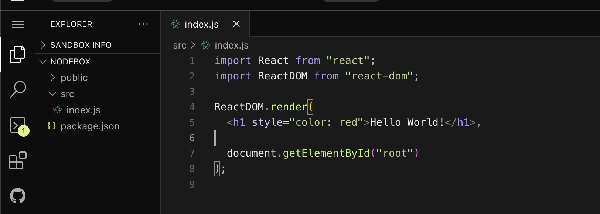
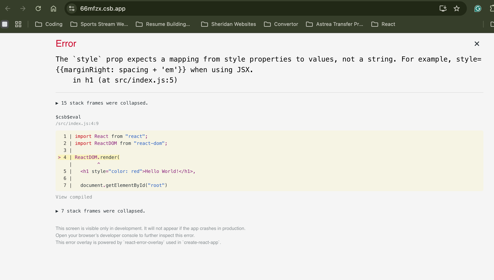
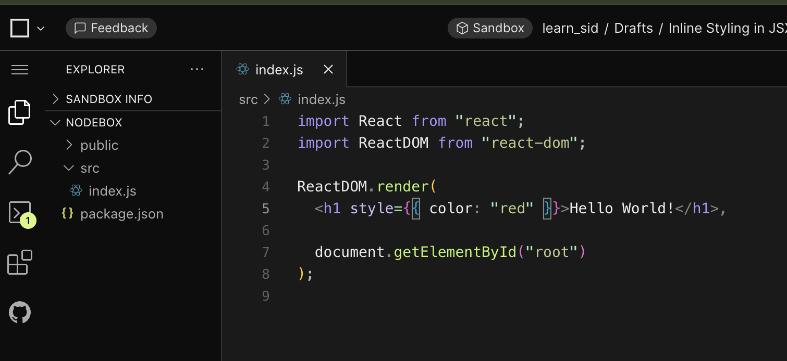
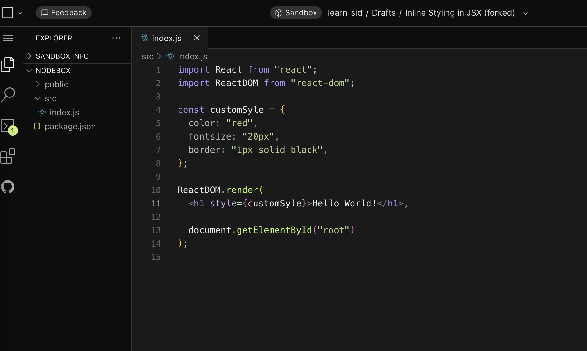
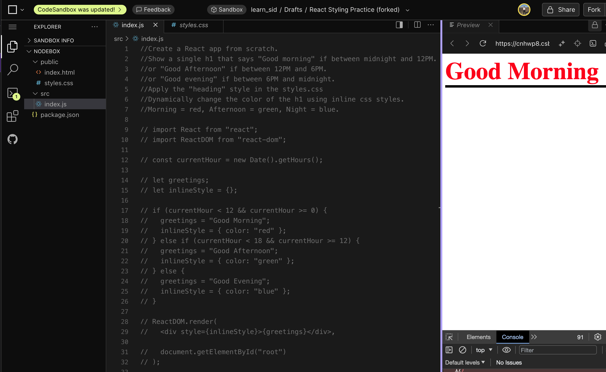
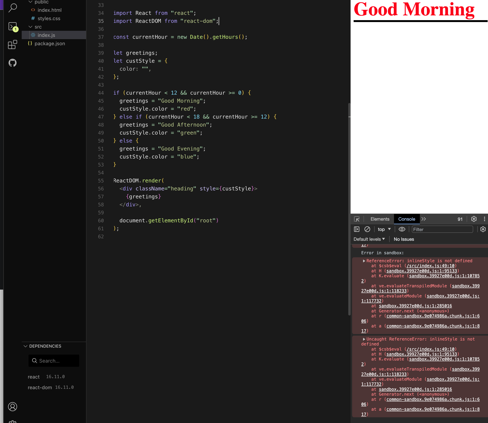

Inline Styling for styling

You wont be able to inject this inline css like this in JSX file. It will throw an error saying : 

It will tell you how to write it. 

We can write this using the JS object in order to use inline css in JSX file.

The reason is becasue of class based styling using the style sheet.

WHY do we use this?

When we want to update the change when the user interact, makes it easy. 

You can use inline styling like this by initilizing a const and creating the JSON. 

You can use these references in order to see the css and learn how to use them in JSX file. 

https://www.w3schools.com/cssref/pr_font_font-size.php

---

