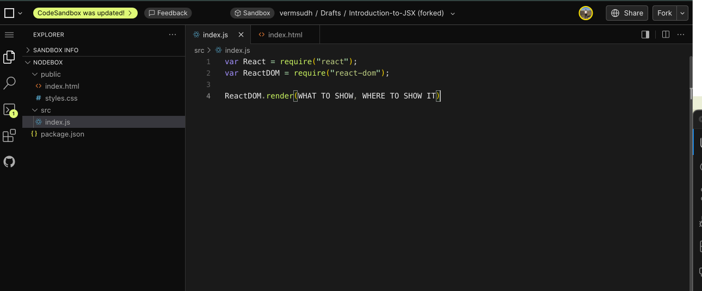
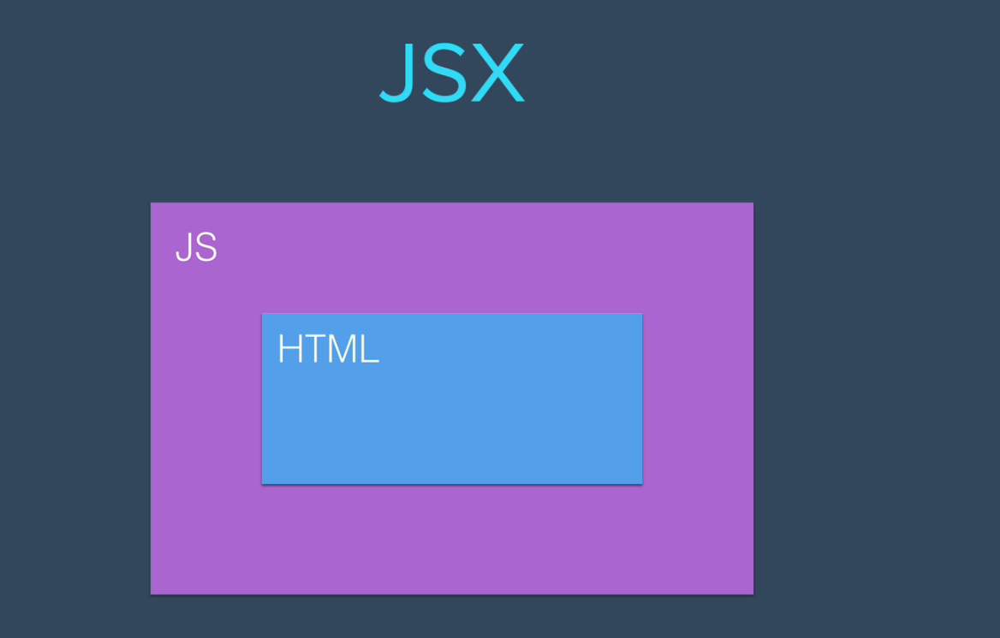

Into to JSX

We have downloaded the required files from the module "INTO to JSX"

Now, we have opened the file.

Now\, the only file we are going to update is going to be index.js. We are not going to touch .html files or any other files.

1) Firstly, we are going to create a varibale React and bind it to the React.
   varReact=require("react");
   varReactDOM=require("react-dom");
2) Then we are going to render the ReactDOM using .render method.
   ReactDOM.render(WHATTOSHOW,WHERETOSHOWIT)
   
3) Then create a callback(optional)

---

We can use Babel to use JS compiler which corresponds to the latest JS. 

importReactfrom"react";

importReactDOMfrom"react-dom";

These are the new ways to import React from the pre-built modules. 

---

React enables us to insert HTML code in JS.

And we also include JS inside HTML as well.
