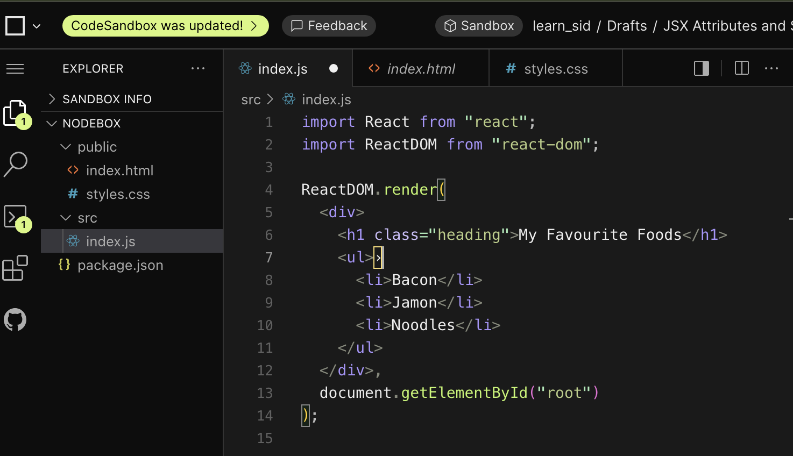
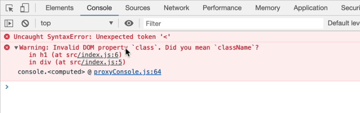
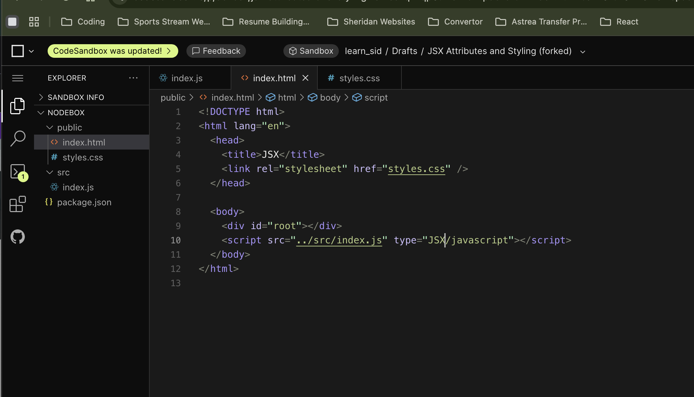

You can create a class inside this HTML code but this code will still be treated as JS.
When you try to inspect this in the console, you will get this error. 

In order to give any tag a class, we can us 

className

If we use that, we will not get this warning.
However, you can use one more thing in order to get rid of the warning : 

By Adding JSX in type instead of text as it will treat the file as JSX file instead of a text.

Important links: You can use these global attributes that can be used in HTML.

PLease make sure that everything you type, type it in camel casing. 

https://www.w3schools.com/tags/ref_standardattributes.asp
