[developer.mozilla.org/en-US/docs/Web/HTML/Reference/Elements/dl](https://developer.mozilla.org/en-US/docs/Web/HTML/Reference/Elements/dl)

This is the reference document on how to use components and display it in a dictionary format on the website. 

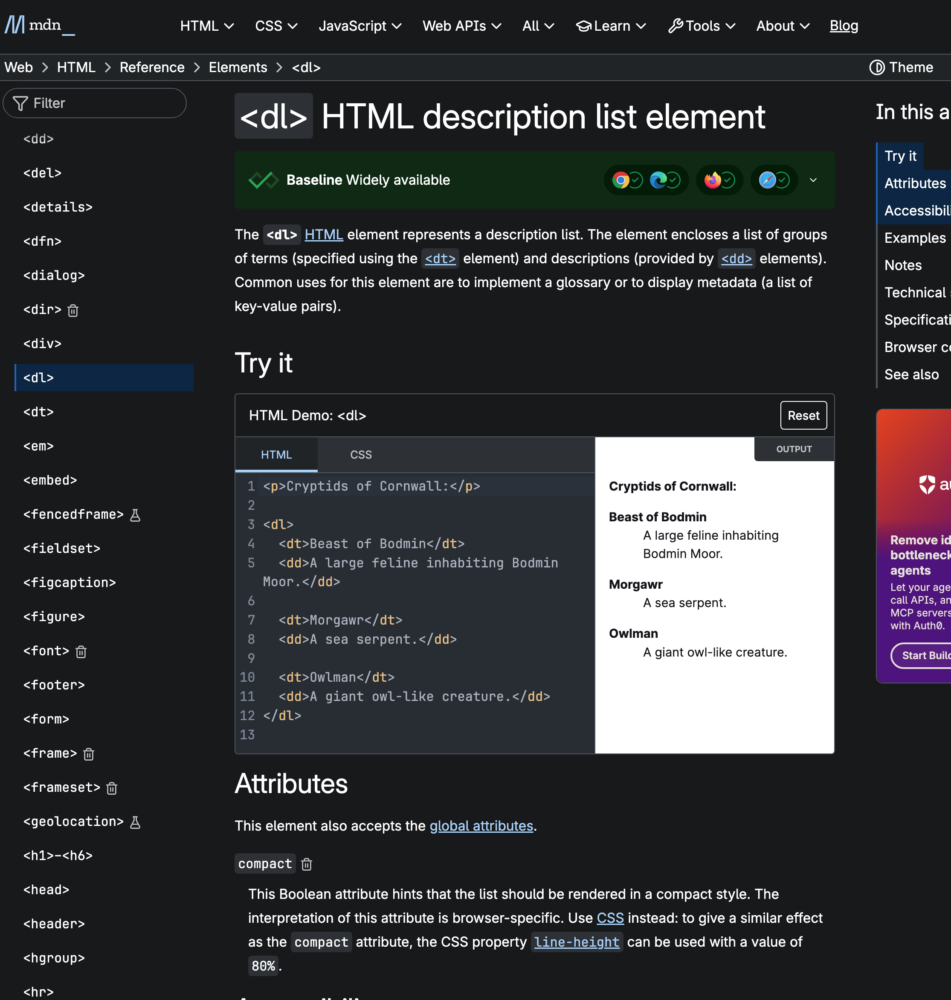

[www.emojimeanings.net/list-smileys-people-whatsapp#google_vignette](https://www.emojimeanings.net/list-smileys-people-whatsapp#google_vignette)

This is just a reference document on Emoji Learning

---

Solution:

Lets define the task to break down the problem.

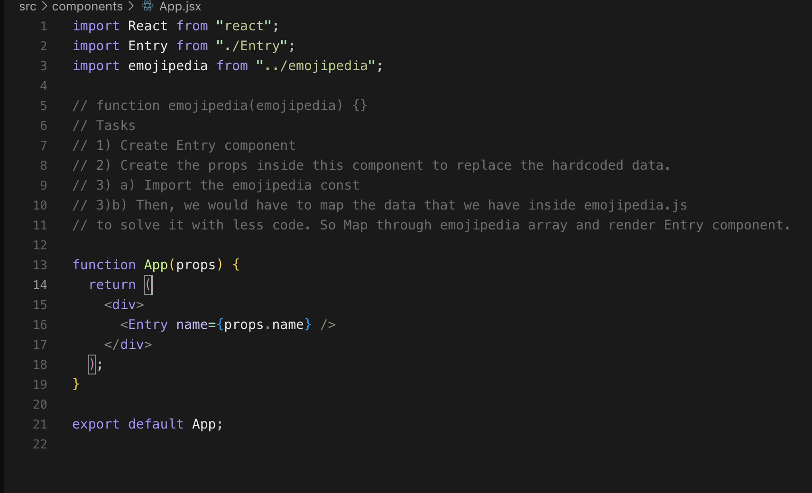

Inorder to complete the first step:

We need to create a new component called "Entry" and import inside the App.

Step 1) 

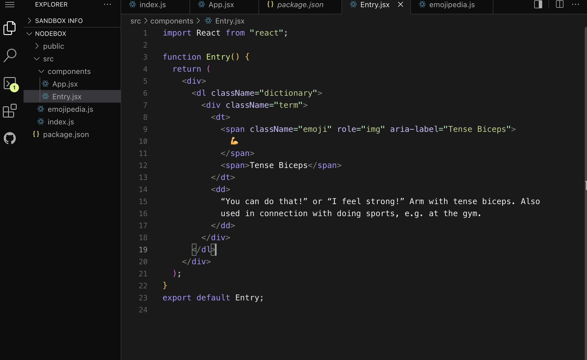

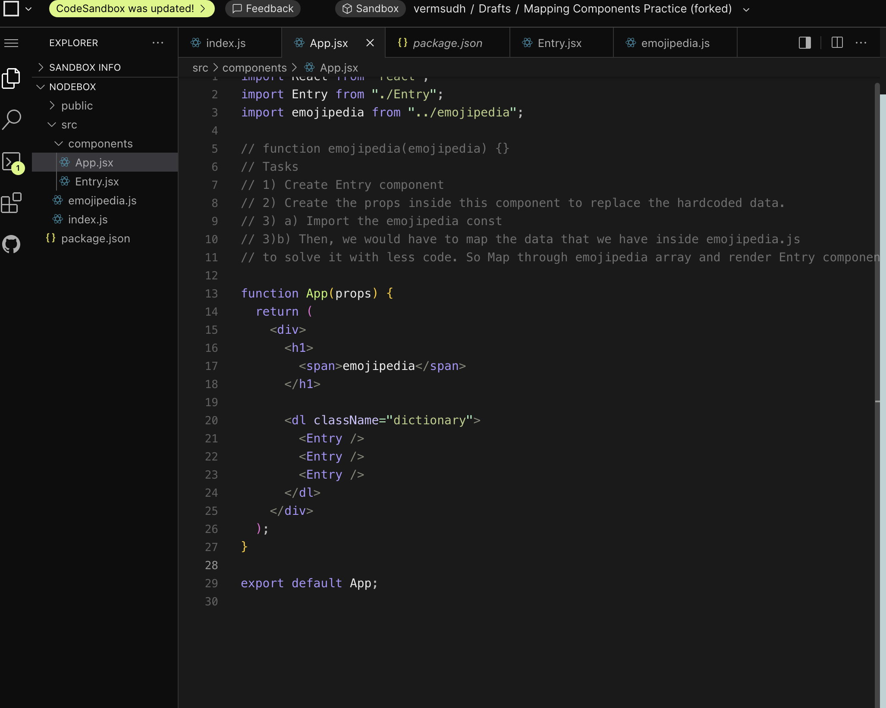

---

Step 2)  ` Create the props inside this component to replace the hardcoded data.`

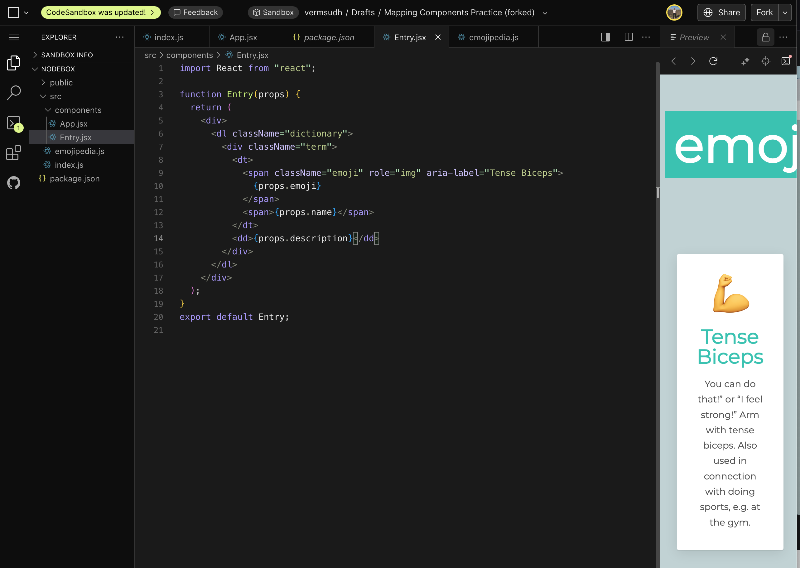

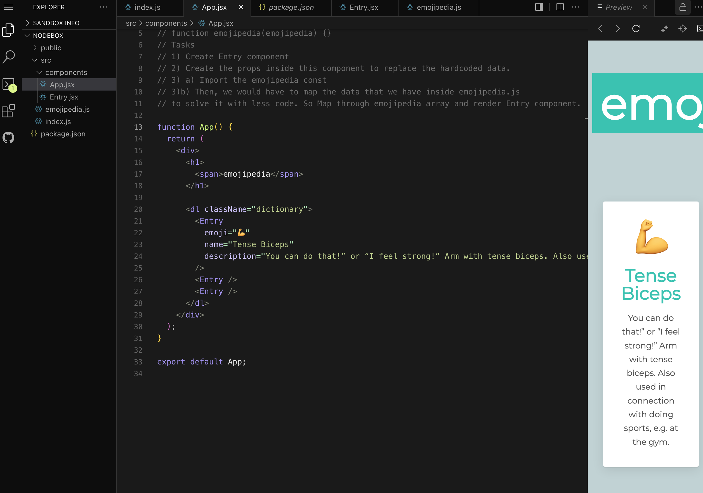

Firstly, we created Entry component. 

Inside the function, we used props as an argument in order to reuse the componets inside the App.jsx.
We defined by `{props.emoji}`, `{props.name}`, `{props.description}`

Then we updated the values of the props inside App.

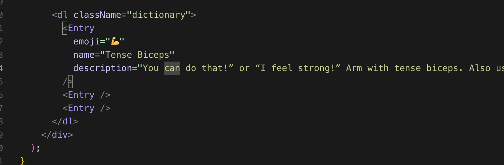

---

Step 3) Now, we are going to use map function inorder to pull the same data from emojipedia.js where we have defined an array. 

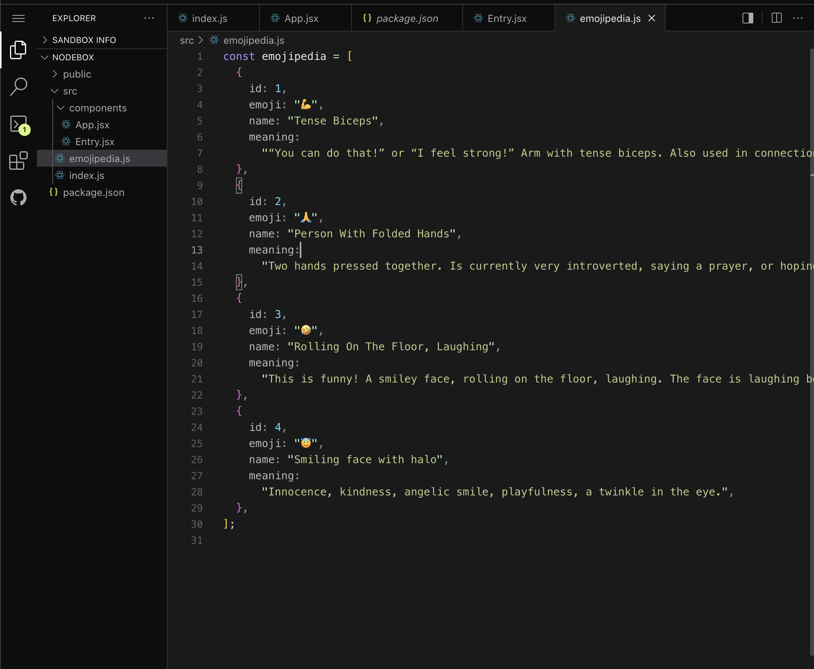

You can't import this array without exporting this, so we are going to use "export default" to firstly export in order to use this inside the App component.

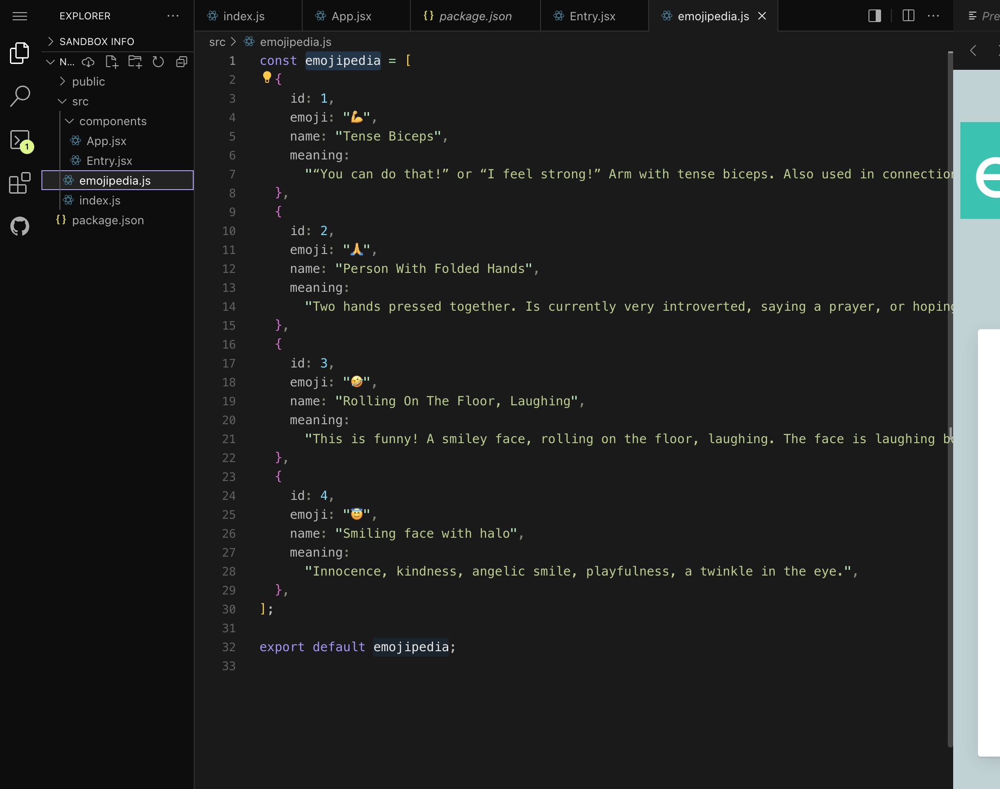

Then, we can import it inside app.jsx using "`import emojipedia from "../emojipedia";`"

You can check if the array has been exported properly by printing on the console. 

`console.log(emojipedia);`

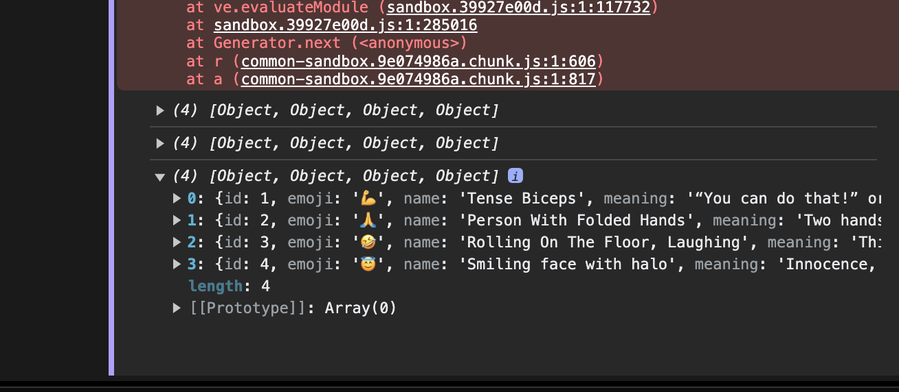

Now, its time to use the map function 

Documentation :[www.w3schools.com/react/react_es6_array_map.asp](https://www.w3schools.com/react/react_es6_array_map.asp)

We are going to delete the Entry component and tap into the data using the map function. 

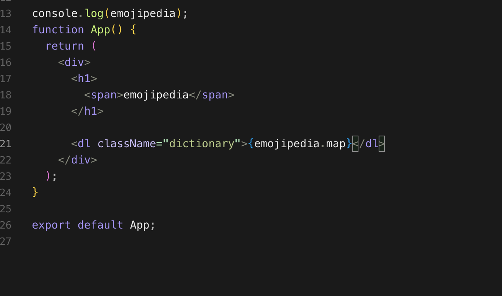

We are going to create a function called createEntry firstly.

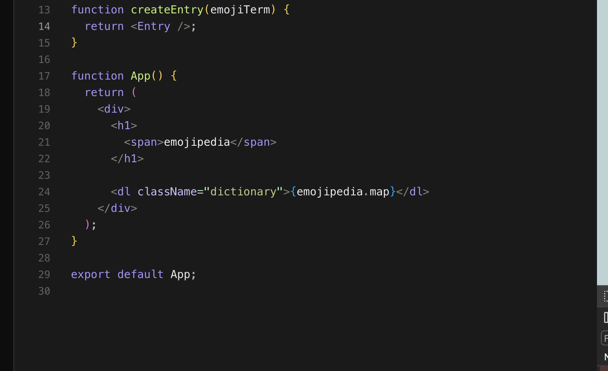

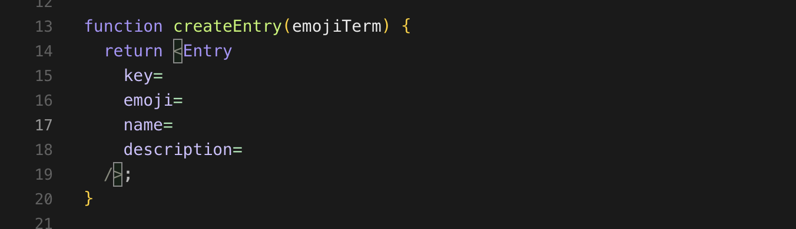

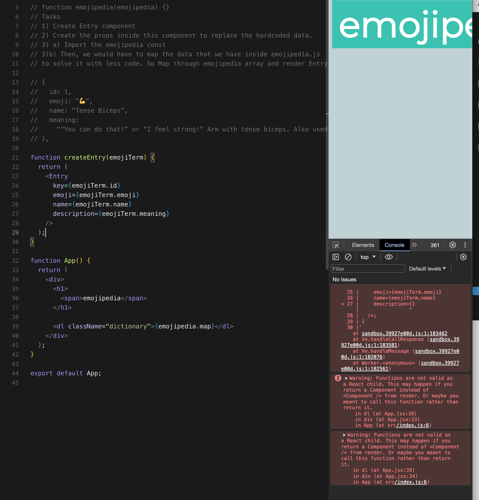

THen passing createEntry inside the map function inside `emojipedia.map(createEntry)`

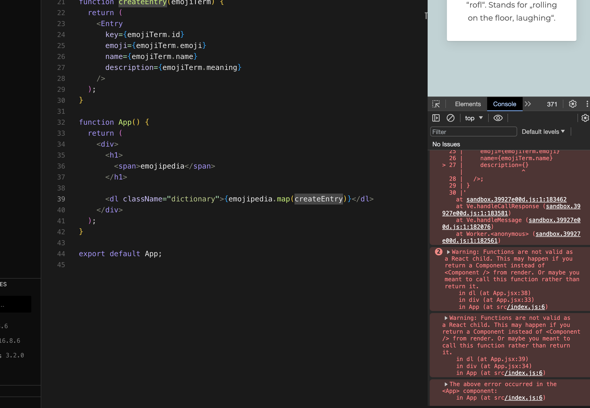

---

This is how you can use the map function to reuse the components in order to code less.
