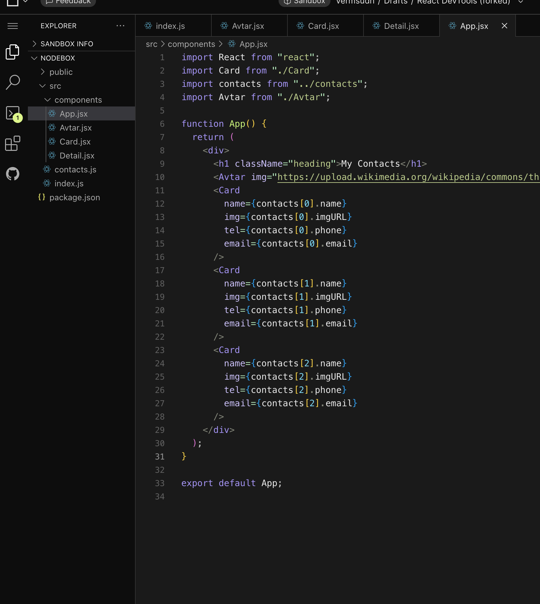
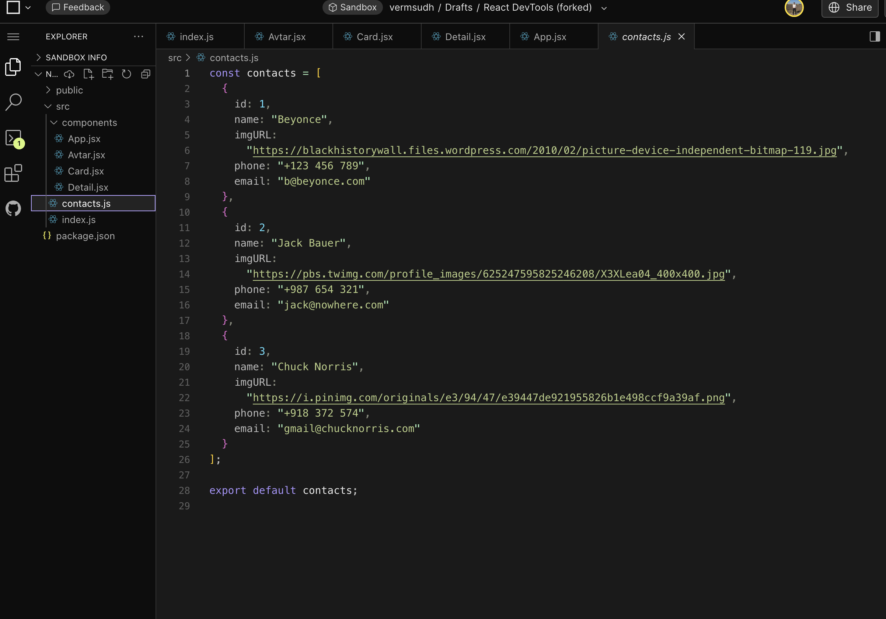
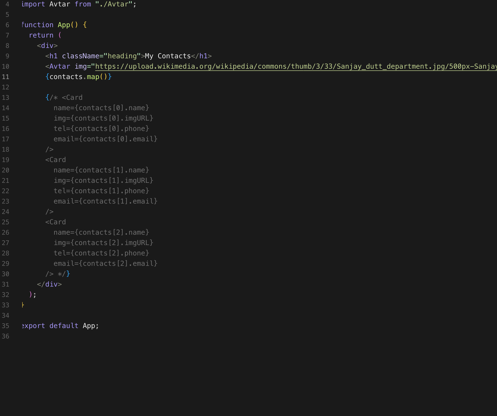
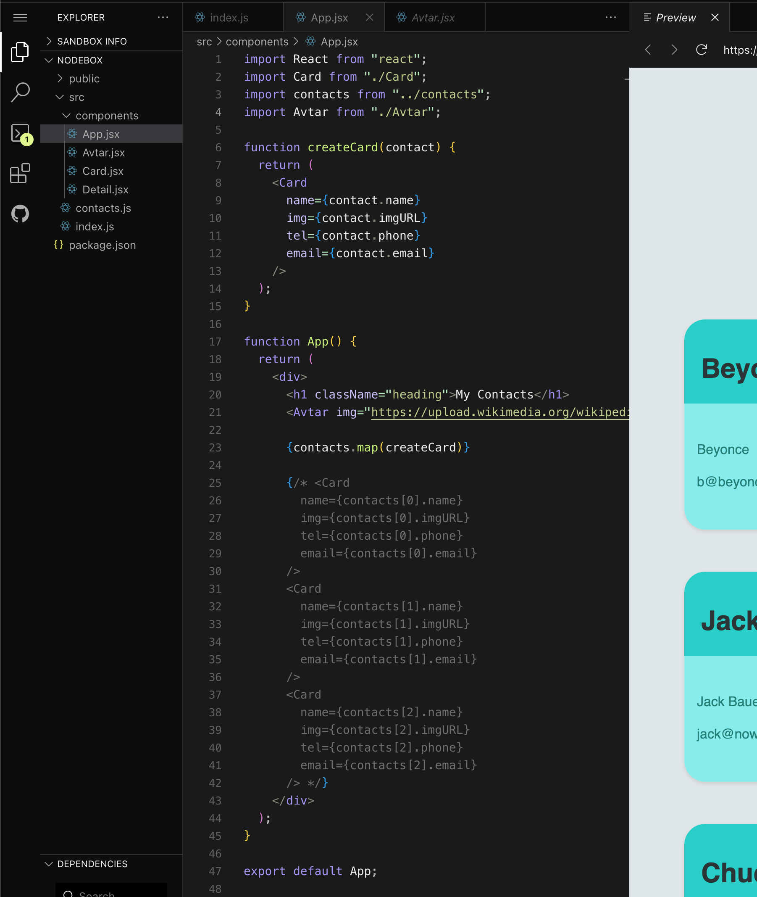
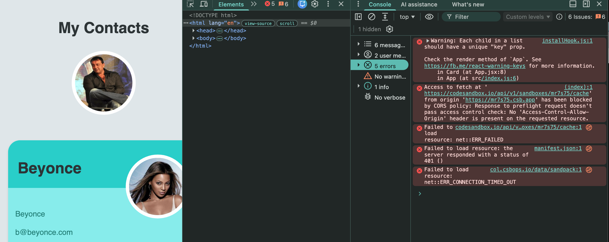
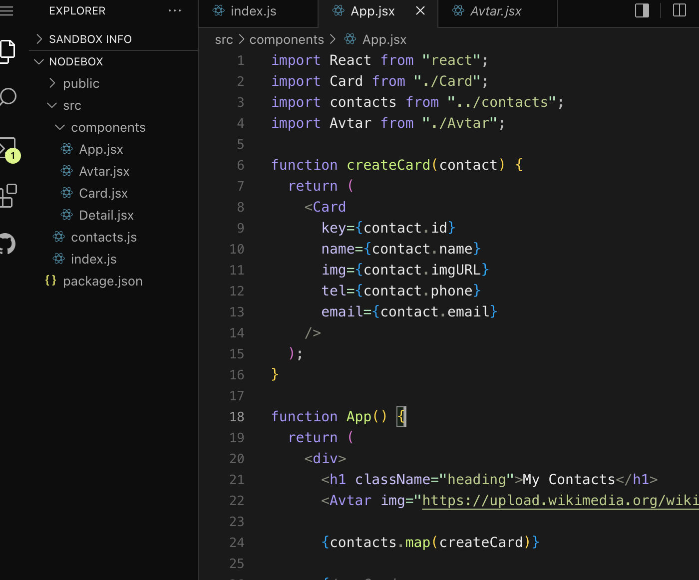
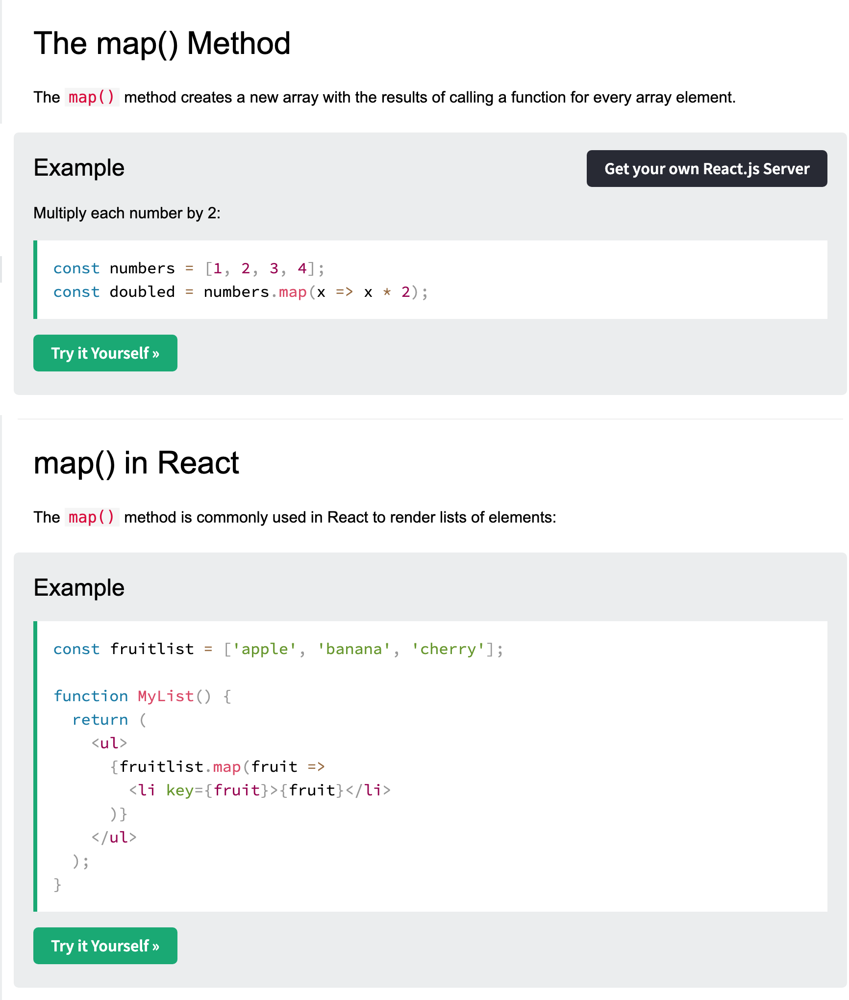

In the Last lesson, we learned how we can use react props re-use react components by passing an argument called "props" inside a function. Just like creating an object in JS and using it.

Now, we also covered on how we can use link our data in the file to organize the files.

Now, we are going to learn on how we can map the data inside the JSX file to avoid repeating same lines od codes.

---

Mapping the components : We can use map function to handle arrays.

We are going to use this in the contact JS file.

We are going to use functional programming concepts in order to solve this.  We are basically passing a function inside a function.

Warning : React is able to create virtual DOM that represents the curren appearance of the website. 

Now, when we specify a key inside this function, the warning goes away as all the keys have unique id's inside contact.js.

---

