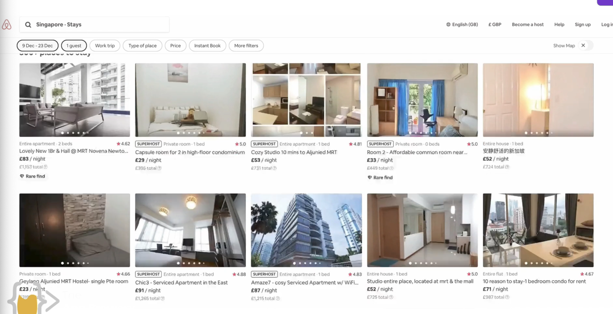
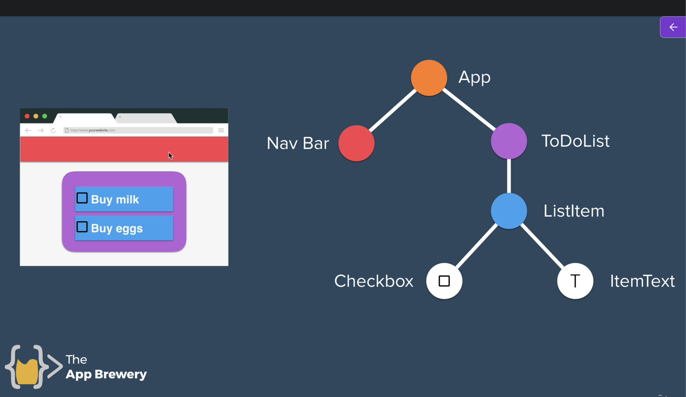
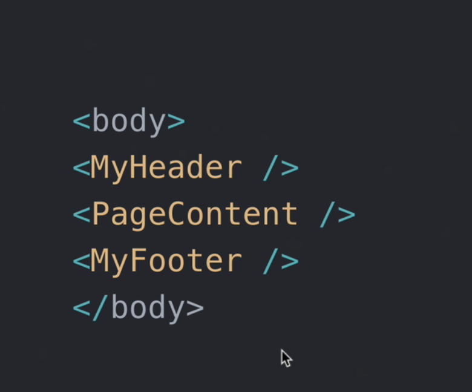
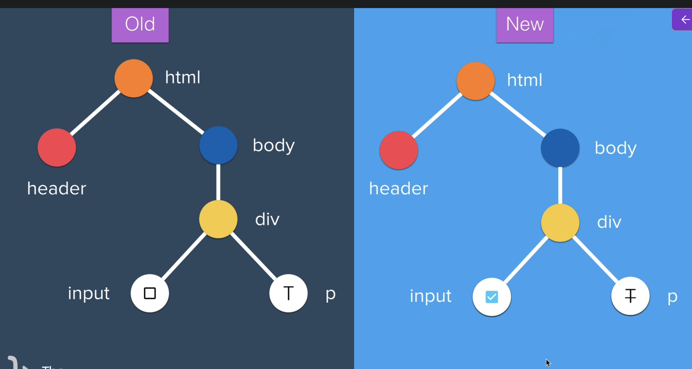
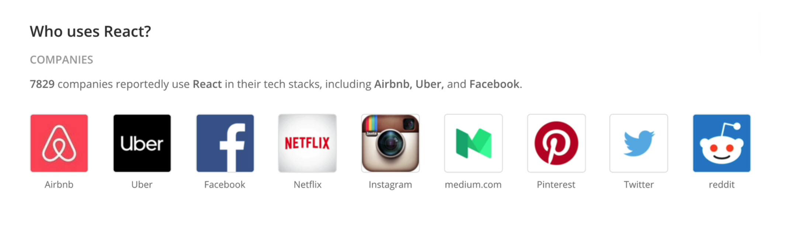

React JS

It is a JS librabry for building user interfaces. 

It reduces repetion code

Like in this airbnb website,

In react, we have mutiple compnents to organize the sections of the website. 

React combines JS, HTML and CSS in one file so that you have more control from a single file.

Website like LinkedIn which uses React.
Benefit : When we scroll down the feed page, the information gets updated but everything else stat staic like the navbar menus and options. 

Back in the days, people had to refresh the page to see the updated changes. React automatically loads the information with the current inputs so that the user does not have to click on refresh button again and again. React updates the information itself.
It is able to rerender the changes very efficiently by comparing the changes. 

Like shown in this image, the only component that will be changes is the input and everything else will remain the same. 

We are going to use Code Sandbox for coding editor tool.
