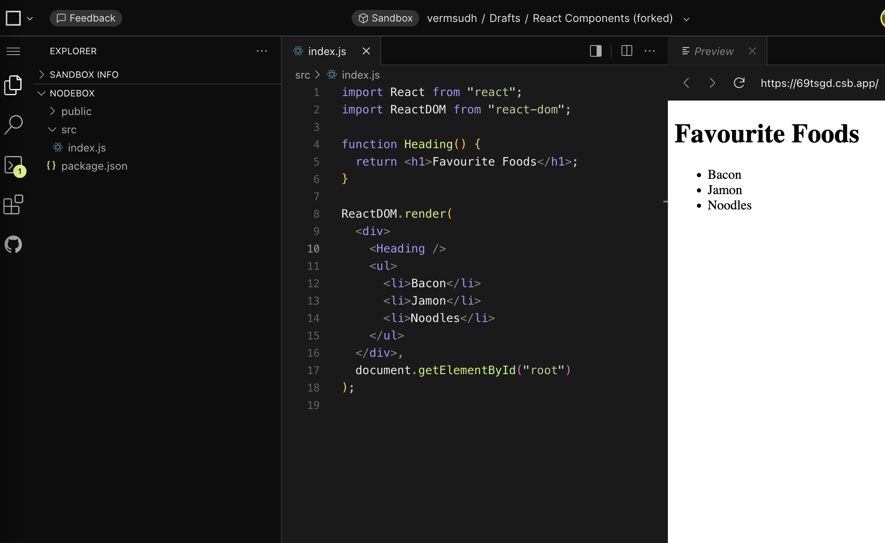
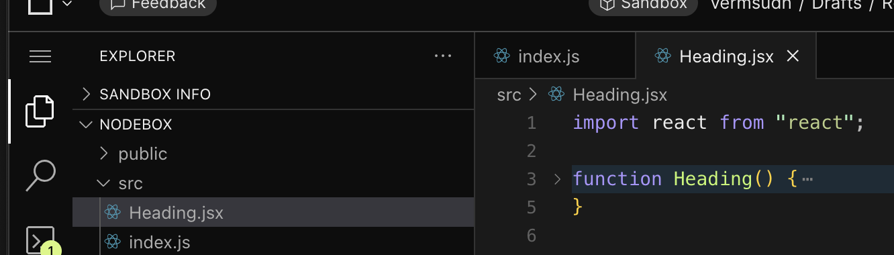
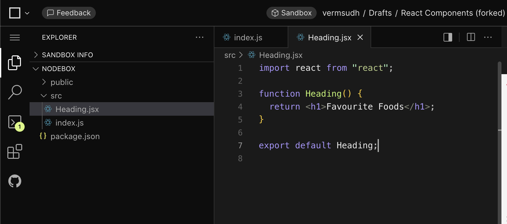
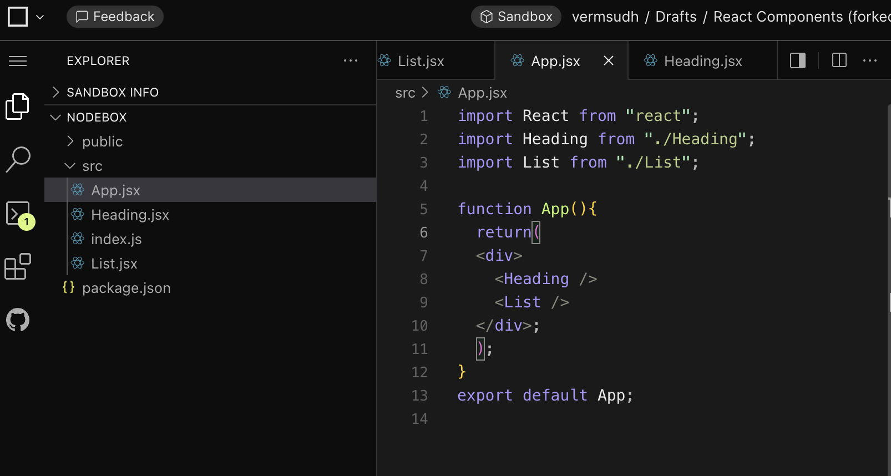

Components in React

It allows us to divide the code in section so that we dont have whole code in a single file.

Since we have created a function called Heading(). We can use this as a React component in the reactDOM

[https://github.com/airbnb/javascript/tree/master/react]()

You can use this Aribnb React librabry to see how to structure your code.

---

Now, we are going to create a different jsx file and use that as a component.

We would need to import the react from the react module.

We have to do this step, whenever we create a new component.

Now, in order to use the component function, we would have to export the function in the jsx file

Now, we are going to import this Heading jsx in index.jsx.

---

Later, we are going to use app.jsx which is custom made for this purpose.

In React, the **`App` file** (usually `App.js`, `App.jsx`, or `App.tsx`)  =serves as the **root component** and the main canvas of your user interface= . It is typically located inside the `src` folder of your project.

In order to be oganized, we will need start creating folders in order to be more organized.

We can make components folder inside the src file. That is the standards of following React.
